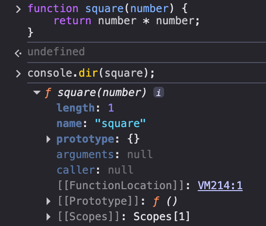
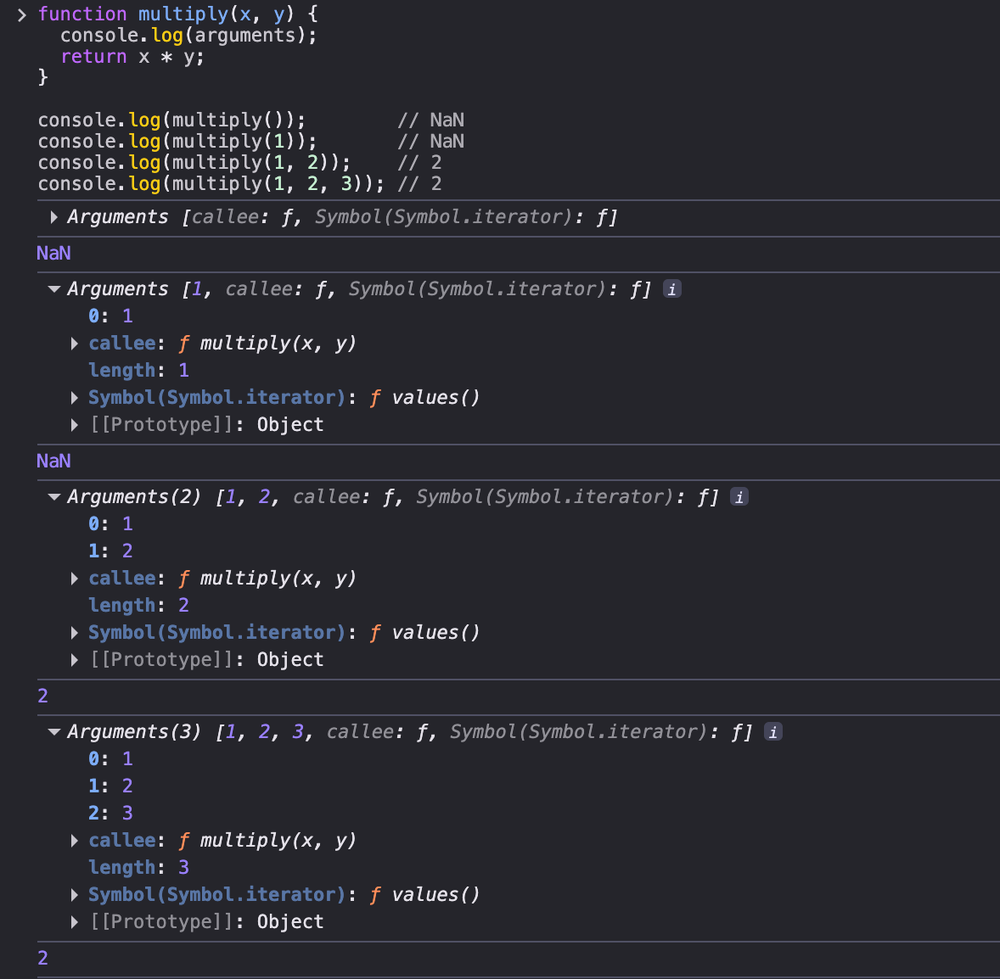

# 18장 함수와 일급 객체

## 18.1 일급 객체

다음과 같은 조건을 만족하는 객체를 **일급 객체**라 한다.

1. 무명의 리터럴로 생성할 수 있다. 즉, 런타임에 생성이 가능하다.
2. 변수나 자료구조(객체, 배열 등)에 저장할 수 있다.
3. 함수의 매개변수에 전달할 수 있다.
4. 함수의 반환값으로 사용할 수 있다.

자바스크립트의 함수는 다음 예제와 같이 위의 조건을 모둔만족하므로 일급 객체다.

```js
// 1. 함수는 무명의 리터럴로 생성할 수 있다.
// 2. 함수는 변수에 저장할 수 있다.
// 런타임(할당 단계)에 함수 리터럴이 평가되어 함수 객체가 생성되고 변수에 할당된다.
const increase = function (num) {
  return ++num;
};

const decrease = function (num) {
  return --num;
};

// 2. 함수는 객체에 저장할 수 있다.
const auxs = { increase, decrease };

// 3. 함수의 매개변수에게 전달할 수 있다.
// 4. 함수의 반환값으로 사용할 수 있다.
function makeCounter(aux) {
  let num = 0;

  return function () {
    num = aux(num);
    return num;
  };
}

// 3. 함수는 매개변수에게 함수를 전달할 수 있다.
const increaser = makeCounter(auxs.increase);
console.log(increaser()); // 1
console.log(increaser()); // 2

// 3. 함수는 매개변수에게 함수를 전달할 수 있다.
const decreaser = makeCounter(auxs.decrease);
console.log(decreaser()); // -1
console.log(decreaser()); // -2
```

함수가 일급 객체라는 것은 함수를 객체와 동일하게 사용할 수 있다는 의미다. 객체는 값이다. 따라서 자바스크립트에서 **함수는 값을 사용할 수 있는 곳이라면 어디서든지 리터럴로 정의**할 수 있으며 **런타임에 함수 객체로 평가** 받는다.

**일급 객체로서 함수가 가지는 가장 큰 특징은 일반 객체와 같이 함수의 매개변수에 전달할 수 있으며, 함수의 반환값으로 사용할 수도 있다는 것**이다. 이는 함수형 프로그래밍을 가능케 하는 자바스크립트의 장점 중 하나다.

## 18.2 함수 객체의 프로퍼티

**함수는 객체이기에 프로퍼티를 가질 수 있다**. 브라우저 콘솔에서 `console.dir` 메서드를 사용하여 함수 객체의 내부를 들여다 보자.

<figure>
  
  <figcaption></figcaption>
</figure>

`square` 함수의 모든 프로퍼티의 프로퍼티 어트리뷰트를 `Object.getOwnPropertyDescriptors` 메서드로 확인해 보면 다음과 같다.

```js
function square(number) {
  return number * number;
}

console.log(Object.getOwnPropertyDescriptors(square));
/*
{
  length: {value: 1, writable: false, enumerable: false, configurable: true},
  name: {value: "square", writable: false, enumerable: false, configurable: true},
  arguments: {value: null, writable: false, enumerable: false, configurable: false},
  caller: {value: null, writable: false, enumerable: false, configurable: false},
  prototype: {value: {...}, writable: true, enumerable: false, configurable: false}
}
*/

// __proto__는 square 함수의 프로퍼티가 아니다.
console.log(Object.getOwnPropertyDescriptor(square, '__proto__')); // undefined

// __proto__는 Object.prototype 객체의 접근자 프로퍼티다.
// square 함수는 Object.prototype 객체로부터 __proto__ 접근자 프로퍼티를 상속받는다.
console.log(Object.getOwnPropertyDescriptor(Object.prototype, '__proto__'));
// {get: ƒ, set: ƒ, enumerable: false, configurable: true}
```

`arguments`, `caller`, `length`, `name`, `prototype` 프로퍼티는 모두 함수 객체의 데이터 프로퍼티다. 
**이들 프로퍼티는 일반 객체에는 없는 함수 객체 고유의 프로퍼티**다. 

하지만 `__proto__`는 접근자 프로퍼티이며, 함수 객체 고유의 프로퍼티가 아니라 **`Object.prototype` 객체의 프로퍼티를 상속**받은 것이다. 즉, `Object.prototype` 객체의 `__proto__` 접근자 프로퍼티는 **모든 객체가 사용할 수 있다.** 상속에 대해서는 19장 "프로토 타입"에서 자세히 살펴보자.

### 18.2.1 arguments 프로퍼티

함수 객체의 `arguments` 프로퍼티 값인 `arguments` 객체는 **함수 호출 시 전달된 인수들의 정보를 담고 있는 순회 가능한 유사 배열 객체**이며, 함수 내부에서 지역 변수처럼 사용된다.

`arguments` 프로퍼티는 현재 일부 브라우저에서는 지원하고 있지만 ES3부터 표준에서 폐지됐다. 

```js
function multiply(x, y) {
  console.log(arguments);
  return x * y;
}

console.log(multiply());        // NaN
console.log(multiply(1));       // NaN  
console.log(multiply(1, 2));    // 2
console.log(multiply(1, 2, 3)); // 2
```

함수를 정의할 때 선언한 매개변수는 함수 몸체 내부에서 변수와 동일하게 취급된다. 즉, 함수가 호출되면 함수 몸체 내에서 암묵적으로 매개변수가 선언되고 `undefined`로 초기화된 이후 인수가 할당된다.

매개변수보다 많은 인수가 전달되었다면, 초과된 인수는 **무시된다.** 그렇다고 초과된 인수가 그냥 버려지는 것은 아니다. **모든 인수는 암묵적으로 `arguments` 객체의 프로퍼티로 보관된다**.

<figure>
  
  <figcaption></figcaption>
</figure>

위를 통해 `arguments` 객체는 인수를 프로퍼티 값으로 가지고, 프로퍼티 키는 인수의 순서를 나타낸다는 것을 알 수 있다.

자바스크립트는 선언된 매개변수의 개수를 확인하지 않는다. 따라서 인수 개수를 확인하고 이에 따라 함수의 동작을 달리 정의할 필요가 있을 수 있다. 이런 경우 `arguments` 객체는 유용하게 사용될 수 있다. 

`arguments` 객체는 매개변수 개수를 확정할 수 없는 **가변 인자 함수**를 구현할 때 유용하다.

```js
function sum() {
  let res = 0;

  // arguments 객체는 length 프로퍼티가 있는 유사 배열 객체이므로 for 문으로 순회할 수 있다.
  for (let i = 0; i < arguments.length; i++) {
    res += arguments[i];
  }

  return res;
}

console.log(sum());        // 0
console.log(sum(1, 2));    // 3
console.log(sum(1, 2, 3)); // 6
```

`arguments` 객체는 실제 배열이 아닌 유사 배열 객체이다. 따라서 배열 메서드를 사용할 수는 없다. 배열 메서드를 사용하려면 `Function.prototype.call`, `Function.prototype.apply` 를 사용해 간접 호출해야 한다. 간접 호출에 대해선 이후에 알아보자.

```js
function sum() {
  // arguments 객체를 배열로 변환
  const array = Array.prototype.slice.call(arguments);
  return array.reduce(function (pre, cur) {
    return pre + cur;
  }, 0);
}

console.log(sum(1, 2));          // 3
console.log(sum(1, 2, 3, 4, 5)); // 15
```

이러한 번거로움을 해결하기 위해 **ES6에서는 Rest 파라미터를 도입했다.**

```js
// ES6 Rest parameter
function sum(...args) {
  return args.reduce((pre, cur) => pre + cur, 0);
}

console.log(sum(1, 2));          // 3
console.log(sum(1, 2, 3, 4, 5)); // 15
```

Rest 파라미터 도입으로 `arguments` 객체의 중요성이 이전같지는 않지만 ES6만 사용하지 않을 수 있기 때문에 알아둘 필요가 있다.

### 18.2.2 caller 프로퍼티

`caller` 프로퍼티는 ECMAScript 사양에 포함되지 않은 비표준 프로퍼티다. 이후 표준화될 예정도 없는 프로퍼티이므로 사용하지 말고 참고로만 알아두자.

### 18.2.3 length 프로퍼티

함수 객체의 `length` 프로퍼티는 **함수를 정의할 때 선언한 매개변수의 개수**를 가리킨다.

```js
function foo() {}
console.log(foo.length); // 0

function bar(x) {
  return x;
}
console.log(bar.length); // 1

function baz(x, y) {
  return x * y;
}
console.log(baz.length); // 2
```

### 18.2.4 name 프로퍼티
함수 객체의 `name` 프로퍼티는 **함수 이름**을 나타낸다. ES6 이전까지는 비표준이었다가 이후 표준 사양으로 바뀌었다.

`name` 프로퍼티는 ES5와 6에서 다르게 동작한다. 익명 함수 표현식에서 ES5는 `name` 프로퍼티는 빈 문자열을 값으로 갖는다. 하지만 ES6에서는 함수 객체를 가리키는 식별자를 값으로 갖는다.

```js
// 기명 함수 표현식
var namedFunc = function foo() {};
console.log(namedFunc.name); // foo

// 익명 함수 표현식
var anonymousFunc = function() {};
// ES5: name 프로퍼티는 빈 문자열을 값으로 갖는다.
// ES6: name 프로퍼티는 함수 객체를 가리키는 변수 이름을 값으로 갖는다.
console.log(anonymousFunc.name); // anonymousFunc

// 함수 선언문(Function declaration)
function bar() {}
console.log(bar.name); // bar
```

### 18.2.5 __proto__ 접근자 프로퍼티
모든 객체는 `[[Prototype]]` 이라는 내부 슬롯을 갖는다. 이는 **객체지향 프로그래밍의 상속을 구현하는 프로토타입 객체**를 가리킨다. 프로토타입 객체에 대해서는 19장 "프로토타입"에서 자세히 살펴볼 것이다.

`__proto__` 프로퍼티는 `[[Prototype]]` 내부 슬롯이 가리키는 **프로토타입 객체에 접근하기 위해 사용하는 접근자 프로퍼티**다.

내부 슬롯에는 직접 접근할 수 없고 간접적인 접근 방법을 제공하는 경우에 한하여 접근할 수 있다. `[[Prototype]]` 내부 슬롯 또한 마찬가지며, `__proto__` 접근자 프로퍼티를 통해 간접적으로 프로토타입 객체에 접근할 수 있다.

```js
const obj = { a: 1 };

// 객체 리터럴 방식으로 생성한 객체의 프로토타입 객체는 Object.prototype이다.
console.log(obj.__proto__ === Object.prototype); // true

// 객체 리터럴 방식으로 생성한 객체는 프로토타입 객체인 Object.prototype의 프로퍼티를 상속받는다.
// hasOwnProperty 메서드는 Object.prototype의 메서드다.
console.log(obj.hasOwnProperty('a'));         // true
console.log(obj.hasOwnProperty('__proto__')); // false
```

> 💡 hasOwnProperty 메서드
>
> hasOwnProperty 메서드는 이름에서 알 수 있듯이 인수로 전달받은 프로퍼티 키가 객체 고유의 프로퍼티 키인 경우에만 true 를 반환하고 상속받은 프로토타입의 프로퍼티 키인 경우 false를 반환한다.

### 18.2.6 prototype 프로퍼티

`prototype` 프로퍼티는 생성자 함수로 호출할 수 있는 함수 객체, 즉 `constructor` 만이 소유하는 프로퍼티다. 일반 객체와 생성자 함수로 호출할 수 없는 `non-constructor`에는 `prototype` 프로퍼티가 없다.

```js
// 함수 객체는 prototype 프로퍼티를 소유한다.
(function () {}).hasOwnProperty('prototype'); // true

// 일반 객체는 prototype 프로퍼티를 소유하지 않는다.
({}).hasOwnProperty('prototype'); // false
```

`prototype` 프로퍼티는 함수가 객체를 생성하는 생성자 함수로 호출될 때 생성자 함수가 생성할 인스턴스의 프로토타입 객체를 가리킨다.