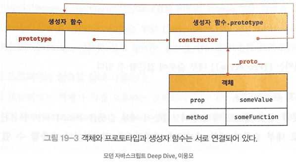
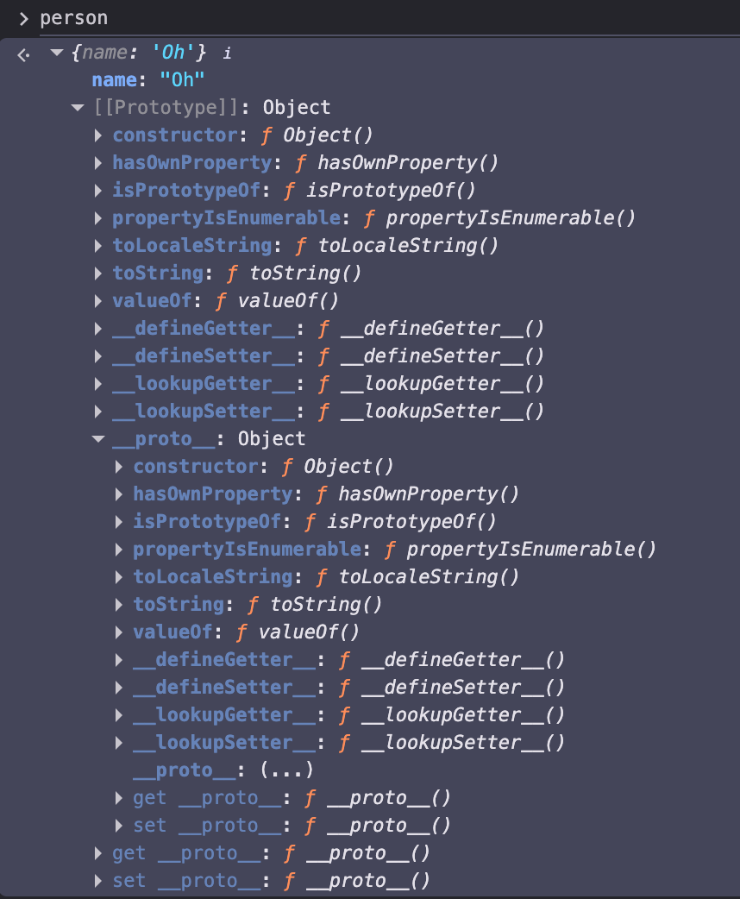

# 19장 프로토타입

자바스크립트는 명령형, 함수형, 프로토타입 기반 객체지향 프로그래밍을 지원하는 **멀티 패러다임 프로그래밍 언어**다.

자바스크립트는 클래스 기반 객체지향 프로그래밍언어보다 효율적이며 더 강력한 객체지향 프로그래밍 능력을 지니고 있는 **프로토타입 기반의 객체지향 프로그래밍 언어**다.

> 💡 클래스
>
> ES6에서 도입된 클래스는 기존의 프로토타입 기반 객체지향 모델을 폐지하고 새로운 객체지향 모델을 제공하는 것은 아니다. 사실 클래스도 함수이며, 기존 프로토타입 기반 문법적 설탕(Syntax Sugar) 이라고 볼 수 있다. 
>
> 클래스와 생성자 함수는 모두 프로토타입 기반의 인스턴스를 생성하지만 정확히 동일하게 동작하지는 않는다. 클래스는 생성자 함수보다 엄격하며 클래스는 생성자 함수에서는 제공하지 않는 기능도 제공한다.
>
> 따라서 클래스를 프로토타입 기반 객체 생성 패턴의 단순한 문법적 설탕이라고 보기보다는 새로운 객체 생성 케머니즘으로 보는 것이 좀 더 합당하다고 할 수 있다.

자바스크립트는 객체 기반의 프로그래밍 언어이며 **자바스크립트를 이루고 있는 거의 "모든 것"이 객체**다. 그러므로 먼저 객체지향 프로그래밍에 대해 간단히 알아보자.

## 19.1 객체지향 프로그래밍
객체지향 프로그래밍은 여러 개의 독립적 단위, 즉 객체의 집합으로 프로그램을 표현하려는 프로그래밍 패러다임을 말한다. 객체지향 프로그래밍은 실세계의 실체를 인식하는 철학적 사고를 프로그래밍에 접목하려는 시도에서 시작한다. 실체는 특징이나 성질을 나타내는 속성을 가지고 있고, 이를 통해 실체를 인식하거나 구별할 수 있다.

예를 들어, "사람"이라는 실체를 생각해보자. 이름, 주소, 성별 등 다양한 속성을 가진다. 만약 우리가 구현하려는 프로그램에서는 사람의 이름과 주소라는 속성에만 관심이 있다고 가정하자. 이처럼 다양한 속성 중에서 프로그램에 필요한 속성만 간추려 내어 표현하는 것을 추상화라 한다.

```js
// 이름과 주소 속성을 갖는 객체, 사람
const person ={
    name: 'Oh',
    addrress: 'Seoul'
};

console.log(person); // {name: "Oh", address: "Seoul"}
```

이때 프로그래머는 이름과 주소 속성으로 표현된 객체인 `person`을 다른 객체와 구별하여 인식할 수 있다. 이처럼 **속성을 통해 여러 개의 값을 하나의 단위로 구성한 복합적인 자료구조를 객체**라하며, 객체지향 프로그래밍은 **독립적인 객체의 집합으로 프로그램을 표현하는 패러다임**이다.

이번에는 원이라는 개념을 객체로 만들어보자. 원의 상태를 나타내는 데이터이며, 원의 지름, 둘레, 넓이를 구하는 것은 **동작**이다.  

```js
const circle = {
  radius: 5, // 반지름

  // 원의 지름: 2r
  getDiameter() {
    return 2 * this.radius;
  },

  // 원의 둘레: 2πr
  getPerimeter() {
    return 2 * Math.PI * this.radius;
  },

  // 원의 넓이: πrr
  getArea() {
    return Math.PI * this.radius ** 2;
  }
};

console.log(circle);
// {radius: 5, getDiameter: ƒ, getPerimeter: ƒ, getArea: ƒ}

console.log(circle.getDiameter());  // 10
console.log(circle.getPerimeter()); // 31.41592653589793
console.log(circle.getArea());      // 78.53981633974483
```

이처럼 객체지향 프로그래밍은 객체의 상태를 나타내는 데이터와 상태 데이터를 조작할 수 있는 **동작**을 하나의 논리적인 단위로 묶어 생각한다. 따라서 객체는 **상태 데이터와 동작을 하나의 논리적인 단위로 묶은 복합적인 자료구조**라고 할 수 있다. 

각 객체는 고유의 기능을 갖는 독립적인 부품으로 볼 수 있지만 자신의 고유한 기능을 수행하면서 다른 객체와 관계성을 가질 수 있다.

## 19.2 상속과 프로토타입

상속은 객체지향 프로그래밍의 핵심 개념으로, 어떤 객체의 프로퍼티 또는 메서드를 다른 객체가 상속받아 그대로 사용할 수 있는 것을 말한다. 

자바스크립트는 프로토타입을 기반으로 상속을 구현하여 불필요한 중복을 제거한다. 다음 예제를 살펴보자.

```js
// 생성자 함수
function Circle(radius) {
  this.radius = radius;
  this.getArea = function () {
    // Math.PI는 원주율을 나타내는 상수다.
    return Math.PI * this.radius ** 2;
  };
}

// 반지름이 1인 인스턴스 생성
const circle1 = new Circle(1);
// 반지름이 2인 인스턴스 생성
const circle2 = new Circle(2);

// Circle 생성자 함수는 인스턴스를 생성할 때마다 동일한 동작을 하는
// getArea 메서드를 중복 생성하고 모든 인스턴스가 중복 소유한다.
// getArea 메서드는 하나만 생성하여 모든 인스턴스가 공유해서 사용하는 것이 바람직하다.
console.log(circle1.getArea === circle2.getArea); // false

console.log(circle1.getArea()); // 3.141592653589793
console.log(circle2.getArea()); // 12.566370614359172
```

17.2절 "생성자 함수"에서 살펴본 바와 같이 생성자 함수는 동일한 프로퍼티(메서드 포함) 구조를 갖는 객체를 여러개 생성하는데 유용하다. 하지만 위 예제에서의 `radius` 프로퍼티 값은 일반적으로 인스턴스마다 다를 수있다. 하지만 `getArea` 메서드는 모든 인스턴스가 동일한 내용의 메서드를 사용하므로 단 하나만 생성하여 **모든 인스턴스가 공유해서 사용하는 것이 바람직**하다. 그런데 `Circle` 생성자 함수는 인스턴스를 생성할 때마다 `getArea` 메서드를 중복 생성하고 모든 인스턴스가 중복 소유한다. 

이처럼 동일한 생성자 함수에 의해 생성된 모든 인스턴스가 동일한 메서드를 중복 소유하는 것은 메모리를 불필요하게 낭비한다. 또한 인스턴스를 생성할 때마다 메서드를 생성하므로 퍼포먼스에도 악영향을 준다. 이럴때 **상속을 통해 불필요한 중복을 제거**해 보자. **자바스크립트는 프로토타입을 기반으로 상속을 구현한다**.

```js
// 생성자 함수
function Circle(radius) {
  this.radius = radius;
}

// Circle 생성자 함수가 생성한 모든 인스턴스가 getArea 메서드를
// 공유해서 사용할 수 있도록 프로토타입에 추가한다.
// 프로토타입은 Circle 생성자 함수의 prototype 프로퍼티에 바인딩되어 있다.
Circle.prototype.getArea = function () {
  return Math.PI * this.radius ** 2;
};

// 인스턴스 생성
const circle1 = new Circle(1);
const circle2 = new Circle(2);

// Circle 생성자 함수가 생성한 모든 인스턴스는 부모 객체의 역할을 하는
// 프로토타입 Circle.prototype으로부터 getArea 메서드를 상속받는다.
// 즉, Circle 생성자 함수가 생성하는 모든 인스턴스는 하나의 getArea 메서드를 공유한다.
console.log(circle1.getArea === circle2.getArea); // true

console.log(circle1.getArea()); // 3.141592653589793
console.log(circle2.getArea()); // 12.566370614359172
```

`Circle` 생성자 함수가 생성한 모든 인스턴스는 자신의 프로토타입, 즉 상위(부모) 객체 역할을 하는 `Circle`, `prototype`의 모든 프로퍼티와 메서드를 상속받는다.

`getArea` 메서드는 단 하나만 생성되어 **프로토타입인 `Circle.prototype`의 메서드로 할당**되어 있다. 따라서 **`Circle` 생성자 함수가 생성하는 모든 인스턴스는 `getArea` 메서드를 상속받아 사용**할 수 있다.

상속은 이처럼 코드의 재사용이란 관점에서 매우 유용하다. **생성자 함수가 생성할 모든 인스턴스가 공통적으로 사용할 프로퍼티나 메서드를 프로토타입에 미리 구현**해 두면 **생성자 함수가 생성할 모든 인스턴스는 별도의 구현없이 상위(부모) 객체인 프로토타입의 자산을 공유**하여 사용할 수 있다.

## 19.3 프로토타입 객체

프로토타입 객체(또는 줄여서 프로토타입)란 객체지향 프로그래밍의 근간을 이루는 **객체 간 상속을 구현**하기 위해 사용된다. 프로토타입을 상속받은 **하위(자식) 객체는 상위(부모) 객체의 프로퍼티를 자신의 프로퍼티처럼 자유롭게 사용**할 수 있다.

**모든 객체는 `[[Prototype]]`이라는 내부 슬롯**을 가진다. 객체가 생성될 때 객체 생성 방식에 따라 프로토타입이 결정되고 `[[Prototype]]`에 저장된다.

예를 들어, 객체 리터럴에 의해 생성된 **객체의 프로토타입은 `Object.prototype`** 이고 **생성자 함수에 의해 생성된 객체의 프로토타입은 생성자 함수의 `prototype` 프로퍼티에 바인딩**되어 있는 객체다.

모든 객체는 하나의 프로토타입을 가지며, 모든 프로토타입은 생성자 함수와 연결되어 있다. 즉, 객체와 프로토타입과 생성자 함수는 다음 그림과 같이 서로 연결되어 있다.

<figure>
  
  <figcaption></figcaption>
</figure>

**`[[Prototype]]` 내부 슬롯에는 직접 접근**할 수 없지만, 위 그림처럼 **`__proto__` 접근자 프로퍼티**를 통해 자신의 프로토타입, 즉 **자신의 `[[Prototype]]` 내부 슬롯이 가리키는 프로토타입에 간접적으로 접근**할 수 있다. 

그리고 프로토타입은 자신의 `constructor` 프로퍼티를 통해 생성자 함수에 접근할 수 있고, 생성자 함수는 자신의 `prototype` 프로퍼티를 통해 프로토타입에 접근할 수 있다.

### 19.3.1 __proto__ 접근자 프로퍼티

**모든 객체는 `__proto__` 접근자 프로퍼티를 통해 자신의 프로토타입**, 즉 **`[[Prototype]]` 내부 슬롯에 간접적으로 접근할 수 있다**. 다음 예제를 크롬 브라우저의 콘솔에서 출력해보자.

<figure>
  
  <figcaption></figcaption>
</figure>

그림의 빨간 박스로 표시한 것이 `person` 객체의 프로토타입인 `Object.prototype`이다. 이는 `__proto__` 접근자 프로퍼티를 통해 `person` 객체의 `[[Prototype]]` 내부 슬롯이 가리키는 객체인 `Object.prototype`에 접근한 결과이다.

**__proto__는 접근자 프로퍼티다.**

내부 슬롯은 직접 접근할 수 없다. 따라서 `__proto__` 접근자 프로퍼티를 통해 객체의 `[[Prototype]]` 내부 슬롯의 값, 즉 프로토타입에 접근할 수 있다.

**__proto__ 접근자 프로퍼티는 상속을 통해 사용된다.**

`__proto__` 접근자 프로퍼티는 객체가 직접 소유하는 프로퍼티가 아니라 **`Object.prototype`의 프로퍼티다**. 따라서 모든 객체는 `Object.prototype`의 `__proto__` 접근자 프로퍼티를 상속받는 것이고, 사용할 수 있는 것이다.

**__proto__ 접근자 프로퍼티를 통해 프로토타입에 접근하는 이유**

`[[Prototype]]` 내부 슬롯의 값, 즉 프로토타입에 접근하기 위해 접근자 프로퍼티를 사용하는 이유는 **상호 참조에 의해 프로토타입 체인이 생성되는 것을 방지**하기 위함이다.

```js
const parent = {};
const child = {};

// child의 프로토타입을 parent로 설정
child.__proto__ = parent;
// parent의 프로토타입을 child로 설정
parent.__proto__ = child; // TypeError: Cyclic __proto__ value
```

위 예제에서는 `parent` 객체를 `child` 객체의 프로토타입으로 설정한 후, 그 반대로 설정했다. 이러한 코드가 동작한다면 비정상적인 프로토타입 체인이 만들어진다.

프로토타입 체인은 **단방향 링크드 리스트로 구현**되어야 한다. 즉, 프로퍼티 검색 방향이 한쪽 방향으로만 흘러가야한다. 하지만 위 그림과 같이 서로가 자신의 프로토타입이 되는 비정상적인 체인이 형성된다. 다시 말해 순환 참조하는 프로토타입 체인이 만들어지면 프로토타입 체인 종점이 존재하지 않기 때문에 **무한 루프에 빠진다.**

따라서 아무런 체크 없이 무조건적으로 프로토타입을 교체할 수 없도록 `__proto__` 접근자 프로퍼티를 통해 프로토타입에 접근하고 교체하도록 구현되어 있다.

**__proto__ 접근자 프로퍼티를 코드 내에서 직접 사용하는 것은 권장하지 않는다.**

직접 상속을 통해 다음과 같이 `Object.prototype`을 상속받지 않는 객체를 생성할 수 도있다. 따라서 이와 같이 `__proto__` 접근자 프로퍼티를 사용할 수 없는 경우가 있으니, 직접 사용하는 것은 권장하지 않는다.

```js
// obj는 프로토타입 체인의 종점이다. 따라서 Object.__proto__를 상속받을 수 없다.
const obj = Object.create(null);

// obj는 Object.__proto__를 상속받을 수 없다.
console.log(obj.__proto__); // undefined

// 따라서 __proto__보다 Object.getPrototypeOf 메서드를 사용하는 편이 좋다.
console.log(Object.getPrototypeOf(obj)); // null
```

위와 같이 `__proto__` 접근자 프로퍼티 대신 프로토타입의 참조를 취득하고 싶은 경우에는 `Object.getPrototypeOf` 메서드를 사용하고, 프로토타입을 교체하고 싶은 경우에는 `Object.setPrototypeOf` 메서드를 사용할 것을 권장한다.

### 19.3.2 함수 객체의 prototype 프로퍼티

**함수 객체만이 소유하는 `prototype` 프로퍼티는 생성자 함수가 생성할 인스턴스의 프로토타입을 가리킨다**.

```js
// 함수 객체는 prototype 프로퍼티를 소유한다.
(function () {}).hasOwnProperty('prototype'); // true

// 일반 객체는 prototype 프로퍼티를 소유하지 않는다.
({}).hasOwnProperty('prototype'); // false
```

`prototype` 프로퍼티는 **생성자 함수가 생성할 객체(인스턴스)의 프로토타입을 가리킨다**. 따라서 **생성자 함수로서 호출할 수 없는 함수**, 즉 `non-constructor` 인 화살표 함수와 `ES6` 메서드 축약 표현으로 정의한 메서드는 **`prototype` 프로퍼티를 소유하지 않으며 프로토타입도 생성하지 않는다.**

```js
// 화살표 함수는 non-constructor다.
const Person = name => {
  this.name = name;
};

// non-constructor는 prototype 프로퍼티를 소유하지 않는다.
console.log(Person.hasOwnProperty('prototype')); // false

// non-constructor는 프로토타입을 생성하지 않는다.
console.log(Person.prototype); // undefined

// ES6의 메서드 축약 표현으로 정의한 메서드는 non-constructor다.
const obj = {
  foo() {}
};

// non-constructor는 prototype 프로퍼티를 소유하지 않는다.
console.log(obj.foo.hasOwnProperty('prototype')); // false

// non-constructor는 프로토타입을 생성하지 않는다.
console.log(obj.foo.prototype); // undefined
```

생성자 함수로 호출하기 위해 정의하지 않은 일반 함수(함수 선언문, 함수 표현식)도 `prototype` 프로퍼티를 소유하지만 객체를 생성하지 않는 일반 함수의 `prototype` 프로퍼티는 아무런 의미가 없다.

**모든 객체가 가지고 있는(엄밀히 말하면 `Object.prototype`으로부터 상속받은) `__proto__` 접근자 프로퍼티와 함수 객체만이 가지고 있는 `prototype` 프로퍼티는 결국 동일한 프로토타입을 가리킨다**. 하지만 이들 프로퍼티를 사용하는 주체가 다르다.

| 구분 | 소유 | 값 | 사용 주체 | 사용 목적 |
|------|------|-----|-----------|-----------|
| `__proto__`<br>접근자 프로퍼티 | 모든 객체 | 프로토타입의 참조 | 모든 객체 | 객체가 자신의 프로토타입에 접근 또는 교체하기 위해 사용 |
| `prototype`<br>프로퍼티 | constructor | 프로토타입의 참조 | 생성자 함수 | 생성자 함수가 자신이 생성할 객체(인스턴스)의 프로토타입을 할당하기 위해 사용 |

예를 들어, 생성자 함수로 객체를 생성한 후 `__proto__` 접근자 프로퍼티와 `prototype` 프로퍼티로 프로토타입 객체에 접근해보자.

```js
// 생성자 함수
function Person(name) {
  this.name = name;
}

const me = new Person('Oh');

// 결국 Person.prototype과 me.__proto__는 결국 동일한 프로토타입을 가리킨다.
console.log(Person.prototype === me.__proto__);  // true
```

### 19.3.3 프로토타입의 constructor 프로퍼티와 생성자 함수

모든 프로토타입은 `consturctor` 프로퍼티를 갖는다. 이 `constructor` 프로퍼티는 `prototype` 프로퍼티로 **자신을 참조하고 있는 생성자 함수를 가리킨다**. 이 연결은 생성자 함수가 생성될 때, 즉 함수 객체가 생성될 때 이뤄진다.

```js
// 생성자 함수
function Person(name) {
  this.name = name;
}

const me = new Person('Oh');

// me 객체의 생성자 함수는 Person이다.
console.log(me.constructor === Person); // true
```

위 예제에서 `Person` 생성자 함수는 `me` 객체를 생성했다. 이때 `me` 객체는 **프로토타입의 `constructor` 프로퍼티를 통해 생성자 함수와 연결**된다. `me` 객체 에는 `constructor` 프로퍼티가 없지만 `me` 객체의 프로토타입인 `Person.prototype`에는 `constructor` 프로퍼티가 있다. 

따라서 **`me` 객체**는 프로토타입인 **`Person.prototype`의 `constructor` 프로터티를 상속**받아 사용할 수 있다.

### 19.4 리터럴 표기법에 의해 생성된 객체의 생성자 함수와 프로토타입

앞에서 살펴본 바와 같이 **생성자 함수에 의해 생성된 인스턴스**는 **프로토타입의 `constructor` 프로퍼티에 의해 생성자 함수와 연결**된다. 

하지만, 객체 리터럴과 같이 `new` 연산자와 함께 샛엇ㅇ자 함수를 호출하여 인스턴스를 생성하지 않는 객체 생성 방식도 있다. 이렇게 생성된 객체도 물론 프로토타입이 존재한다. 

하지만 리터럴 표기법에 의해 생성된 객체의 경우 프로토타입의 `constructor` 프로퍼티가 가리키는 생성자 함수가 반드시 객체를 생성한 생성자 함수라고 단정할 수 는 없다.

```js
// obj 객체는 Object 생성자 함수로 생성한 객체가 아니라 객체 리터럴로 생성했다.
const obj = {};

// 하지만 obj 객체의 생성자 함수는 Object 생성자 함수다.
console.log(obj.constructor === Object); // true
```

위 예제의 `obj` 객체는 리터럴로 생성했다. 하지만 `Object` 생성자 함수와 `constructor` 프로퍼티로 연결되어 있다.

ECMAScript 사양을 살펴보면, `Object` 생성자 함수의 내부구현이 정의되어있다. `Object` 생성자 함수에 인수를 전달하지 않거나 `undefined` 또는 `null`을 인수로 전달하면서 호출하면 **내부적으로는 추상 연산 `OrdinaryObjectCreate`를 호출하여 `Object.prototype`을 프로토타입으로 갖는 빈 객체를 생성**한다.

```js
// 2. Object 생성자 함수에 의한 객체 생성
// 인수가 전달되지 않았을 때 추상 연산 OrdinaryObjectCreate를 호출하여 빈 객체를 생성한다.
let obj = new Object();
console.log(obj); // {}

// 1. new.target이 undefined이거나 Object가 아닌 경우
// 인스턴스 -> Foo.prototype -> Object.prototype 순으로 프로토타입 체인이 생성된다.
class Foo extends Object {}
new Foo(); // Foo {}

// 3. 인수가 전달된 경우에는 인수를 객체로 변환한다.
// Number 객체 생성
obj = new Object(123);
console.log(obj); // Number {123}

// String 객체 생성
obj = new Object('123');
console.log(obj); // String {"123"}
```

객체 리터럴이 평가될 때는 다음과 같이 추상 연산 `OrdinaryObjectCreate`를 호출하여 빈 객체를 생성하고 프로퍼티를 추가하도록 정의되어 있다.

이처럼 `Object` 생성자 함수 호출과 객체 리터럴의 평가는 추상 연산 `OrdinaryObjectCreate`를 호출하여 **빈 객체를 생성하는 점에서 동일**하나 `new.target`의 확인이나 프로퍼티를 추가하는 처리 등 **세부 내용은 다르다**.

**함수 객체의 경우 차이가 더 명확하다.** `Function` 생성자 함수를 호출하여 생성한 함수는 렉시컬 스코프를 만들지 않는다. 따라서 함수 선언문과 함수 표현식을 평가하여 함수 객체를 생성한 것은 `Function `생성자 함수가 아니다. 하지만 `constructor` 프로퍼티를 통해 확인해 보면 `foo` 함수의 생성자 함수는 `Function` 생성자 함수다.

리터럴 표기법에 의해 생성된 객체도 상속을 위해 프로토타입이 필요하다. 따라서 리터럴 표기법에 의해 생성된 객체도 가상적인 생성자 함수를 갖는다. 프로토타입은 생성자 함수와 더불어 생성되며 `prototype`, `constructor` 프로퍼티에 의해 연결되어 있기 때문이다. 다시 말해, **프로토타입과 생성자 함수는 단독으로 존재할 수 없고 언제나 쌍으로 존재한다.**

리터럴 표기법에 의해 생성된 객체는 생성자 함수에 의해 생성된 객체는 아니다. 하지만 큰 틀에서 생각해보면 본질적인 면에서 큰 차이는 없다.

예를 들어, 객체 리터럴에 의해 생성한 객체와 `Object` 생성자 함수에 의해 생성한 객체는 생성 과정에 미묘한 차이는 있지만 결국 객체로서 동일한 특성을 갖는다. 함수 리터럴에 의해 생성한 함수와 `Function` 생성자 함수에 의해 생성한 함수는 생성 과정과 스코프, 클로저 등의 차이가 있지만 결국 함수로서 동일한 특성을 갖는다.

따라서, 프로토타입의 `constructor` 프로퍼티를 통해 연결되어 있는 생성자 함수를 리터럴 표기법으로 생성한 객체를 생성한 생성자 함수로 생각해도 크게 무리는 없다. 리터럴 표기법에 의해 생성된 객체의 생성자 함수와 프로토타입은 다음과 같다.

| 리터럴 표기법 | 생성자 함수 | 프로토타입 |
|---------------|-------------|-------------|
| 객체 리터럴 | Object | Object.prototype |
| 함수 리터럴 | Function | Function.prototype |
| 배열 리터럴 | Array | Array.prototype |
| 정규 표현식 리터럴 | RegExp | RegExp.prototype |

## 19.5 프로토타입의 생성 시점

객체는 리터럴 표기법 또는 생성자 함수에 의해 생성되므로 결국 모든 객체는 생성자 함수와 연결되어 있다.

**프로토타입은 생성자 함수가 생성되는 시점에 더불어 생성된다.** 19.4절 "리터럴 표기법에 의해 생성된 객체의 생성자 함수와 프로토타입"에서 살펴본 바와 같이 **프로토타입과 생성자 함수는** 단독으로 존재할 수 없고 **언제나 쌍으로 존재하기 때문이다**.

생성자 함수는 사용자가 직접 정의한 사용자 정의 생성자 함수와 자바스크립트가 기본 제공하는 빌트인 생성자 함수로 구분할 수 있다. 사용자 정의 생성자 함수와 빌트인 생성자 함수를 구분하여 프로토타입 생성 시점에 대해 살펴보자.

### 19.5.1 사용자 정의 생성자 함수와 프로토타입 생성 시점

내부 메서드 `[[Construct]]` 를 갖는 함수 객체, 즉 화살표 함수나 ES6의 메서드 축약 표현으로 정의하지 않고 일반 함수로 정의한 함수 객체는 `new` 연산자와 함께 생성자 함수로서 호출할 수 있다.

**생성자 함수로서 호출할 수 있는 함수, 즉 `constructor`는 함수 정의가 평가되어 함수 객체를 생성하는 시점에 프로토타입도 더불어 생성된다.**

```js
// 함수 정의(constructor)가 평가되어 함수 객체를 생성하는 시점에 프로토타입도 더불어 생성된다.
console.log(Person.prototype); // {constructor: ƒ}

// 생성자 함수
function Person(name) {
  this.name = name;
}
```

**생성자 함수로서 호출할 수 없는 함수**, 즉 `non-constructor`는 프로토타입이 생성되지 않는다.

```js
// 화살표 함수는 non-constructor다.
const Person = name => {
  this.name = name;
};

// non-constructor는 프로토타입이 생성되지 않는다.
console.log(Person.prototype); // undefined
```

"함수 생성 시점과 함수 호이스팅"에서 살펴 보았듯 함수 선언문은 런타임 이전에 자바스크립트 엔진에 의해 먼저 실행된다. 따라서 함수 선언문으로 정의된 `Person` 생성자 함수는 어떤 코드보다 먼저 평가되어 함수 객체가 된다. 이때 프로토타입도 더불어 생성된다.

### 19.5.2 빌트인 생성자 함수와 프로토타입 생성 시점

`Object`, `String`, `Number`, `Function` 등과 같은 빌트인 생성자 함수도 일반 함수와 마찬가지로 빌트인 생성자 함수가 생성되는 시점에 프로토타입이 생성된다. 모든 빌트인 생성자 함수는 전역 객체가 생성되는 시점에 생성된다.

> 💡 전역 객체
>
> 전역 객체는 코드가 실행되기 이전 단계에 자바스크립트 엔진에 의해 생성되는 특수한 객체다. 전역 객체는 표준 빌트인 객체(Object, String, Number ...)들과 환경에 따른 호스트 객체(클라이언트 Web API 또는 Node.js의 호스트 API), 그리고 var 키워드로 선언한 전역 변수와 전역 함수를 프로퍼티로 갖는다.

이처럼 객체가 생성되기 이전에 생성자 함수와 프로토타입은 이미 객체화되어 존재한다. **이후 생성자 함수 또는 리터럴 표기법으로 객체를 생성하면 프로토타입은 생성된 객체의 `[[Prototype]]` 내부 슬롯에 할당된다.**

## 19.6 객체 생성 방식과 프로토타입의 결정

객체는 다음과 같이 다양한 생성 방법이 있다.

- 객체 리터럴
- `Object` 생성자 함수
- 생성자 함수
- `Object.create` 메서드
- 클래스(ES6)

이처럼 다양한 방식으로 생성된 모든 객체는 추상 연산 `OrdinaryObjectCreate`에 의해 생성된다는 공통점이 있다. 

추상 연산 `OrdinaryObjectCreate`는 필수적으로 자신이 생성할 객체의 프로토타입을 인수로 전달 받는다. 그리고 자신이 생성할 객체에 추가할 프로퍼티 목록을 옵션으로 전달할 수 있다. `OrdinaryObjectCreate`는 빈 객체를 생성한 후, 객체에 추가할 프로퍼티 목록이 인수로 전달된 경우 프로퍼티를 객체에 추가한다. 그리고 **인수로 전달받은 프로토타입을 자신이 생성한 객체의 `[[Prototype]]` 내부 슬롯에 할당**한 다음, 생성한 객체를 반환하다.

즉 **프로토타입은 추상 연산 `OrdinaryObjectCreate` 에 전달되는 인수에 의해 결정**된다. 이 인수는 객체가 생성되는 시점에 객체 생성 방식에 의해 결정된다.

### 19.6.1 객체 리터럴에 의해 생성된 객체의 프로토타입

자바스크립트 엔진은 객체 리터럴을 평가하여 객체를 생성할 때 `OrdinaryObjectCreate` 를 호출한다. 이때 `OrdinaryObjectCreate` 에 전달되는 프로토타입은 `Object.prototype`이다. 즉, 객체 리터럴에 의해 생성되는 객체의 프로토타입은 `Object.prototype` 이다.

```js
const obj = {x : 1};
```

위 객체 리터럴이 평가되면 `OrdinaryObjectCreate` 에 의해 다음과 같이 `Object` 생성자 함수와 `Object.prototype` 과 생성된 객체 사이에 연결이 만들어진다.

이처럼 객체 리터럴에 의해 생성된 `obj` 객체는 `Object.prototype` 을 프로토타입을 갖게 되며, 이로써 `Object.prototype` 을 상속받는다. 

### 19.6.2 Object 생성자 함수에 의해 생성된 객체의 프로토타입

`Object` 생성자 함수를 인수 없이 호출하면 빈 객체가 생성된다. `Object` 생성자 함수를 호출하면 객체 리터럴과 마찬가지로 `OrdinaryObjectCreate`가 호출된다. 이때 `OrdinaryObjectCreate` 에 전달되는 프로토타입은 `Object.prototype` 이다. 즉, `Object` 생성자 함수에 의해 생성되는 객체의 프로토타입은 `Object.prototype`이다.

```js
const obj = new Object();
obj.x = 1;
```

위 코드가 실행되면 `OrdinaryObjectCreate` 에 의해 다음과 같이 `Object` 생성자 함수와 `Object.prototype` 과 생성된 객체 사이에 연결이 만들어진다. 객체 리터럴에 의해 생성된 객체와 동일한 구조를 갖게된다.

이처럼 `Object` 생성자 함수에 의해 생성된 `obj` 객체는 `Object.prototype` 을 프로토타입으로 갖게 되며, 이로써 `Object.prototype`을 상속 받는다.

```js
const obj = { x: 1 };

// 객체 리터럴에 의해 생성된 obj 객체는 Object.prototype을 상속받는다.
console.log(obj.constructor === Object); // true
console.log(obj.hasOwnProperty('x'));    // true
```

객체 리터럴과 `Object` 생성자 함수에 의한 **객체 생성 방식의 차이는 프로퍼티를 추가하는 방식**에 있다. **객체 리터럴 방식은 객체 리터럴 내부에 프로퍼티를 추가**하지만 **`Object` 생성자 함수 방식은 일단 빈 객체를 생성한 이후 프로퍼티를 추가**해야한다.

### 19.6.3 생성자 함수에 의해 생성된 객체의 프로토타입

`new` 연산자와 함께 생성자 함수를 호출하여 인스턴스를 생성하면 다른 객체 생성 방식과 마찬가지로 `OrdinaryObjectCreate` 가 호출된다. 이때 `OrdinaryObjectCreate` 에 전달되는 프로토타입은 생성자 함수의 `prototype` 프로퍼티에 바인딩되어 있는 객체다. **즉, 생성자 함수에 의해 생성되는 객체의 프로토타입은 생성자 함수의 `prototype` 프로퍼티에 바인딩되어 있는 객체**다.

```js
function Person(name) {
  this.name = name;
}

const me = new Person('Oh');
```

위 코드가 실행되면 `OrdinaryObjectCreate` 에 의해 다음과 같이 생성자 함수에 **생성자 함수의 `prototype` 프로퍼티에 바인딩되어 있는 객체**와 **생성된 객체 사이에 연결**이 만들어진다.

표준 빌트인 객체인 `Object` 생성자 함수와 더불어 생성된 프로토타입 `Object.prototype`은 다양한 빌트인 메서드를 갖고 있다. 사용자 정의 생성자 함수 `Person`과 더불어 생성된 프로토타입 **`Person.prototype`의 프로퍼티는 `constructor`** 뿐이다.

프로토타입 `Person.prototype` 에 프로퍼티를 추가하여 하위 객체가 상속 받을 수 있도록 구현해보자. 프로토타입은 객체다. 따라서 **일반 객체와 같이 프로토타입에도 프로퍼티를 추가/삭제**할 수 있다. 그리고 이렇게 추가/삭제된 프로퍼티는 프로토타입 체인에 즉각 반영된다.

```js
function Person(name) {
  this.name = name;
}

// 프로토타입 메서드
Person.prototype.sayHello = function () {
  console.log(`Hi! My name is ${this.name}`);
};

const me = new Person('Oh');
const you = new Person('Sim');

me.sayHello();
you.sayHello();
```

`Person` 생성자 함수를 통해 생성된 모든 객체는 프로토타입에 추가된 `sayHello` 메서드를 **상속받아 자신의 메서드처럼 사용**할 수 있다.

## 19.7 프로토타입 체인

다음 예시를 살펴보자.

```js
function Person(name) {
  this.name = name;
}

// 프로토타입 메서드
Person.prototype.sayHello = function () {
  console.log(`Hi! My name is ${this.name}`);
};

const me = new Person('Oh');

// hasOwnProperty는 Object.prototype의 메서드다.
console.log(me.hasOwnProperty('name'));
```

`Person` 생성자 함수에 의해 생성된 `me` 객체는 `Object.prototype` 의 메서드인 `hasOwnProperty` 를 호출할 수 있다. 이는, `me` 객체가 `Object.prototype` 도 상속받았다는 것을 의미한다.

`me` 객체의 프로토타입은 `Person.prototype` 이다.

```js
Object.getPrototypeOf(me) === Person.prototype; // true
```

`Person.prototype` 의 프로토타입은 `Object.prototype` 이다.

자바스크립트는 객체의 프로퍼티(메서드 포함)에 접근하려고 할 때 **해당 객체에 접근하려는 프로퍼티가 없다면 `[[Prototype]]` 내부 슬롯의 참조를 따라 자신의 부모 역할을 하는 프로토타입의 프로퍼티를 순차적으로 검색**한다. **이를 프로토타입 체인**이라 한다. 프로토타입 체인은 자바스크립트가 객체지향 프로그래밍의 상속을 구현하는 메커니즘이다.

프로토타입 체인의 최상위에 있는 객체는 언제나 `Object.prototype` 이다. 따라서 모든 객체는 `Object.prototype` 을 상속받는다. `Object.prototype`을 프로토타입 체인의 종점이라한다. `Object.prototype` 의 프로토타입, 즉 `[[Prototype]]` 내부 슬롯의 값은 `null`이다.

이처럼 자바스크립트 엔진은 프로토타입 체인을 따라 프로퍼티/메서드를 검색한다.

따라서 **프로토타입 체인은 상속과 프로퍼티 검색을 위한 메커니즘**이라고 할 수 있다. 이에 반해, 프로퍼티가 아닌 식별자는 스코프 체인에서 검색한다. 다시 말해, 자바스크립트 엔진은 함수의 중첩 관계로 이루어진 스코프의 계층적 구조에서 식별자를 검색한다. 따라서 **스코프 체인은 식별자 검색을 위한 메커니즘**이라고 할 수 있다.

## 19.8 오버라이딩과 프로퍼티 섀도잉

다음 예제를 살펴보자.

```js
// 예제 19-35
function Person(name) {
  this.name = name;
}

// 프로토타입 메서드
Person.prototype.sayHello = function () {
  console.log(`Hi! My name is ${this.name}`);
};

const me = new Person('Lee');

// 인스턴스 메서드
me.sayHello = function () {
  console.log(`Hey! My name is ${this.name}`);
};

// 인스턴스 메서드가 호출된다. 프로토타입 메서드는 인스턴스 메서드에 의해 가려진다.
me.sayHello(); // Hey! My name is Lee
```

생성자 함수로 객체(인스턴스)를 생성한 다음, 인스턴스에 메서드를 추가했다. 이를 그림으로 나타내면 다음과 같다.

**프로토타입이 소유한 프로퍼티**(메서드 포함)를 **프로토타입 프로퍼티**, **인스턴스가 소유한 프로퍼티**를 **인스턴스 프로퍼티**라고 부른다. 

프로토타입 프로퍼티와 같은 이름의 **프로퍼티를 인스턴스에 추가하면 프로토타입 체인을 따라 프로토타입 프로퍼티를 검색하여 프로토타입 프로퍼티를 덮어쓰는 것이 아니라 인스턴스 프로퍼티로 추가**한다.

`sayHello` 는 프로토타입 메서드 `sayHello` 를 오버라이딩했고 프로토타입 메서드 `sayHello` 는 가려진다. 이처럼 **상속 관계에 의해 프로퍼티가 가려지는 현상**을 **프로퍼티 섀도잉**이라 한다.

> 💡 오버라이딩
>
> 상위 클래스가 가지고 있는 메서드를 하위 클래스가 재정의하여 사용하는 방식이다.

> 💡 오버로딩
>
> 함수의 이름은 동일하지만 매개변수의 타입 또는 개수가 다른 메서드를 구현하고 매개변수에 의해 메서드를 구별하여 호출하는 방식이다. 자바스크립트는 오버로딩을 지원하지 않지만 arguments 객체를 사용하여 구현할 수는 있다.

## 19.9 프로토타입의 교체

**프로토타입은 임의의 다른 객체로 변경할 수 있다**. 이것은 부모 객체인 프로토타입을 동적으로 변경할 수 있다는 것을 의미한다. 이러한 특징을 활용해 **객체 간의 상속 관계를 동적으로 변경**할 수 있다. 프로토타입은 **생성자 함수 또는 인스턴스에 의해 교체**할 수 있다.

### 19.9.1 생성자 함수에 의한 프로토타입의 교체

```js
const Person = (function () {
  function Person(name) {
    this.name = name;
  }

  // 1. 생성자 함수의 prototype 프로퍼티를 통해 프로토타입을 교체
  Person.prototype = {
    sayHello() {
      console.log(`Hi! My name is ${this.name}`);
    }
  };

  return Person;
}());

const me = new Person('Oh');
```
1.에서 `Person.prototype`에 객체 리터럴을 할당했다. 이는 `Person` **생성자 함수가 생성할 객체의 프로토타입을 객체 리터럴로 교체**한 것이다.

프로토타입으로 교체한 객체 리터럴에는 `constructor` 프로퍼티가 없다. `constructor` 프로퍼티는 **자바스크립트 엔진이 프로토타입을 생성할 때 암묵적으로 추가한 프로퍼**티이다. 따라서 `me` 객체의 생성자 함수를 검색하면 `Person`이 아닌 `Object`가 나온다. 

이는 프로토타입을 교체하면 `constructor` 프로퍼티와 생성자 함수 간의 연결이 파괴되기 때문이다. 대신 프로토타입 체인을 따라 `Object.prototype`의 `constructor` 프로퍼티가 검색된 결과이다.

### 19.9.2 인스턴스에 의한 프로토타입의 교체하고

프로토타입은 생성자 함수의 `prototype` 프로퍼티뿐만 아니라 인스턴스의 `__proto__` 접근자 프로퍼티(또는 `Object.getPrototypeOf` 메서드)를 통해 접근할 수 있다. 따라서 인스턴스의 `__proto__` 접근자(또는 `Object.setPrototypeOf` 메서드) 프로퍼티를 통해 프로토타입을 교체할 수도 있다.

생성자 함수의 `prototype` 프로퍼티에 다른 임의의 객체를 할당하는 것은 미래에 생성할 인스턴스의 프로토타입을 교체하는 것이다. 반면, `__proto__` 접근자 프로퍼티를 변경하는 것은 **이미 생성된 객체의 프로토타입을 교체하는 것**이다.

```js
function Person(name) {
  this.name = name;
}

const me = new Person('Oh');

// 프로토타입으로 교체할 객체
const parent = {
  sayHello() {
    console.log(`Hi! My name is ${this.name}`);
  }
};

// me 객체의 프로토타입을 parent 객체로 교체한다.
Object.setPrototypeOf(me, parent);
// 위 코드는 아래의 코드와 동일하게 동작한다.
// me.__proto__ = parent;

me.sayHello(); // Hi! My name is Oh
```

1.에서 `me` 객체의 프로토타입은 `parent` 객체로 교체됐다. 앞서 생성자 함수에 의한 프로토타입 교체와 인스턴스에 의한 프로토타입 교체는 별다른 차이가 없어 보인다. 하지만 미묘한 차이가 있다.

생성자 함수에 의한 프로토타입 교체는 생성자 함수의 `prototype` 프로퍼티가 계속해서 교체된 프로토타입을 가리킨다. 하지만, 인스턴스에 의해 프로토타입 교체가 되면 교체된 프로토타입을 가리키지 않는다. 

**프로토타입 교체를 통해 객체 간의 상속 관계를 동적으로 변경하는 것은 꽤나 번거롭다**. 따라서 **프로토타입은 직접 교체하지 않는 것이 좋다**. 상속 관계를 인위적으로 설정하려면 19.11절 "직접 상속"에서 살펴 볼 직접 상속이 더 편리하고 안전하다. 또는 이후 살펴볼 "클래스"에서 자세히 살펴보도록 하자.

## 19.10 instanceof 연산자와

`instanceof` 연산자는 이항 연산자로서 좌변에 객체를 가리키는 식별자, 우변에 생성자 함수를 가리키는 식별자를 피연산자로 받는다. 만약 우변의 피연산자가 함수가 아닌 경우 `TypeError`가 발생한다.

```
객체 instaceof 생성자 함수
```

**우변의 생성자 함수의 `prototype`에 바인딩된 객체가 좌변의 프로토타입 체인 상에 존재하면 `true`로 평가되고, 그렇지 않은 경우에는 `false`로 평가된다.**

```js
function Person(name) {
  this.name = name;
}

const me = new Person('Oh');

// Person.prototype이 me 객체의 프로토타입 체인 상에 존재하므로 true로 평가된다.
console.log(me instanceof Person); // true

// Object.prototype이 me 객체의 프로토타입 체인 상에 존재하므로 true로 평가된다.
console.log(me instanceof Object); // true
```

`instanceof` 연산자가 어떻게 동작하는지 이해하기 위해 프로토타입을 교체해 보자.

```js
// 생성자 함수
function Person(name) {
  this.name = name;
}

const me = new Person('Oh');

// 프로토타입으로 교체할 객체
const parent = {};

// 프로토타입의 교체
Object.setPrototypeOf(me, parent);

// Person 생성자 함수와 parent 객체는 연결되어 있지 않다.
console.log(Person.prototype === parent); // false
console.log(parent.constructor === Person); // false

// Person.prototype이 me 객체의 프로토타입 체인 상에 존재하지 않기 때문에 false로 평가 받는다.
console.log(me instanceof Person); // false

// Object.prototype이 me 객체의 프로토타입 체인 상에 존재하므로 true로 평가된다.
console.log(me instanceof Object); // true
```

`me` 객체는 비록 프로토타입이 교체되어 프로토타입과 생성자 함수 간의 연결이 파괴되었지만 `Person` 생성자 함수에 의해 생성된 인스턴스임에는 틀림이 없다. 그러나 `me instaceof Person` 은 `false`로 평가된다.

이는 `Person.prototype`이 `me` 객체의 **프로토타입 체인 상에 존재하지 않기 때문이다**. 따라서 프로토타입으로 교체한 `parent` 객체를 `Person` 생성자 함수의 `prototype` 프로퍼티에 바인딩하면 `me instaceof Person`은 `true`로 평가될 것이다.

```js
function Person(name) {
  this.name = name;
}

const me = new Person('Oh');

// 프로토타입으로 교체할 객체
const parent = {};

// me 객체의 프로토타입을 parent 객체로 교체한다.
Object.setPrototypeOf(me, parent);

// Person 생성자 함수와 parent 객체는 연결되어 있지 않다.
console.log(Person.prototype === parent); // false
console.log(parent.constructor === Person); // false

// parent 객체를 Person 생성자 함수의 prototype 프로퍼티에 바인딩한다.
Person.prototype = parent;

// Person.prototype이 me 객체의 프로토타입 체인 상에 존재하므로 true로 평가된다.
console.log(me instanceof Person); // true

// Object.prototype이 me 객체의 프로토타입 체인 상에 존재하므로 true로 평가된다.
console.log(me instanceof Object); // true
```

이처럼 `instanceof` 연산자는 프로토타입의 `constructor` 프로퍼티가 가리키는 생성자 함수를 찾는 것이 아니라 **생성자 함수의 `prototype`에 바인딩된 객체가 프로토타입 체인 상에 존재하는지 확인**한다.

## 19.11 직접 상속

### 19.11.1 Object.create에 의한 직접 상속

`Object.create` 메서드는 명시적으로 프로토타입을 지정해 새로운 객체를 생성한다. 이 또한 다른 객체 생성 방식과 마찬가지로 추상 연산 `OrdinaryObjectCreate`를 호출한다.

`Object.create` 메서드의 첫 번째 매개변수에는 **생성할 객체의 프로토타입으로 지정할 객체를 전달**한다. 두번째 매개변수에는 생성할 객체의 프로퍼티 키와 프로퍼티 디스크립터 객체로 이뤄진 객체를 전달한다.


```js
/**
 * 지정된 프로토타입 및 프로퍼티를 갖는 새로운 객체를 생성하여 반환한다.
 * @param {Object} prototype - 생성할 객체의 프로토타입으로 지정할 객체
 * @param {Object} [propertiesObject] - 생성할 객체의 프로토타입으로 지정할 객체
 * @returns {Object} 지정된 프로토타입 및 프로퍼티를 갖는 새로운 객체
*/
Object.create(prototype[, propertiesObject])
```

```js
// 프로토타입이 null인 객체를 생성한다. 생성된 객체는 프로토타입 체인의 종점에 위치한다.
// obj → null
let obj = Object.create(null);
console.log(Object.getPrototypeOf(obj) === null); // true
// Object.prototype을 상속받지 못한다.
console.log(obj.toString()); // TypeError: obj.toString is not a function

// obj → Object.prototype → null
// obj = {};와 동일하다.
obj = Object.create(Object.prototype);
console.log(Object.getPrototypeOf(obj) === Object.prototype); // true

// obj → Object.prototype → null
// obj = { x: 1 };와 동일하다.
obj = Object.create(Object.prototype, {
  x: { value: 1, writable: true, enumerable: true, configurable: true }
});
// 위 코드는 다음과 동일하다.
// obj = Object.create(Object.prototype);
// obj.x = 1;
console.log(obj.x); // 1
console.log(Object.getPrototypeOf(obj) === Object.prototype); // true

const myProto = { x: 10 };
// 임의의 객체를 직접 상속받는다.
// obj → myProto → Object.prototype → null
obj = Object.create(myProto);
console.log(obj.x); // 10
console.log(Object.getPrototypeOf(obj) === myProto); // true

// 생성자 함수
function Person(name) {
  this.name = name;
}

// obj → Person.prototype → Object.prototype → null
// obj = new Person('Lee')와 동일하다.
obj = Object.create(Person.prototype);
obj.name = 'Lee';
console.log(obj.name); // Lee
console.log(Object.getPrototypeOf(obj) === Person.prototype); // true
```

이처럼 `Object.create` 메서드는 첫 번째 매개변수에 전달한 객체의 프로토타입 체인에 속하는 객체를 생성한다. 즉, 객체를 생성하는 동시에 직접적으로 상속을 구현하는 것이다. 이 메서드의 장점은 다음과 같다.

- `new` 연산자 없이도 객체를 생성할 수 있다.
- 프로토타입을 지정하면서 객체를 생성할 수 있다.
- 객체 리터럴에 의해 생성된 객체도 상속받을 수 있다.

### 19.11.2 객체 리터럴 내부에서 __proto__에 의한 직접 상속

`Object.create` 메서드에 의한 직접 상속은 앞에서 다룬 것과 같이 여러 장점이 있다. 하지만 두 번째 인자로 프로퍼티를 정의하는 것은 번거롭다. 

ES6에서는 객체 리터럴 내부에서 `__proto__` 접근자 프로퍼티를 사용하여 직접 상속을 구현할 수 있다.

```js
// 예제 19-55
const myProto = { x: 10 };

// 객체 리터럴에 의해 객체를 생성하면서 프로토타입을 지정하여 직접 상속받을 수 있다.
const obj = {
  y: 20,
  // 객체를 직접 상속받는다.
  // obj → myProto → Object.prototype → null
  __proto__: myProto
};

// 위 코드는 아래와 동일하다.
// const obj = Object.create(myProto, {
//   y: { value: 20, writable: true, enumerable: true, configurable: true }
// });

console.log(obj.x, obj.y); // 10 20
console.log(Object.getPrototypeOf(obj) === myProto); // true
```

## 19.12 정적 프로퍼티/메서드

정적 프로퍼티/메서드는 생성자 함수로 인스턴스를 생성하지 않아도 참조/호출할 수 있는 프로퍼티/메서드를 말한다. 다음 예제를 살펴보자.

```js
function Person(name) {
  this.name = name;
}

// 프로토타입 메서드
Person.prototype.sayHello = function () {
  console.log(`Hi! My name is ${this.name}`);
};

// 정적 프로퍼티
Person.staticProp = 'static prop';

// 정적 메서드
Person.staticMethod = function () {
  console.log('staticMethod');
};

const me = new Person('Lee');

// 생성자 함수에 추가한 정적 프로퍼티/메서드는 생성자 함수로 참조/호출한다.
Person.staticMethod(); // staticMethod

// 정적 프로퍼티/메서드는 생성자 함수가 생성한 인스턴스로 참조/호출할 수 없다.
// 인스턴스로 참조/호출할 수 있는 프로퍼티/메서드는 프로토타입 체인 상에 존재해야 한다.
me.staticMethod(); // TypeError: me.staticMethod is not a function
```

`Person` 생성자 함수는 객체이므로 자신의 프로퍼티/메서드를 소유할 수 있다. `Person` **생성자 함수 객체가 소유한 프로퍼티/메서드를 정적 프로퍼티/메서드라고 한다**. 정적 프로퍼티/메서드는 인스턴스의 프로토타입 체인에 속한 프로퍼티/메서드가 아니므로 인스턴스로 접근할 수 없다.

앞서 살펴본 `Object.create` 메서드는 `Object` 생성자 함수의 정적 메서드이고, `Object.prototype.hasOwnProperty` 메서드는 `Object.prototype`의 메서드다. 따라서 `Object.create` 메서드는 인스턴스, 즉 `Object` 생성자 함수가 생성한 객체로 호출할 수 없다. 

```js
const obj = Object.create(null);

// Object.create는 정적 메서드다.
// Object 생성자 함수가 생성한 객체로 호출할 수 없다.
const obj = obj.create({}); // TypeError: obj.create is not a function

// Object.prototype.hasOwnProperty는 프로토타입 메서드다.
// 모든 객체의 프로토타입 체인의 종점, Object.prototype의 메서드이므로 모든 객체가 호출할 수 있다.
obj.hasOwnProperty('a'); // TypeError: obj.hasOwnProperty is not a function
```

만약 메서드 내에서 `this` 를 사용하지 않는 다면 그 메서드는 정적 메서드로 변경할 수 있다. 

```js
function Foo() {}

// 프로토타입 메서드
// this를 참조하지 않는 프로토타입 메서드는 정적 메서드로 변경하여도 동일한 효과를 얻을 수 있다.
Foo.prototype.x = function () {
  console.log('x');
};

const foo = new Foo();
// 프로토타입 메서드를 호출하려면 인스턴스를 생성해야 한다.
foo.x(); // x

// 정적 메서드
Foo.x = function() {
  console.log('x');
};

// 정적 메서드는 인스턴스를 생성하지 않아도 호출할 수 있다.
Foo.x(); // x
```

[MDN과 같은 문서](https://developer.mozilla.org/en-US/docs/Web/JavaScript/Reference/Global_Objects/Object)를 보면 다음과 같이 정적 프로퍼티/메서드와 프로토타입 프로퍼티/메서드를 구분하여 소개하고 있다. 따라서 표기법 만으로도 정적 프로퍼티/메서드와 프로토타입 프로퍼티/메서드를 구별할 수 있어야한다.

## 19.13 프로퍼티 존재 확인

### 19.13.1 in 연산사

`in` 연산자는 객체 내에 특정 프로퍼티가 존재하는지 여부를 확인한다. 

```js
/**
 * key: 프로퍼티 키를 나타내는 문자열
 * object: 객체로 평가되는 표현식
*/
key in object
```

```js
const person = { name: 'Oh' };

// person 객체에 name 프로퍼티가 존재한다.
console.log('name' in person);    // true
// person 객체에 address 프로퍼티가 존재하지 않는다.
console.log('address' in person); // false
// person 객체에 toString이라는 프로퍼티가 존재하지 않지만 true다.
console.log('toString' in person); // true
```

`in` 연산자는 확인 대상 객체의 프로퍼티뿐 아니라 확인 대상 객체가 상속받은 모든 프로토타입의 프로퍼티를 확인하므로 주의가 필요하다. `person` 객체에는 `toString`이라는 프로퍼티가 없지만 다음 코드의 실행 결과는 `true`다.

```js
console.log('toString' in person);  true
```

이는 `in` 연산자가 `person` 객체가 속한 프로토타입 체인 상에 존재하는 모든 프로토타입에서 `toString` 프로퍼티를 검색했기 때문이다. `toString`은 `Object.prototype`의 메서드다.

### 19.13.2 Object.prototype.hasOwnProperty 메서드

`Object.prototype.hasOwnProperty` 메서드는 인수로 전달받은 프로퍼티 키가 객체의 고유의 프로퍼티 키인 경우에만 `true`를 반환하고, 상속받은 프로토타입의 프로퍼티 키인 경우 `false`를 반환한다.

```js
console.log(person.hasOwnProperty('toString')); //false
```

## 19.14 프로퍼티 열거되지

### 19.14.1 for ... in 문

객체의 모든 프로퍼티를 순회하며 열거하려면 for ... in 문을 사용한다.

```js
for (변수선언문 in 객체) {...}
```

```js
// 예제 19-64
const person = {
  name: 'Lee',
  address: 'Seoul',
  __proto__: { age: 20 }
};

for (const key in person) {
  console.log(key + ': ' + person[key]);
}
// name: Lee
// address: Seoul
// age: 20
```

`for...in` 문은 객체의 프로퍼티 개수만큼 순회하며, `for...in`무 내 변수 선언문에서 선언한 변수에 프로퍼티 키를 할당한다. `in` 연산자처럼 순회 대상 객체의 프로퍼티뿐 아니라 상속받은 프로토타입의 프로퍼티까지 열거한다.

하지만 위 예제의 경우 `toString`과 같은 `Object.prototype`의 프로퍼티가 열거되지 않는다. 그 이유는 `toString`메서드가 열거할 수 없도록 정의되어 있는 프로퍼티이기 때문이다. 

```js
console.log(Object.getOwnPropertyDescriptor(Object.prototype, 'toString'));
// {value: ƒ, writable: true, enumerable: false, configurable: true}
```

다시말해 `Object.prototype.toString` 프로퍼티의 프로퍼티 어트리뷰트 `[[Enumerable]]`의 값이 `false`이기 때문이다. 따라서 `for...in` 문에 대해 좀 더 정확히 표현하면 아래와 같다.  

**`for...in` 문은 객체의 프로토타입 체인 상에 존재하는 모든 프로토타입의 ㅍ로퍼티 중에서 프로퍼티 어트리뷰트 [[Enumerable]]의 값이 `true`인 프로퍼티를 순회하며 열거한다.**

배열에는 `for...in` 문을 사용하지 말고 일반적인 `for` 문이나 `for...of` 문 등을 사용하기를 권장한다. 이는 배열도 객체이므로 프로퍼티와 상속받은 프로퍼티가 포함될 수 있기 때문이다. 

### 19.14.2 Object.keys/values/entries 메서드

지금까지 살펴보았듯 `for...in` 문은 자신의 고유 프로퍼티뿐 아니라 상속받은 프로퍼티도 열거한다. 따라서 `Object.prototype.hasOwnProperty` 와 같이 객체 자신의 프로퍼티인지 확인하는 추가 처리가 필요하다.

객체 자신의 고유 프로퍼티만 열거하기 위해서는 `Object.keys/values/entries` 메서드를 사용하는 것을 권장한다.

`Object.keys` 메서드는 객체 자신의 열거가능한 프로퍼티 키를 배열로 반환한다.

```js
// 예제 19-66
const person = {
  name: 'Oh',
  address: 'Seoul',
  __proto__: { age: 30 }
};

console.log(Object.keys(perosn)); // ["name", "address"]
```

ES8에 도입된 `Object.values` 메서드는 객체 자신의 열거 가능한 프로퍼티 값을 배열로 반환한다.

```js
console.log(Object.values(person)); // ["Oh", "Seoul"]
```

ES8에 도입된 `Object.entries` 메서드는 객체 자신의 열거 가능한 프로퍼티 키와 값의 쌍의 배열을 배열에 담아 반환한다.

```js
console.log(Object.entries(person)); // [["name", "Oh"], ["address", "Seoul"]]


Object.entries(person).forEach(([key, value]) => console.log(key, value));

/*
name Oh
address Seoul
*/
```