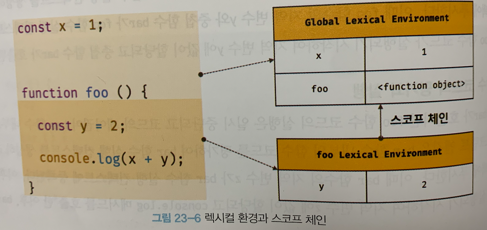

# 23장 실행 컨텍스트

실행 컨텍스트는 자바스크립트의 동작 원리를 담고 있는 핵심 개념이다. 실행 컨텍스트를 바르게 이해하면 자바스크립트가 **스코프를 기반으로 식별자와 식별자에 바인딩된 값을 관리하는 방식**과 **호이스팅이 발생하는 이유**, **클로저의 동작 방식**, 그리고 **태스크 큐와 함께 동작하는 이벤트 핸들러와 비동기 처리의 동작 방식**을 이해할 수 있다.

## 23.1 소스코드의 타입

ECMAScript 사양은 소스코드를 4가지 타입으로 구분한다. 4가지 타입의 소스코드는 실행 컨텍스트를 생성한다.

소스 코드를 4가지 타입으로 구분하는 이유는 소스코드의 타입에 따라 실행 컨텍스트를 생성하는 과정과 관리 내용이 다르기 때문이다.

### 1. 전역코드

전역 코드는 전역 변수를 관리하기 위해 최상위 스코프인 **전역 스코프를 생성**해야 한다. 그리고 `var` 키워드로 선언된 전역 변수와 함수 선언문으로 정의된 전역 함수를 전역 객체의 프로퍼티와 메서드로 바인딩하고 참조하기 위해 전역 객체와 연결되어야 한다. 이를 위해 전역 코드가 평가되면 전역 실행 컨텍스트가 생성된다.

### 2. 함수 코드

함수 코드는 **지역 스코프를 생성**하고 지역 변수, 매개변수, `arguments` 객체를 관리해야 한다. 그리고 생성한 지역 스코프를 전역 스코프에서 시작하는 스코프 체인의 일원으로 연결해야 한다. 이를 위해 함수 코드가 평가되면 함수 실행 컨텍스트가 생성된다.

### 3. eval 코드

`eval` 코드는 **strict mode에서 자신만의 독자적인 스코프**를 생성한다. 이를 위해 `eval` 코드가 평가되면 `eval` 실행 컨텍스트가 생성된다.

### 4. 모듈 코드

모듈 코드는 **모듈별로 독립적인 모듈 스코프를 생성**한다. 이를 위해 모듈 코드가 평가되면 모듈 실행 컨텍스트가 생성된다.

## 23.2 소스코드와 평가와 실행

자바스크립트 엔진은 소스코드를 2개의 과정, 즉 **"소스코드의 평가"**와 **"소스코드의 실행"** 과정으로 나누어 처리한다.

**소스코드 평가** 과정에서는 **실행 컨텍스트를 생성**하고 **변수, 함수 등의 선언문만 먼저 실행**한다. 그리고 생성된 변수나 함수 식별자를 키로 **실행 컨텍스트가 관리하는 스코프(렉시컬 환경의 환경 레코드)에 등록**한다.

소스코드 평가 과정이 끝나면 선언문을 제외한 **소스코드가 순차적으로 실행**, 즉, **런타임이 시작**된다. 이때 **변수나 함수의 참조**를 실행 컨텍스트가 관리하는 스코프에서 검색해서 취득한다. 그리고  **소스코드의 실행 결과는 다시 실행 컨텍스트가 관리하는 스코프에 등록**한다.

예를 들어, 다음과 같은 소스코드가 실행된다고 생각해보자.

```js
var x;
x = 1;
```

자바스크립트 엔진은 위 예제를 2개의 과정으로 나누어 처리한다.

1. 먼저 **소스코드 평가** 과정에서 변수 선언문 `var x;`를 먼저 실행한다. 이때 생성된 변수 식별자 `x`는 실행 컨텍스트가 관리하는 스코프에 등록되고 `undefined`로 초기화 된다.
2. 소스코드 실행 과정이 시작되면, 변수 할당문 `x = 1;`만 실행된다. 

2.에서 변수 할당을 하려면 먼저 `x` 변수가 선언된 변수인지 확인해야 한다. 이를 위해 실행 컨텍스트가 관리하는 스코프에 `x` 변수가 등록되어 있는지 확인한다. 

만약 `x` 변수가 **실행 컨텍스트가 관리하는 스코프에 등록**되어 있다면 `x` 변수는 소스코드 평가 과정에서 **선언문이 실행되어 등록된 변수**다. `x` 변수가 **선언된 변수라면 값을 할당하고 그 결과를 실행 컨텍스트에 등록해 관리**한다.

## 23.3 실행 컨텍스트의 역할

다음 예제는 전역 코드와 함수 코드로 구성되어 있다. 자바스크립트 엔진이 이 예제를 어떻게 평가하고 실행할지 생각해보자.

```js
// 전역 변수 선언
const x = 1;
const y = 2;

// 함수 정의
function foo(a) {
  // 지역 변수 선언
  const x = 10;
  const y = 20;

  // 메서드 호출
  console.log(a + x + y); // 130
}

// 함수 호출
foo(100);

// 메서드 호출
console.log(x + y); // 3
```

### 1. 전역 코드 평가

전역 코드를 평가 하며 실행할 준비를 한다. 소스코드 평가 과정에서는 변수 선언문만 먼저 실행하므로 변수 및 함수 선언문만 실행 컨텍스트가 관리하는 **전역 스코프에 등록**된다. 이때 `var` 키워드로 선언된 전역 변수와 함수 선언문으로 정의된 전역 함수는 전역 객체의 프로퍼티와 메서드가 된다.

### 2. 전역 코드 실행

전역 코드 평가 과정이 끝나면 런타임이 시작되어 **전역 코드가 순차적으로 실행**되기 시작한다. 이때 전역 변수에 값이 할당되고, 함수가 호출된다. **함수가 호출**되면 순차적으로 실행되던 **전역 코드를 일시 중단**하고 코드 실행 순서를 변경해 **함수 내부로 진입**한다.

### 3. 함수 코드 평가

함수 내부로 진입하면 함수 내부의 문들을 실행하기에, 함수 코드 평가 과정을 거친다. 이때 매개변수와 지역 변수 선언문이 먼저 실행되고, 그 결과 **생성된 매개변수와 지역 변수가 실행 컨텍스트가 관리하는 지역 스코프에 등록**된다. 또한 함수 내부에서 지역 변수처럼 사용할 수 있는 **`arguments` 객체가 생성되어 지역 스코프에 등록**되고 **`this` 바인딩도 결정**된다.

### 4. 함수 코드 실행

함수 코드 평가 과정이 끝나면 런타임이 시작돼 함수 코드가 순차적으로 실행된다. 이때 매개변수와 지역 변수에 값이 할당되고 `console.log` 메서드가 호출된다.

`console.log` 메서드를 실행하기 위해 자바스크립트 엔진은 식별자인 `console` 을 먼저 스코프 체인을 통해 검색한다. `console` 식별자는 스코프 체인에 등록되어 있지 않고, 저역 객체의 프로퍼티로 존재한다. 따라서 이는 **전역 객체의 프로퍼티가 마치 전역 변수처럼 전역 스코프를 통해 검색 가능**하다는 것을 의미한다.

다음은 `log` 프로퍼티를 `console` 객체의 프로토 타입 체인을 통해 검색한다. 그후 인수인 `a + x + y` 가 평가된다. 이 식별자들 또한 스코프 체인을 통해 검색한다. 

`console.log` 메서드의 실행이 종료되면 함수 코드 실행 과정이 종료되고 다시 전역 코드 실행을 계속 한다.

---

이처럼 코드가 실행되려면 다음과 같이 스코프, 식별자, 코드 실행 순서 등의 관리가 필요하다.

1. 선언에 의해 생성된 모든 식별자(변수, 함수, 클래스 등)를 스포크를 구분해 등록하고 상태 변화(식별자에 바인딩된 값의 변화)를 지속적으로 관리할 수 있어야한다.
2. 스코프는 중첩 관계에 의해 스코프 체인을 형성해야 한다.
3. 현재 실행 중인 코드의 실행 순서를 변경할 수 있어야 하며 다시 되돌아 갈수도 있어야 한다.

**이 모든 것을 관리하는 것이 실행 컨텍스트다.** **실행 컨텍스트는 소스코드를 실행하는 데 필요한 환경을 제공하고 코드의 실행 결과를 실제로 관리하는 영역이다.**

좀 더 구체적으로 말해, 실행 컨텍스트는 식별자(변수, 함수, 클래스 등의 이름)를 등록하고 관리하는 **스코프**와 **코드 실행 순서를 관리를 구현한 내부 메커니즘**으로,** 모든 코드는 실행 컨텍스트를 통해 실행되고 관리**된다.

식별자와 스코프는 실행 컨텍스트의 **렉시컬 환경**으로 관리하고, 코드 실행 순서는 **실행 컨텍스트 스택**으로 관리한다.

## 23.4 실행 컨텍스트 스택

```js
const x = 1;

function foo () {
  const y = 2;

  function bar () {
    const z = 3;
    console.log(x + y + z);
  }
  bar();
}

foo(); // 6
```

위 코드를 실행할때 생성된 실행 컨텍스트는 스택 자료구조로 관리된다. 이를 **실행 컨텍스트 스택**이라고 부른다.

코드가 실행되는 시간의 흐름에 따라 실행 컨텍스트 스택에는 다음과 같이 실행 컨텍스트가 추가되고 제거된다.

<figure>
  
  <figcaption></figcaption>
</figure>

위 코드의 실행 순서를 실행 컨텍스트 스택으로 어떻게 관리하는 지 살펴보자.

### 1. 전역 코드의 평가와 실행

먼저 전역 실행 컨텍스트를 생성하고 실행 컨텍스트 스택에 푸시한다. 이때 전역 변수 `x`와 전역 함수 `foo`는 전역 실행 컨텍스트에 등록된다. 

### 2. foo 함수 코드의 평가와 실행

전역 함수 `foo`가 호출되면 전역 코드 실행은 일시 중단되고, 코드의 제어권이 `foo` 함수 내부로 이동한다. 자바스크립트 엔진은 `foo` 함수를 평가하여 `foo` 함수 실행 컨텍스트를 생성하고 실행 컨텍스트 스택에 푸시한다.

### 3. bar 함수 코드의 평가와 실행

중첩 함수 `bar`가 호출되면 `foo` 함수 코드의 실행은 일시 중단되고 코드의 제어권이 `bar` 함수로 이동한다. 자바스크립트 엔진은 **`bar` 함수를 평가하고 실행 컨텍스트를 생성하여 실행 컨텍스트 스택에 푸시**한다. 이때 `bar` 함수의 지역 변수 `z`가 실행 컨텍스트에 등록된다. 그리고 `bar` 함수는 종료된다.

### 4. foo 함수 코드로 복귀

`bar` 함수가 종료되면 코드의 제어권은 다시 `foo` 함수로 이동한다. 이때 자바스크립트 엔진은 `bar` **함수 실행 컨텍스트를 실행 컨텍스트 스택에서 팝하여 제거**한다. 그리고 `foo` 함수는 종료된다.

### 5. 전역 코드로 복귀

`foo` 함수가 종료되면 코드의 제어권은 다시 전역 코드로 이동한다. 이때 자바스크립트 엔진은 **`foo` 함수 실행 컨텍스트를 실행 컨텍스트 스택에서 팝하여 제거**한다. 그리고 더이상 실행할 전역 코드가 남아있지 않으므로 **전역 실행 컨텍스트 또한 실행 컨텍스트에서 팝하여 제거**된다. 실행 컨텍스트에는 아무것도 남아있지 않게 된다.

---
이처럼 **실행 컨텍스트 스택은 코드의 실행 순서를 관리한다.** 

소스코드가 평가되면 실행 컨텍스트가 생성되고 실행 컨텍스트 스택의 최상위에 쌓인다. **실행 컨텍스트 스택의 최상위에 존재하는 실행 컨텍스트는 언제나 현재 실행 중인 코드의 실행 컨텍스트**다. 따라서 실행 컨텍스트 스택의 최상위에 존재하는 실행 컨텍스트를 **실행중인 실행 컨텍스트**라 부른다.

## 23.5 렉시컬 환경

렉시컬 환경은 **식별자와 식별자에 바인딩된 값**, 그리고 **상위 스코프에 대한 참조**를 기록하는 **자료구조**로 실행 컨텍스트를 구성하는 컴포넌트다.

실행 컨텍스트 스택이 실행 순서를 관리한다면 **렉시컬 환경은 스코프와 식별자를 관리한다**.

렉시컬 환경은 키와 값을 갖는 객체 형태의 스코프를 생성하여 식별자를 키로 등록하고 식별자에 바인딩 된 값을 관리한다.

<figure>
  
  <figcaption></figcaption>
</figure>

즉, 렉시컬 환경은 **스코프를 구분해 식별자를 등록하고 관리**하는 저장소 역할을 하는 **렉시컬 스코프의 실체**다.

실행 컨텍스트는 `LexicalEnvironment` 컴포넌트와 `VariableEnvironment` 컴포넌트로 구성된다. 생성 초기에  `LexicalEnvironment` 컴포넌트와 `VariableEnvironment`는 하나의 동일한 렉시컬 환경을 참조한다. 이후 몇 가지 상황을 만나면 `VariableEnvironment` 컴포넌트를 위한 새로운 렉시컬 환경을 생성해 서로 내용이 달라지는 경우도 있다. 하지만 이 책에서는 구분하지 않고 렉시컬 환경으로 통일해 간략하게 설명하려 한다.

렉시컬 환경은 다음과 같이 두 개의 컴포넌트로 구성된다.

1. 환경 레코드
   
   **스코프에 포함된** **식별자를 등록하고 등록된 식별자에 바인딩된 값을 관리하는 저장소**다. 환경 레코드는 소스코드의 타입에 따라 관리하는 내용에 차이가 있다.

2. 외부 렉시컬 환경에 대한 참조
   
   **외부 렉시컬 환경에 대한 참조는 상위 스코프**를 가리킨다. 이때 상위 스코프란 외부 렉시컬 환경, 즉 **해당 실행 컨텍스트를 생성한 소스코드를 포함하는 상위 코드의 렉시컬 환경**을 말한다.


## 23.6 실행 컨텍스트의 생성과 식별자 검색 과정

다음 예제를 통해 어떻게 실행 컨텍스트가 생성되고 코드 실행 결과가 관리되는지, 어떻게 실행 컨텍스트를 통해 식별자를 검색하는 지 살펴보자.

```js
var x = 1;
const y = 2;

function foo (a) {
  var x = 3;
  const y = 4;

  function bar (b) {
    const z = 5;
    console.log(a + b + x + y + z);
}
  bar(10);
}

foo(20); // 42
```

### 23.6.1 전역 객체 생성

**전역 객체는 전역 코드가 평가되기 이전에 생성**된다. 이때 전역 객체에는 빌트인 전역 프로퍼티와 전역 함수, 그리고 표준 빌트인 객체가 추가되며, 동작 환경에 따라 클라이언트 사이드 WebAPI 혹은 호스트 객체를 포함한다.

### 23.6.2 전역 코드 평가

소스코드가 로드되면 자바스크립트 엔진은 전역 코드를 다음과 같은 순서로 평가한다.

1. 전역 실행 컨텍스트 생성
2. 전역 렉시컬 환경 생성
   1. 전역 환경 레코드 생성
      1. 객체 환경 레코드 생성
      2. 선언적 환경 레코드 생성
   2. `this` 바인딩
   3. 외부 렉시컬 환경에 대한 참조 설정 

위 과정을 거쳐 생성된 전역 실행 컨텍스트와 렉시컬 환경은 다음과 같다.

<figure>
  
  <figcaption></figcaption>
</figure>

_**1. 전역 실행 컨텍스트 생성**_

먼저 비어있는 전역 실행 컨텍스트를 생성해 실행 컨텍스트 스택에 푸시한다. 이때 전역 실행 컨텍스트는 실행 컨텍스트 스택의 최상위 실행 컨텍스트, 즉 실행 중인 실행 컨텍스트가 된다.

_**2. 전역 렉시컬 환경 생성**_

전역 렉시컬 환경을 생성하고 **전역 실행 컨텍스트에 바인딩**한다. 앞서 보았듯 렉시컬 환경은, 환경 레코드와 외부 렉시컬 환경에 대한 참조 2개의 컴포넌트로 구성된다.

_**2.1 전역 환경 레코드 생성**_

**전역 환경 레코드**는 **전역 스코프, 전역 객체의 빌트인 전역 프로퍼티와 빌트인 전역 함수, 표준 빌트인 객체를 제공**한다.

ES6 이전에는 모든 전역 변수가 전역 객체의 프로퍼티가 되었기에 전역 객체가 전역 환경 레코드의 역할을 수행했다. 하지만 ES6 이후 등장한 `let`, `const` 키워드로 선언한 전역 변수는 전역 객체의 프로퍼티가 되지 않고 개념적 블록에 존재하게 된다. 이처럼 기존 `var` 키워드로 선언한 변수와 `let`, `const`로 선언한 변수를 **구분해 관리하기 위해 전역 환경 레코드는 객체 환경 레코드와 선언적 환경 레코드로 구성되어 있다**.

**객체 환경 레코드**는 기존 전역 객체가 관리하던 `var` 키워드로 선언한 전역 변수와 함수 선언문으로 정의한 전역 함수, 빌트인 전역 프로퍼티/전역 함수, 표준 빌트인 객체를 관리한다.

**선언적 환경 레코드**는 `let`, `const` 키워드로 선언한 전역 변수를 관리한다.

즉, 전역 환경 레코드의 객체 환경 레코드와 선언적 환경 레코드는 서로 협력하여 전역 스코프와 전역 객체를 관리한다.

_**2.1.1 객체 환경 레코드 생성**_

객체 환경 레코드는 `BindingObject`라고 부르는 객체와 연결된다. **`BindingObject`는 전역 객체 생성에서 생성된 전역 객체다.**

전역 코드 평가 과정에서 `var` 키워드로 선언한 전역 변수와 함수 선언문으로 정의된 전역 함수는 전역 환경 레코드의 **객체 환경 레코드에 연결된 `BindingObject`를 통해** 전역 객체의 프로퍼티와 메서드가 된다.

이것이 `var` 키워드로 선언된 전역 변수와 함수 선언문으로 정의된 전역 함수가 전역 객체의 프로퍼티와 메서드가 되고, 전역 객체를 가리키는 식별자(window)없이 전역 객체의 프로퍼티를 참조할 수 있는 메커니즘이다.

위 예제의 경우, 전역 변수 `x`와 전역 함수 `foo`는 객체 환경 레코드를 통해 `BindingObject`에 바인딩되어 있는 전역 객체의 프로퍼티와 메서드가 된다.

_**2.1.2 선언적 환경 레코드 생성**_

`let`, `const` 키워드로 선언한 전역 변수는 선언적 환경 레코드에 등록되고 관뢰된다.

앞서, `let` 과 `const`는 전역 객체가 아닌 개념적인 블록내에 존재한다고 했다. 여기서 **개념적인 블록이 바로 선언적 환경 레코드다.**

_**2.2 this 바인딩**_

전역 환경 레코드의 `[[GlobalThisValue]]` 내부 슬롯에 `this`가 바인딩 된다. 참고로 객체 환경 레코드와 선언적 환경 레코드에는 `this` 바인딩이 없다. `this` 바인딩은 전역 환경 레코드와 함수 환경 레코드에만 존재한다.

_**2.3 외부 렉시컬 환경에 대한 참조 결정**_

외부 렉시컬 환경에 대한 참조는 현재 평가 중인 소크포드를 포함하는 외부 소스코드의 렉시컬 환경, 즉 **상위 스코프를 가리킨다.** 이를 통해 **단방향 링크드 리스트인 스코프 체인을 구현한다.**

현재 평가 중인 소스코드는 전역 코드다. 전역 코드를 포함하는 소스코드는 없으므로 전역 렉시컬 환경의 외부 렉시컬 환경에 대한 참조에 `null`이 할당된다. 이는 **전역 렉시컬 환경이 스코프 체인의 종점에 존재함**을 의미한다.

### 23.6.3 전역 코드 실행

이제 전역 코드가 순차적으로 실행된다. 

변수 할당문 또는 함수 호출문을 실행하려면 먼저 변수 또는 함수 이름이 선언된 식별자인지 확인해야 한다. 

예를 들어, 동일한 이름의 식별자가 다른 스코프에 여러 개 존재할 수 있다. 따라서 어느 스코프의 식별자를 참조하면 되는지 결정할 필요가 있는데, 이를 **식별자 결정**이라 한다.

**식별자 결정을 위해 식별자를 검색할 때는 실행 중인 실행 컨텍스트에서 식별자를 검색하기 시작한다.** 선언된 **식별자**는 실행 컨텍스트의 **렉시컬 환경의 환경 레코드에 등록**되어 있다.

실행 중인 실행 컨텍스트의 렉시컬 환경에서 식별자를 검색할 수 없으면, **외부 렉시컬 환경에 대한 참조가 가리키는 렉시컬 환경**, 즉 **상위 스코프로 이동하여 식별자를 검색**한다.

이것이 바로 **스코프 체인의 동작 원리**다.

### 23.6.4 foo 함수 코드 평가

현재 전역 코드 평가 후, 전역 실행 컨텍스트가 생성되었고 전역 코드를 실행하고 있다. 현재 `foo` 함수는 호출하기 직전이다.

`foo` 함수가 호출되면 전역 코드의 실행을 일시 중단하고 `foo` 함수 내부로 코드의 제어권이 이동한다. 그리고 함수 코드를 평가하기 시작한다. 함수 코드 평가는 아래 순서로 진행된다.

1. 함수 실행 컨텍스트 생성
2. 함수 렉시컬 환경 생성
   1. 함수 환경 레코드 생성
   2. `this` 바인딩
   3. 외부 렉시컬 환경에 대한 참조 결정을

_**1. 함수 실행 컨텍스트 생성**_

먼저 `foo` 함수 실행 컨텍스트를 생성한다. 생성된 실행 컨텍스트는 함수 렉시컬 환경이 완성된 다음 실행 컨텍스트 스택에 푸시될 것이다. 이때 `foo` 함수 실행 컨텍스트는 실행중인 실행 컨텍스트가 된다.

_**2. 함수 렉시컬 환경 생성**_

`foo` 함수 렉시컬 환경을 생성하고 `foo` 함수 실행 컨텍스트에 바인딩한다. 앞서 살펴보았듯, 동일하게 렉시컬 환경은 환경 레코드와 외부 렉시컬 환경에 대한 참조로 구성된다.

_**2.1 함수 환경 레코드 생성**_

함수 환경 레코드는 **매개 변수**, **`arguments` 객체**, **함수 내부에서 선언한 지역 변수와 중첩 함수를 등록하고 관리**한다.

_**2.2 this 바인딩**_

함수 환경 레코드의 `[[ThisValue]]` 내부 슬롯에 `this`가 바인딩된다. `[[ThisValue]]`에 바인딩 될 객체는 앞선 22장 "this"에서 살펴보았듯, 함수 호출 방식에 따라 결정된다.

_**2.3. 외부 렉시컬 환경에 대한 참조 결정**_

외부 렉시컬 환경에 대한 참조는 `foo` **함수 정의가 평가된 시점에 실행 중인 실행 컨텍스트의 렉시컬 환경의 참조가 할당**된다. 

`foo` 함수는 전역 코드에 정의된 전역 함수다. 따라서 이 경우, 실행 중인 실행 컨텍스트는 전역 컨텍스트이며, 외부 렉시컬 환경에 대한 참조에는 전역 렉시컬 환경의 참조가 할당된다.

자바스크립트는 **함수를 어디에 정의했는 지에 따라 상위 스코프를 결정**한다. 그리고 함수 객체는 자신이 정의된 스코프, 즉 상위 스코프를 기억한다.

자바스크립트 엔진은 함수 정의를 평가해 함수 객체를 생성할 때, 현재 실행 중인 실행 컨텍스트의 렉시컬 환경, **함수의 상위 스코프를 함수 객체의 내부 슬롯 `[[Environment]]`에 저장**한다. 즉, **외부 렉시컬 환경에 대한 참조**에 할당되는 것은 바로 **함수의 상위 스코프를 가리키는 함수 객체의 내부 슬롯 `[[Environment]]`에 저장된 렉시컬 환경에 대한 참조**다. 그리고 이것이 바로 렉시컬 스코프를 구현하는 메커니즘이다.

### 23.6.5 foo 함수 코드 실행

이제 런타임이 실행되어 `foo` 함수의 소스코드가 순차적으로 실행되기 시작한다. 매개변수에 인수가 할당되고, 변수 할당문이 실행되어 지역 변수 `x`, `y`에 값이 할당된다. 그리고 `bar` 함수가 실행된다.

이때 식별자 결정을 위해 실행 중인 실행 컨텍스트의 렉시컬 환경에서 식별자를 검색하기 시작한다. 만약 실행 중인 실행 컨텍스트의 렉시컬 환경에서 식별자를 검색할 수 없으면 외부 렉시컬 환경에 대한 참조가 가리키는 렉시컬 환경으로 이동해 식별자를 검색한다.

### 23.6.6 bar 함수 코드 평가

`bar` 함수가 호출되면 `bar` 함수 내부로 코드의 제어권이 이동한다. 그리고 `bar` 함수 코드를 평가하기 시작한다. 실행 컨텍스트와 렉시컬 환경의 생성 과정은 `foo` 함수 코드 ㅍ여가와 동일하다.

### 23.6.7 bar 함수 코드 실행

이제 런타임이 실행되어 `bar` 함수의 소스코드가 순차적으로 실행되기 시작한다. 매개변수에 인수가 할당되고, 변수 할다움ㄴ이 실행되어 지역 변수 `z` 에 값이 할당된다. 그리고 `console.log(a + b + x + y + z);`가 실행된다. 이 코드는 다음 순서로 실행된다.

**1. console 식별자 검색**

먼저 `console` 식별자를 스코프 체인에서 검색한다.

스코프 체인은 현재 실행 중인 실행 컨텍스트의 렉시컬 환경에서 시작해 외부 렉시컬 환경에 대한 참조로 이어지는 렉시컬 환경의 연속이다.

현재 실행 중인 실행 컨텍스트는 `bar` 함수 실행 컨텍스트다. 이곳에는 `console` 식별자가 없으므로 상위 스코프, 즉 외부 렉시컬 환경에 대한 참조가 가리키는 `foo` 함수 렉시컬 환경으로 이동해 `console` 식별자를 검색한다.

이곳에도 없으므로 상위 스코프, 즉 전역 렉시컬 환경으로 이동하여 검색한다. 전역 렉시컬 환경의 객체 환경 레코드의 `BindingObject`를 통해 전역 객체에서 `console` 식별자를 찾을 수 있다.

**2. log 메서드 검색**

이제 `console` 식별자에 바인딩된 객체, 즉 `console` 객체에서 `log` 메서드를 검색한다. 이때 `console` 객체의 프로토타입 체인을 통해 메서드를 검색한다. 

**3. 표현식 a + b + x + y + z 의 평가**

이제 `console.log` 메서드에 전달할 인수, 즉 표현식 `a + b + x + y + z` 를 평가하기 위해 각 식별자를 검색한다. 이또한 스코프 체인, 즉 외부 렉시컬 환경에 대한 참조가 이어지는 렉시컬 환경의 연속에서 검색한다.

**4. console.log 메서드 호출**

표현식 `a + b + x + y + z`가 평가되어 생성한 값을 `console.log` 메서드에 전달하여 호출한다.

### 23.6.8 bar 함수 코드 실행 종료

`bar` 함수에는 더이상 실행할 코드가 남아있지 않으므로 실행이 종료된다. 이때 실행 컨텍스트 스택에서 `bar` 함수 실행 컨텍스트가 팝되어 제거되고 실행 중인 실행 컨텍스트는 다시 `foo` 실행 컨텍스트가 된다.

실행 컨텍스트 스택에서 `bar` 함수 실행 컨텍스트가 제거되었다고 해서 `bar` 함수 **렉시컬 환경까지 즉시 소멸하는 것은 아니다.** 렉시컬 환경은 실행 컨텍스트에 의해 참조되기는 하지만 독립적인 객체다. 따라서 누군가에 의해 참조되지 않을 때 비로소 가비지 컬렉터에 의해 메모리 공간의 확보가 해제되어 소멸한다.

즉, `bar` 함수 실행 컨텍스트가 제거되었다 하더라도 만약 그 렉시컬 환경을 **누군가 참조하고 있다면 `bar` 함수 렉시컬 환경은 소멸하지 않는다.**

### 23.6.9 foo 함수 코드 실행 종료

`bar` 함수가 종료 하면 더 이상 실행할 코드가 없으므로, `foo` 함수 코드의 실행이 종료되고, 실행 컨텍스트 스택에서 `foo` 함수 실행 컨텍스트가 팝되어 제거되고 전역 실행 컨텍스트가 실행 중인 실행 컨텍스트가 된다.

### 23.6.19 전역 코드 실행 종료

`foo` 함수가 종료되면 더 실행할 전역 코드가 없으므로 전역 코드의 실행이 종료 되고, 전역 실행 컨텍스트도 실행 컨텍스트 스택에서 팝되어 실행 컨텍스트 스택에는 아무것도 남아있지 않게 된다.

## 23.7 실행 컨텍스트와 블록 레벨 스코프

`var` 키워드로 선언한 변수는 오로지 함수의 코드 블록만 지역 스코프로 인정하는 함수 레벨 스코프를 따른다. 

하지만 `let`, `const` 키워드로 선언한 변수는 모든 코드 블록을 지역 스코프로 인정하는 블록 레벨 스코프를 따른다.

```js
let x = 1;

if (true) {
  let x = 10;
  console.log(x); // 10
}

console.log(x); // 1
```

`if` 문의 코드 블록 내에서 `let` 키워드로 변수가 선언됐기에, `if` 문의 코드 블록이 실행되면 **`if` 문의 코드 블록을 위한 블록 레벨 스코프를 생**성해야 한다. 이를 위해 **선언적 환경 레코드를 갖는 렉시컬 환경을 새롭게 생성해 기존의 전역 렉시컬 환경을 교체** 한다. 이때 새롭게 생성된 `if` 문의 코드 블록을 위한 렉시컬 환경의 외부 렉시컬 환경에 대한 참조는 `if` 문 실행되기 이전의 전역 렉시컬 환경을 가리킨다. 이는 모든 블록문에 적용된다.

`for` 문의 변수 선언문에 `let` 키워드를 사용하면 코드 블록이 반복되어 실행될 때마다 코드 블록을 위한 새로운 렉시컬 환경을 생성한다. 만약 이 코드 블록내에 정의된 함수가 있다면 이 함수의 상위 스코프는 `for` 문의 코드 블록이 생성한 렉시컬 환경이다.

이때 함수의 상위 스코프는 코드 블록이 반복해서 실행될 때마다 식별자의 값을 유지해야한다. 이를 위해 `for` 문의 코드 블록이 반복해서 실행될 때마다 **독립적인 렉시컬 환경을 생성하여 식별자의 값을 유지**한다. 이에 대해서는 다음 장 24장 클로저에서 자세히 살펴보자.