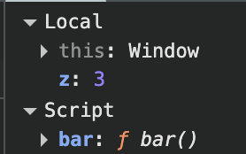
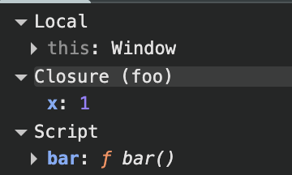

# 24장 클로저

클로저는 자바스크립트 고유의 개념이 아니다. 따라서 클로저의 정의가 ECMAScript 사양에 등장하지 않는다. MDN에서는 클로저에 대해 다음과 같이 정의하고 있다.

> 클로저는 함수와 그 함수가 선언된 렉시컬 환경과의 조합이다.

정의가 무척 난해하다. 예제를 통해 정의의 의미부터 살펴보자. 위 정의에서 먼저 이해해야 할 핵심 키워드는 "**함수가 선언된 렉시컬 환경**"이다.

```js
const x = 1;

function outerFunc() {
  const x = 10;

  function innerFunc() {
    console.log(x); // 10
  }

  innerFunc();
}

outerFunc();
```

`outerFunc` 함수 내부에서 중첩 함수 `innerFunc`가 정의되고 호출되었다. 이때 중첩 함수 `innerFunc`의 상위 스코프는 외부 함수 `outerFunc`의 스코프다. 따라서 중첩 함수 `innerFunc` 내부에서 자신을 포함하고 있는 외부 함수 `outerFunc`의 `x` 변수에 접근할 수 있다.

만약 `innerFunc` 함수가 `outerFunc` **함수의 외부에서 정의되었다면**, `innerFunc` 함수를 `outerFunc` 함수의 내부에서 호출한다 하더라도 `outerFunc` 함수의 **변수에 접근할 수 없다**.

이 같은 현상이 발생하는 이유는 **자바스크립트가 렉시컬 스코프를 따르는 프로그래밍 언어이기 때문이다.**

## 24.1 렉시컬 스코프

자바스크립트 엔진은 함수를 어디서 호출했는지가 아니라 **함수를 어디에 정의했는지에 따라 상위 스코프를 결정**한다. 이를 **렉시컬 스코프(정적 스코프)**라 한다.

```js
const x = 1;

function foo() {
  const x = 10;
  bar();
}

function bar() {
  console.log(x);
}

foo(); // ?
bar(); // ?
```

위 예제의 `foo` 함수와 `bar` 함수는 모두 전역에서 정의된 전역 함수다. 함수의 상위 스코프는 함수를 어디서 정의했느냐에 따라 결정되므로, 각 함수의 상위 스코프는 전역이다. 함수를 어디서 호출하는 지는 함수의 상위 스코프 결정에 어떠한 영향도 주지 못한다. 즉, 함수의 상위 스코프는 함**수를 정의한 위치에 의해 정적으로 결정되고 변하지 않는다**.

23장 "실행 컨텍스트"에서 살펴보았듯, **스코프의 실체는 실행 컨텍스트의 렉시컬 환경**이다. 이 렉시컬 환경은 자신의 외부 렉시컬 환경에 대한 참조를 통해 상위 렉시컬 환경과 연결된다. 이것이 바로 스코프 체인이다.

따라서 "**함수의 상위 스코프를 결정한다**" === "**렉시컬 환경의 외부 렉시컬 환경에 대한 참조에 저장할 참조값을 결정한다**" 라고 볼 수 있다. 렉시컬 환경의 "외부 렉시컬 환경에 대한 참조"에 저장할 참조값이 바로 상위 렉시컬 환경에 대한 참조이며, 이것이 상위 스코프이기 때문이다. 이 개념을 반영해 다시 한번 렉시컬 스코프를 정의해 보면 다음과 같다.

렉시컬 환경의 **외부 렉시컬 환경에 대한 참조에 저장할 참조값**, 즉 **상위 스코프에 대한 참조**는 **함수 정의 가 평가되는 시점**에 **함수가 정의된 환경(위치)에 의해 결정**된다. 이것이 바로 **렉시컬 스코프**다.

## 24.2 함수 객체의 내부 슬롯 [[Environment]]

렉시컬 스코프가 가능하려면 함수는 자신이 정의된 환경, 즉 상위 스코프를 기억해야 한다. 이를 위해 함수는 자신의 내부 슬롯 `[[Environment]]`에 자신이 정의된 환경, 즉 상위 스코프의 참조를 저장한다.

`[[Environment]]`에 저장된 상위 스코프의 참조는 현재 실행 중인 실행 컨텍스트의 렉시컬 환경을 가리킨다.

왜냐하면 함수 정의가 평가되는 시점은, 상위 함수(또는 전역 코드)가 평가 또는 실행되는 시점이기 때문이다. 그리고 이때 실행 중인 실행 컨텍스트는 상위 함수(또는 전역 코드)의 실행 컨텍스트이기 때문이다.

예를 들어, 함수 내부에서 정의된 함수 표현식은 **외부 함수 코드가 실행되는 시점에 평가**되어 함수 객체를 생성한다. 이때 생성된 함수 객체의 내부 슬롯 `[[Environment]]`에는 함수 정의가 평가되는 시점, 즉 외부 함수 코드 실행 시점에 실행 중인 실행 컨텍스트의 렉시컬 환경인 외부 함수 렉시컬 환경의 참조가 저장된다.

따라서 **함수 객체의 내부 슬롯 `[[Environment]]`에 저장된 현재 실행 중인 실행 컨텍스트의 렉시컬 환경의 참조가 바로 상위 스코프**다. 또한 자신이 호출되었을 때 생성될 함수 렉시컬 환경의 외부 렉시컬 환경에 대한 참조에 저장될 참조 값이다. 함수 객체는 내부 슬롯 `[[Environment]]`에 저장한 **렉시컬 환경의 참조**, 즉 **상위 스코프를 자신이 존재하는 한 기억**한다.

렉시컬 스코프에서 살펴보았던 예제를 다시 한번 살펴보자.

```js
const x = 1;

function foo() {
  const x = 10;

  // 상위 스코프는 함수 정의 환경(위치)에 따라 결정된다.
  // 함수 호출 위치와 상위 스코프는 아무런 관계가 없다.
  bar();
}

// 함수 bar는 자신의 상위 스코프, 즉 전역 렉시컬 환경을 [[Environment]]에 저장하여 기억한다.
function bar() {
  console.log(x);
}

foo(); // ?
bar(); // ?
```

`foo` 함수와 `bar` 함수는 모두 전역에서 함수 선언문으로 정의되었다. 따라서 모두 전역 코드가 평가되는 시점에 평가되어 전역 객체 `window` 의 메서드가 된다. 이때 생성된 함수 객체의 내부 슬롯 `[[Environment]]`에는 전역 코드 평가 시점에 실행중인 실행 컨텍스트의 렉시컬 환경인 전역 렉시컬 환경의 참조가 저장된다.

함수가 호출되면 코드의 제어권은 함수 내부로 이동하며 함수 코드를 평가하기 시작한다. 이때 함수 렉시켤 환경의 구성 요소인 **외부 렉시컬 환경에 대한 참조**에는 함수 객체의 내부 슬롯 **`[[Environment]]`에 저장된 렉시컬 환경의 참조가 할당**된다.

## 24.3 클로저와 렉시컬 환경

다음 예제를 살펴보자.

```js
const x = 1;

// ①
function outer() {
  const x = 10;
  const inner = function () { console.log(x); }; // ②
  return inner;
}

// outer 함수를 호출하면 중첩 함수 inner를 반환한다.
// 그리고 outer 함수의 실행 컨텍스트는 실행 컨텍스트 스택에서 팝되어 제거된다.
const innerFunc = outer(); // ③
innerFunc(); // ④ 10
```

`outer` 함수를 호출하면 `outer` 함수는 중첩 함수 `inner`를 반환하고 생명 주기를 마감한다. 즉, `outer` 함수의 실행이 종료되면 `outer` 함수의 실행 컨텍스트는 실행 컨텍스트 스택에서 제거된다. 이때 `outer` 함수의 지역 변수 `x`와 변수 값 10을 저장하고 있던 `outer` 함수의 실행 컨텍스트가 제거되었으므로 `outer` 함수의 지역 변수 `x` 또한 생명 주기를 마감한다. 따라서 `outer` 함수의 지역 변수 `x` 에는 더이상 접근할 방법이 없어보인다.

그러나 위 코드의 실행결과(4)는 10이다.  

**외부 함수보다 중첩 함수가 더 오래 유지되는 경우** 중첩 함수는 **이미 생명 주기가 종료한 외부 함수의 변수를 참조**할 수 있다. 이러한 중첩 함수를 **클로저**라고 부른다.

다시 클로저에 대한 MDN의 정의로 돌아가 보자.

> 클로저는 함수와 그 함수가 선언된 렉시컬 환경과의 조합이다.

렉시컬 스코프에서 살펴보았듯 위 정의에서 "**그 함수가 선언된 렉시컬 환경**" 이란 **함수가 정의된 위치의 스코프**, **즉 상위 스코프를 의미하는 실행 컨텍스트의 렉시컬 환경**을 말한다.

자바스크립트의 모든 함수는 자신의 상위 스코프를 기억한다. 따라서 함수를 어디서 호출하든 상관없이 함수는 언제나 자신이 기억하는 상위 스코프의 식별자를 참조할 수 있으며 식별자에 바인딩된 값을 변경할 수도 있다.

위 예제에서 `inner` 함수는 자신이 평가될 때 자신이 정의된 위치에 의해 결정된 상위 스코프를 `[[Environment]]` 내부 슬롯에 저장한다. 이때 저장된 상위 스코프는 함수가 존재하는 한 유지된다.


위 예제에서 `outer` 함수가 평가되어 함수 객체를 생성할 때(1) 현재 실행 중인 실행 컨텍스트의 렉시컬 환경, 즉 전역 렉시컬 환경을 `outer` 함수 객체의 `[[Environment]]` 내부 슬롯에 상위 스코프로서 저장한다.

`outer` 함수를 호출하면 `outer` 함수의 렉시컬 환경이 생성되고 앞서 `outer` 함수 객체의 **`[[Environment]]` 내부 슬롯에 저장된 전역 렉시컬 환경**을 `outer` 함수 렉시컬 환경의 **"외부 렉시컬 환경에 대한 참조"에 할당**한다.

그리고 중첩 함수 `inner`가 평가된다.(2 `inner` 함수는 함수 표현식으로 정의했기 때문에 런타임에 평가된다). 이때 중첩 함수 `inner`는 자신의 **`[[Environment]]` 내부 슬롯에 현재 실행 중인 실행 컨텍스트의 렉시컬 환경**, 즉 **`outer` 함수의 렉시컬 환경을 상위 스코프로서 저장**한다.

`outer` 함수의 실행이 종료하면 `inner` 함수를 반환하면서 `outer` 함수의 생명 주기가 종료된다. 즉, `outer` 함수의 실행 컨텍스트가 실행 컨텍스트 스택에서 제거된다. 이때 **`outer` 함수의 실행 컨텍스트는 실행 컨텍스트 스택에 제거되지만 `outer` 함수의 렉시컬 환경까지 소멸하는 것은 아니다.**

`outer` 함수의 렉시컬 환경은 **`inner` 함수의 `[[Environment]]` 내부 슬롯에 의해 참조**되고 있고 `inner` 함수는 전역 변수 `innerFunc`에 의해 참조되고 있다. 따라서, 가비지 컬렉션의 대상이 되지 않는다.

`outer` 함수가 반환한 `inner` 함수를 호출(4)하면 `inner` 함수의 실행 컨텍스트가 생성되고 실행 컨텍스트 스택에 푸시된다. 그리고 렉시컬 환경의 외부 렉시컬 환경에 대한 참조에는 `inner` 함수 객체의 `[[Environment]]` 내부 슬롯에 저장되어 있는 참조값이 할당된다.


중첩 함수 `inner`는 외부 함수 `outer` 보다 오래 생존했다. 외부 함수보다 **더 오래 생존한 중첩 함수**는 외부 함수의 생존 여부(실행 컨텍스트의 생존 여부)와 **상관없이 자신이 정의된 위치에 의해 결정된 상위 스코프를 기억**한다.

자바스크립트의 모든 함수는 상위 스코프를 기억하므로 이론적으로 모든 함수는 클로저다. 하지만 일반적으로 모든 함수를 클로저라고 하지는 않는다. 다음 예제를 브라우저에서 디버깅 모드로 실행해보자.

```html
<!DOCTYPE html>
<html>
<body>
  <script>
    function foo() {
      const x = 1;
      const y = 2;

      // 일반적으로 클로저라고 하지 않는다.
      function bar() {
        const z = 3;

        debugger;
        // 상위 스코프의 식별자를 참조하지 않는다.
        console.log(z);
      }

      return bar;
    }

    const bar = foo();
    bar();
  </script>
</body>
</html>
```

<figure>
  
  <figcaption></figcaption>
</figure>

위 예제의 중첩 함수 `bar` 는 외부 함수보다 오래 생존했지만 **상위 스코프의 어떠한 식별자도 참조하지 않는다**. 이와 같은 경우, 대부분의 **모던 브라우저는 최적화를 통해 상위 스코프를 기억하지 않는다**. 따라서 `bar` 함수는 클로저라고 할 수 없다.

또 다른 예제를 살펴보자.

```js
<!DOCTYPE html>
<html>
<body>
  <script>
    function foo() {
      const x = 1;

      // 일반적으로 클로저라고 하지 않는다.
      // bar 함수는 클로저였지만 곧바로 소멸한다.
      function bar() {
        debugger;
        // 상위 스코프의 식별자를 참조한다.
        console.log(x);
      }
      bar();
    }

    foo();
  </script>
</body>
</html>
```

<figure>
  
  <figcaption></figcaption>
</figure>

위 예제의 경우 중첩 함수 `bar` 가 상위 스코프의 식별자를 참조하고 있으므로 클로저다. 하지만 외부 함수 `foo`의 외부로 중찹 함수 `bar` 가 반환되지는 않는다. 즉, 외부 함수 `foo`보다 중첩 함수 `bar`의 생명 주기가 짧다. 이런 경우, `bar`는 **클로저였지만 외부 함수보다 일찍 소멸**되기 때문에 **생명 주기가 종료된 외부 함수의 식별자를 참조할 수 있다는 클로저의 본질에 부합하지 않는다**. 따라서 `bar`는 일반적으로 클로저라고 하지 않는다.

또 다른 예제를 살펴보자.

```js
<!DOCTYPE html>
<html>
<body>
  <script>
    function foo() {
      const x = 1;
      const y = 2;

      // 클로저
      // 중첩 함수 bar는 외부 함수보다 더 오래 유지되며 상위 스코프의 식별자를 참조한다.
      function bar() {
        debugger;
        console.log(x);
      }
      return bar;
    }

    const bar = foo();
    bar();
  </script>
</body>
</html>
```

위 예제의 중첩 함수 `bar`는 상위 스코프의 식별자를 참조하고 있다. 또한 외부 함수의 외부로 반환되어 외부 함수보다 더 오래 살아남는다.

클로저는 **중첩 함수가 상위 스코프의 식별자를 참조**하고 있고, 중첩 함수가 **외부 함수보다 더 오래 유지되는 경우에 한정**하는 것이 **일반적**이다.

다만 상위 스코프의 식별자중 `y`만 참조하고 있다. 이런 경우 대부분 모던 브라우저는 최적화를 통해 식별자 중 클로저가 참조하고 있는 식별자만을 기억한다.

**클로저에 의해 기억되는 상위 스코프의 변수**를 **자유 변수**라고 부른다. 클로저란 "함수가 자유 변수에 대해 닫혀있다"라는 의미다. 이를 좀 더 알기 쉽게 의역하자면 "**자유 변수에 묶여있는 함수**"라고 할 수 있다.

이론적으로 클로저는 상위 스코프를 기억해야 하므로 불필요한 메모리의 점유를 걱정할 수 있다. 하지만 앞서 말했듯 모던 브라우저는 최적화를 통해 **기억해야 할 식별자만 기억**한다. 이는 메모리의 불필요한 사용이라고 볼 수 없다.

클로저는 자바스크립트의 강력한 기능으로, 필요하다면 적극적으로 활용해야 한다.

## 24.4 클로저의 활용

클로저는 **상태를 안전하게 변경하고 유지하기 위해 사용**한다. 상태가 의도치 않게 변경되지 않도록 상태를 안전하게 은닉하고 **특정 함수에게만 상태 변경을 허용하기 위해 사용**한다.

함수가 호출될 때마다 호출된 횟수를 누적하여 출력하는 카운터를 만들어보자. 이 예제의 **호출된 횟수**가 바로 **안전하게 변경하고 유지해야 할 상태**다.

```js
// 카운트 상태 변수
let num = 0;

// 카운트 상태 변경 함수
const increase = function () {
  // 카운트 상태를 1만큼 증가 시킨다.
  return ++num;
};

console.log(increase()); // 1
console.log(increase()); // 2
console.log(increase()); // 3
```

카운트 상태는 전역 변수를 통해 관리되고 있기에 언제든 누구나 접근할 수 있고 변경할 수 있다. 이는 의도치 않게 상태가 변경될 수 있다는 것을 의미한다.

따라서 카운트 상태를 안전하게 변경하고 유지하기 위해서는 **`increase` 함수만이 `num` 변수를 참조하고 변경할 수 있게 하는 것**이 바람직 하다. 이를 위해 전역 변수 `num` 을 지역 변수로 바꾸어 의도치 않은 상태 변경을 방지해 보자.

```js
// 카운트 상태 변경 함수
const increase = function () {
  // 카운트 상태 변수
  let num = 0;

  // 카운트 상태를 1만큼 증가 시킨다.
  return ++num;
};

// 이전 상태를 유지하지 못한다.
console.log(increase()); // 1
console.log(increase()); // 1
console.log(increase()); // 1
```

이제 확실히 `num` 변수 상태는 `increase` 함수만이 변경할 수 있다. 

하지만 문제는 `increase`함수가 호출될 때마다 함수의 지역 변수 `num`은 `0`으로 초기화 된다는 것이다. 다시 말해, **이전 상태를 유지하지 못한다**. 이를 위해 클로저를 사용해보자.

```js
// 카운트 상태 변경 함수
const increase = (function () {
  // 카운트 상태 변수
  let num = 0;

  // 클로저
  return function () {
    // 카운트 상태를 1만큼 증가 시킨다.
    return ++num;
  };
}());

console.log(increase()); // 1
console.log(increase()); // 2
console.log(increase()); // 3
```

즉시 실행 함수가 호출되면 즉시 실행 함수가 반환한 함수가 `increase` 변수에 바로 할당된다. 즉시 실행 함수는 호출된 이후 소멸되지만 반환된 클로저는 `increase` 변수에 할당되어 호출된다. 이때 이 클로저는 **자신이 정의된 위치에 의해 결정된 상위 스코프인 즉시 실행 함수의 렉시컬 환경을 기억**하고 있다. 따라서 즉시 실행 함수가 반환한 클로저는 카운트 상태를 유지하기 위한 자유 변수 `num`을 언제 어디서든 호출하든지 참조하고 변경할 수 있다.

즉시 실행 함수는 한 번만 실행되므로 호출될때 마다 초기화될 일은 없을 것이다. 또한 `num` 변수는 외부에서 직접 접근할 수 없는 은닉된 private 변수이므로 전역 변수를 사용했을 때와 같이 의도되지 않은 변경을 걱정할 필요도 없다.

이처럼 클로저는 상태가 의도치 않게 변경되지 않도록 안전하게 은닉하고 특정 함수에게만 상태 변경을 허용하여 상태를 안전하게 변경하고 유지하기 위해 사용된다.

이제 앞의 예제를 카운트 상태를 감소할수도 있도록 발전시켜보자.

```js
const counter = (function () {
  // 카운트 상태 변수
  let num = 0;

  // 클로저인 메서드를 갖는 객체를 반환한다.
  // 객체 리터럴은 스코프를 만들지 않는다.
  // 따라서 아래 메서드들의 상위 스코프는 즉시 실행 함수의 렉시컬 환경이다.
  return {
    // num: 0, // 프로퍼티는 public하므로 은닉되지 않는다.
    increase() {
      return ++num;
    },
    decrease() {
      return num > 0 ? --num : 0;
    }
  };
}());

console.log(counter.increase()); // 1
console.log(counter.increase()); // 2

console.log(counter.decrease()); // 1
console.log(counter.decrease()); // 0
```

위 예제에서 반환하는 객체 리터럴은 별도의 스코프를 생성하지 않는다. `increase`, `decrease` 메서드의 상위 스코프는 메서드가 평가되는 시점에 실행중인 실행 컨텍스트인 즉시 실행 함수의 실행 컨텍스트의 렉시컬 환경이다.

위 예제를 생성자 함수로 표현하면 다음과 같다.

```js
const Counter = (function () {
  // ① 카운트 상태 변수
  let num = 0;

  function Counter() {
    // this.num = 0; // ② 프로퍼티는 public하므로 은닉되지 않는다.
  }

  Counter.prototype.increase = function () {
    return ++num;
  };

  Counter.prototype.decrease = function () {
    return num > 0 ? --num : 0;
  };

  return Counter;
}());

const counter = new Counter();

console.log(counter.increase()); // 1
console.log(counter.increase()); // 2

console.log(counter.decrease()); // 1
console.log(counter.decrease()); // 0
```

1은 생성자 함수가 생성할 인스턴스의 프로퍼티가 아니라 즉시 실행 함수 내에서 선언된 변수다. 만약 **생성할 인스턴스의 프로퍼티(2)라면 외부의 접근이 자유로운 public 프로퍼티가 된다**. 하지만 즉시 실행 함수 내에서 선언된 `num` 변수는 인스턴스를 통해 접근할 수 없으며, 외부에서도 접근할 수 없는 은닉된 변수다.

생성자 함수 `Counter` 는 프로토타입을 통해 `increase`, `decrease` 메서드를 상속받는 인스턴스를 생성한다. 이 메서드들은 모두 자신의 함수 정의가 평가되어 함수 객체가 될 때 실행 중인 실행 컨텍스트인 즉시 실행 함수 실행 컨텍스트의 렉시컬 환경을 기억하는 클로저다. 따라서 **프로토타입을 통해 상속되는 프로토타입 메서드일지라도 즉시 실행 함수의 자유 변수 `num`을 참조할 수 있다**. 다시 말해, `num` 변수의 값은 `increase`, `decrease` 만이 변경할 수 있다.

클로저는 외부 상태변경이나 가변 데이터를 피하고 불변성을 지향하는 함수형 프로그래밍에서 적극적으로 사용된다. 다음은 함수형 프로그래밍에서 클로저를 활용하는 간단한 예제다.

```js
// 함수를 인수로 전달받고 함수를 반환하는 고차 함수
// 이 함수는 카운트 상태를 유지하기 위한 자유 변수 counter를 기억하는 클로저를 반환한다.
function makeCounter(aux) {
  // 카운트 상태를 유지하기 위한 자유 변수
  let counter = 0;

  // 클로저를 반환
  return function () {
    // 인수로 전달 받은 보조 함수에 상태 변경을 위임한다.
    counter = aux(counter);
    return counter;
  };
}

// 보조 함수
function increase(n) {
  return ++n;
}

// 보조 함수
function decrease(n) {
  return --n;
}

// 함수로 함수를 생성한다.
// makeCounter 함수는 보조 함수를 인수로 전달받아 함수를 반환한다
const increaser = makeCounter(increase); // ①
console.log(increaser()); // 1
console.log(increaser()); // 2

// increaser 함수와는 별개의 독립된 렉시컬 환경을 갖기 때문에 카운터 상태가 연동하지 않는다.
const decreaser = makeCounter(decrease); // ②
console.log(decreaser()); // -1
console.log(decreaser()); // -2
```

`makeCounter` 함수는 보조 함수를 인자로 전달받고 함수를 반환하는 고차 함수다. `makeCounter` 함수가 반환하는 함수는 클로저다.

이때 주의해야 할 것은 **`makeCounter` 함수가 반환하는 함수는 자신만의 독립된 렉시컬 환경을 갖는다는 것**이다. 이는 함수를 호출하면 그때마다 새로운 `makeCounter` 함수 실행 컨텍스트의 렉시컬 환경이 생성되기 때문이다.

1에서 `makeCounter` 함수가 반환하는 함수는 `makeCounter` 함수의 렉시컬 환경을 상위 스코프로서 기억하는 클로저이며, 전역 변수인 `increaser`에 할당된다. 이때, `makeCounter` 함수의 실행 컨텍스트는 소멸되지만 `makeCounter` 함수 실행 컨텍스트의 렉시컬 환경은 반환한 클로저의 `[[Environment]]` 내부 슬롯에 의해 참조되고 있기 때문에 소멸되지 않는다.

2 또한 마찬가지다.  따라서 위 예제에서 **`increaser`, `decreaser`에 할당된 함수**는 **각각 자신만의 독립된 렉시컬 환경**을 가져 자유 변수 `counter` 는 각각 공유되지 않는다. 따라서 서로 렉시컬 환경을 공유하는 클로저를 만드려면 **`makeCounter` 는 두번 호출되면 안된다**.

```js
// 함수를 반환하는 고차 함수
// 이 함수는 카운트 상태를 유지하기 위한 자유 변수 counter를 기억하는 클로저를 반환한다.
const counter = (function () {
  // 카운트 상태를 유지하기 위한 자유 변수
  let counter = 0;

  // 함수를 인수로 전달받는 클로저를 반환
  return function (aux) {
    // 인수로 전달 받은 보조 함수에 상태 변경을 위임한다.
    counter = aux(counter);
    return counter;
  };
}());

// 보조 함수
function increase(n) {
  return ++n;
}

// 보조 함수
function decrease(n) {
  return --n;
}

// 보조 함수를 전달하여 호출
console.log(counter(increase)); // 1
console.log(counter(increase)); // 2

// 자유 변수를 공유한다.
console.log(counter(decrease)); // 1
console.log(counter(decrease)); // 0
```

## 24.5 캡슐화와 정보 은닉

캡슐화는 객체의 상태를 나타내는 **프로퍼티**와 프로퍼티를 참조하고 조작할 수 있는 동작인 **메서드를 하나로 묶는 것**을 말한다. 캡슐화는 객체의 **특정 프로퍼티나 메서드를 감출 목적**으로 사용하기도 해, 이를 **정보 은닉**이라 한다.

대부분의 객체지향 프로그래밍 언어는 클래스를 구성하는 멤버에 대해 접근 제한자를 선언해 공개 범위를 한정할 수 있다. `private`으로 선언된 경우 클래스 외부에서 참조할 수 없다.

자바스크립트는 `public`, ~~`private`~~, `protected` 같은 접근 제한자를 제공하지 않는다. (ES2022 부터 `private` 접근자 기능을 `#` 를 통해 사용할 수 있다.) 따라서 자바스크립트 객체의 모든 프로퍼티와 메서드는 기본적으로 `public`하다.

```js
function Person(name, age) {
  this.name = name; // public
  let _age = age;   // private
}

// 프로토타입 메서드
Person.prototype.sayHi = function () {
  // Person 생성자 함수의 지역 변수 _age를 참조할 수 없다
  console.log(`Hi! My name is ${this.name}. I am ${_age}.`);
};
```

위 예제의 `name` 프로퍼티는 현재 외부로 공개되어 있어 자유롭게 참조하거나 변경할 수 있다. 하지만 `_age` 변수는 `Person` 생성자 함수의 지역 변수이므로 `Person` 생성자 함수 외부에서 참조하거나 변경할 수 없다. 즉, private 하다.

하지만 `Person.prototype.sayHi` 메서드 내에서 `Person` 생성자 함수의 지역 변수 `_age_`를 참조할 수 없는 문제가 발생한다.(생성자 함수 내부의 지역 변수이기 때문에) 따라서 다음과 같이 즉시 실행 함수를 사용해 `Person` 생성자 함수와 `Person.prototype.sayHi` 메서드를 하나의 함수 내에 모아보자.

```js
const Person = (function () {
  let _age = 0; // private

  // 생성자 함수
  function Person(name, age) {
    this.name = name; // public
    _age = age;
  }

  // 프로토타입 메서드
  Person.prototype.sayHi = function () {
    console.log(`Hi! My name is ${this.name}. I am ${_age}.`);
  };

  // 생성자 함수를 반환
  return Person;
}());

const me = new Person('Lee', 20);
me.sayHi(); // Hi! My name is Lee. I am 20.
console.log(me.name); // Lee
console.log(me._age); // undefined

const you = new Person('Kim', 30);
you.sayHi(); // Hi! My name is Kim. I am 30.
console.log(you.name); // Kim
console.log(you._age); // undefined
```

위 패턴을 사용하면 접근 제한자를 제공하지 않는 자바스크립트에서도 정보 은닉이 가능한 것 처럼 보인다. `Person.prototype.sayHi` 메서드는 즉시 실행 함수가 종료된 이후 호출된다. 하지만 `Person` 생성자 함수와 `sayHi` 메서드는 이미 종료되어 소멸한 즉시 실행 함수의 지역 변수 `_age`를 참조할 수 있는 **클로저**다.

하지만 위 코드도 문제가 있다. `Person` 생성자 함수가 여러 개의 인스턴스를 생성할 경우 다음과 같이 `_age` 변수의 상태가 유지되지 않는다는 것이다.

```js
const me = new Person('Lee', 20);
me.sayHi(); // Hi! My name is Lee. I am 20.

const you = new Person('Kim', 30);
you.sayHi(); // Hi! My name is Kim. I am 30.

// _age 변수 값이 변경된다!
me.sayHi(); // Hi! My name is Lee. I am 30.
```

이는 `Person.prototype.sayHi` 메서드가 단 한 번 생성되는 클로저이기 때문에 발생하는 현상이다. `Person` 생성자 함수가 여러 개의 인스턴스를 생성할 경우 위와 같이 `_age` 변수의 상태가 유지되지 않는다.

이처런 자바스크립트는 정보 은닉을 완전하게 지원하지 않는다. 다행히도 `private` 필드를 정의할 수 있는 새로운 표준 사양이 제안되어 있다. 그리고 ES2022 부터는 `private` 필드를 `#`을 통해 정의할 수 있다.

## 24.6 자주 발생하는 실수

아래는 클로저를 사용할 때 자주 발생할 수 있는 실수를 보여주는 예제다.

```js
var funcs = [];

for (var i = 0; i < 3; i++) {
  funcs[i] = function () { return i; }; // ①
}

for (var j = 0; j < funcs.length; j++) {
  console.log(funcs[j]()); // ②
}
```

결과가 `0`, `1`, `2`가 나올 것을 기대했지만 아쉽지만 그렇지 않다. 이는 `for` 문의 변수 선언문에서 `var` 키워드로 선언한 `i` 변수는 블록 레벨 스코프가 아닌 함수 레벨 스ㅗ프를 갖기 때문에 전역 변수다. 전역 변수 `i` 에는 `0`, `1`, `2`가 순차적으로 할당된다. 따라서 `funcs` 배열의 요소로 추가한 함수를 호출하면 전역 변수 `i`를 참조하여 `i`의 값 `3`이 출력된다.

클로저를 사용해 위 예제를 바르게 동작하는 코드로 만들어보자.

```js
var funcs = [];

for (var i = 0; i < 3; i++){
  funcs[i] = (function (id) { // ①
    return function () {
      return id;
    };
  }(i));
}

for (var j = 0; j < funcs.length; j++) {
  console.log(funcs[j]());
}
```

1에서 전역 변수 `i`에 현재 할당되어 있는 값을 인수로 전달받아 매개변수 `id`에 할당한 후 중첩 함수를 반환한고 종료된다. 이때 매개변수 `id`는 즉시 실행 함수가 반환한 중첩 함수의 상위 스코프에 존재한다. 그렇기에 매개변수 `id`는 즉시 실행 함수가 반환한 중첩 함수에 묶여있는 자유 변수가 되어 그 값이 유지된다.

이는 `var` 의 함수 레벨 스코프 특성으로 인해 `for`문의 변수 선언문에서 `var` 키워드로 선언한 변수가 전역 변수가 되기 때문에 발생하는 현상이다. `ES6`의 `let` 키워드를 사용하면 이 같은 번거로움이 깔끔하게 해결된다.

```js
const funcs = [];

for (let i = 0; i < 3; i++) {
  funcs[i] = function () { return i; };
}

for (let i = 0; i < funcs.length; i++) {
  console.log(funcs[i]()); // 0 1 2
}
```

`let` 은 코드 블록 레벨 스코프를 따르기 때문에, `for` 문 코드 블록의 새로운 렉시컬 환경이 생성된다. 이처럼 `let` 이나 `const` 키워드를 사용하는 반복문은 코드 블록을 반복 실행할 때마다 새로운 렉시컬 환경을 생성해 반복할 당시의 상태를 마치 스냅샷을 찍는 것처럼 저장한다. 단, 이는 반복문의 코드 블록 내부에서 함수를 정의할 때 의미가 있다.

또 다른 방법으로 함수형 프로그래밍 기법인 고차 함수를 사용하는 방법이 있다. 이 방법은 변수와 반복문의 사용을 억제할 수 있기 때문에 오류를 줄이고 가독성을 좋게 만든다. 다음 예제에는 아직 살펴보지 않은 내용이 포함되어 있으므로 또 다른 방법이 있다는 것만 참고로 알아두자.

```js
// 요소가 3개인 배열을 생성하고 배열의 인덱스를 반환하는 함수를 요소로 추가한다.
// 배열의 요소로 추가된 함수들은 모두 클로저다.
const funcs = Array.from(new Array(3), (_, i) => () => i); // (3) [ƒ, ƒ, ƒ]

// 배열의 요소로 추가된 함수 들을 순차적으로 호출한다.
funcs.forEach(f => console.log(f())); // 0 1 2
```