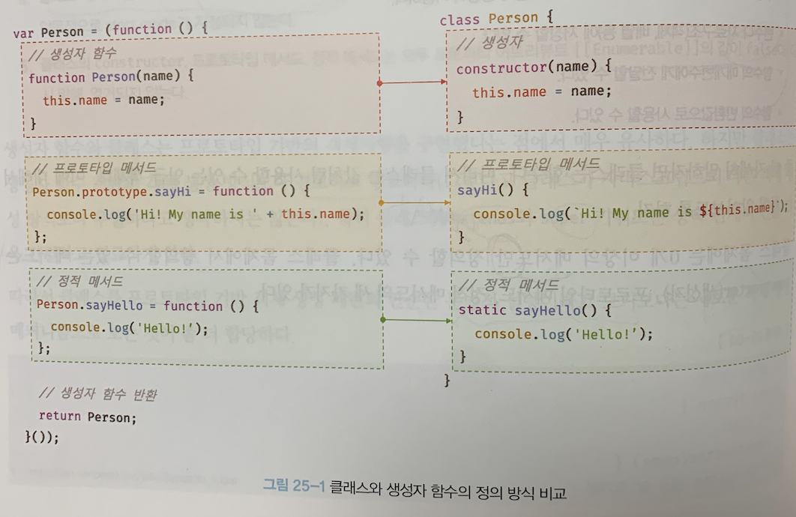
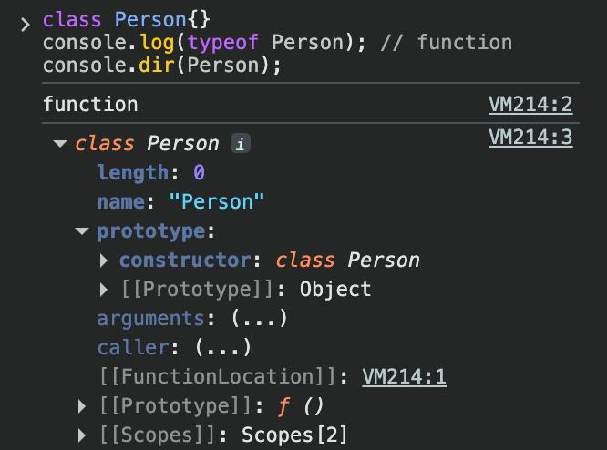
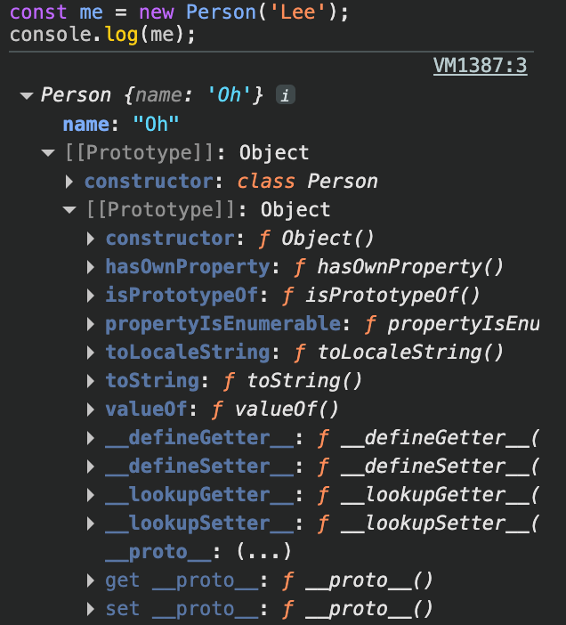

# 25장 클래스를

## 25.1 클래스는 프로토타입의 문법적 설탕인가?

자바스크립트는 프로토타입 기반 객체지향 언어이다. 프로토타입 기반 객체지향 언어는 클래스가 필요 없는 객체지향 프로그래밍 언어다. ES5에서는 클래스 없이도 다음과 같이 생성자 함수와 프로토타입을 통해 객체지향 언어의 상속을 구현할 수 있다.

```js
// ES5 생성자 함수
var Person = (function () {
  // 생성자 함수
  function Person(name) {
    this.name = name;
  }

  // 프로토타입 메서드
  Person.prototype.sayHi = function () {
    console.log('Hi! My name is ' + this.name);
  };

  // 생성자 함수 반환
  return Person;
}());

// 인스턴스 생성
var me = new Person('Lee');
me.sayHi(); // Hi! My name is Lee
```

하지만 클래스 기반 언어에 익숙한 프로그래머들은 프로토타입 기반 프로그래밍 방식에 혼란을 느낄 수 있으며, 자바스크립트를 어렵게 느끼게 하는 하나의 장벽처럼 인식되었다.

ES6에서 도입된 클래스는 기존 프로토타입 기반 객체지향 프로그래밍보다 자바나 C#과 같은 클래스 기반 객체지향 프로그래밍에 익숙한 프로그래머가 더욱 빠르게 학습할 수 있도록 클래스 기반 객체지향 프로그래밍 언어와 매우 흡사한 새로운 객체 생성 메커니즘을 제시한다.

하지만 이는 새로운 모델을 제공한다는 것은 아니다. 사실 **클래스 또한 함수이며, 기존 프로토타입 기반 패턴을 클래스 기반 패턴처럼 사용할 수 있도록 하는 문법적 설탕**이라고 볼 수도 있다.

단, 클래스와 생성자 함수는 모두 프로토타입 기반의 인스턴스를 제공하지만 **정확히 동일하게 동작하지는 않는다**. 클래스는 생성자 함수보다 엄격하며 생성자 함수에서는 제공하지 않는 기능도 제공한다.

| 클래스                                                                                      | 생성자 함수                         |
| ---------------------------------------------------------------------------------------- | ------------------------------ |
| new연산자 없이 호출하면 에러가 발생한다.                                                                 | new 연산자 없이 호출하면 일반 함수로서 호출된다.  |
| 상속을 지원하는 `extends`와 `super` 키워드를 제공한다.                                                       | `extends`와 `super` 키워드를 지원하지 않는다.  |
| 호이스팅이 발생하지 않는 것 처럼 동작한다.                                                                 | 함수 선언문으로 정의된 경우 함수 호이스팅이 발생한다. |
| 내의 모든 코드에는 암묵적으로 `strict mode`가 지정되어 실행되며 `strict mode`를 해제할 수 없다.                           | 암묵적으로 `strict mode`가 지정되지 않는다.   |
| constructor, 프로토타입 메서드, 정적 메서드는 모두 프로퍼티 어트리뷰트 `[[Enumerable]]`의 값이 false다. 다시 말해 열거되지 않는다. |                                |

생성자 함수와 클래스는 프로토타입 기반의 객체지향을 구현했다는 점에서 매우 유사하다. 하지만 클래스는 생성자 함수 기반의 객체 생성 방식보다 견고하고 명료하다.

따라서 클래스를 프로토타입 기반 객체 생성 패턴의 단순한 문법적 설탕이라고 보기보다는 **새로운 객체 생성 메커니즘으로 보는 것이 좀 더 합당**하다.

## 25.2 클래스 정의

클래스는 `class` 키워드를 사용하여 정의한다. 클래스 이름은 생성자 함수와 마찬가지로 파스칼 케이스를 사용하는 것이 일반적이다. 하지만 파스칼 케이스를 사용하지 않아도 에러가 발생하지는 않는다.

```js
// 클래스 선언문
class Person {}
```

일반적이진 않지만 함수와 마찬가지로 표현식으로 클래스를 정의할 수도 있다. 이때 클래스는 함수와 마찬가지로 이름을 가질 수도 있고, 아닐 수도 있다.

```js
// 익명 클래스 표현식
const Person = class {};

// 기명 클래스 표현식
const Person = class MyClass {};
```

클래스를 표현식으로 정의할 수 있다는 것은 **클래스가 값으로 사용할 수 있는 일급 객체**라는 것을 의미한다. 즉, 클래스는 일급 객체로서 다음과 같은 특징을 갖는다.

- 무명의 리터럴로 생성할 수 있다. 즉, 런타임에 생성이 가능하다.
- 변수나 자료구조에 저장할 수 있다.
- 함수의 매개변수에게 전달할 수 있다.
- 함수의 반환값으로 사용할 수 있다.

클래스 몸체에는 0개 이상의 메서드만 정의할 수 있다. 정의 가능한 메서드는 `constructor`, 프로토타입 메서드, 정적 메서드의 세 가지가 있다.

```js
// 클래스 선언문
class Person {
  // 생성자
  constructor(name) {
    // 인스턴스 생성 및 초기화
    this.name = name; // name 프로퍼티는 public하다.
  }

  // 프로토타입 메서드
  sayHi() {
    console.log(`Hi! My name is ${this.name}`);
  }

  // 정적 메서드
  static sayHello() {
    console.log('Hello!');
  }
}

// 인스턴스 생성
const me = new Person('Lee');

// 인스턴스의 프로퍼티 참조
console.log(me.name); // Lee
// 프로토타입 메서드 호출
me.sayHi(); // Hi! My name is Lee
// 정적 메서드 호출
Person.sayHello(); // Hello!
```

클래스와 생성자 함수의 정의 방식을 비교해 보면 다음과 같다.

<figure>
  
  <figcaption></figcaption>
</figure>

## 25.3 클래스 호이스팅

앞서 얘기했듯 클래스는 함수로 평가된다.

```js
// 클래스 선언문
class Person {}

console.log(typeof Person); // function
```

클래스 선언문으로 정의한 클래스는 함수 선언문과 같이 소스코드 평가 과정, **즉 런타임 이전에 먼저 평가되어 함수 객체를 생성**한다. 이때 클래스가 평가되어 **생성된 함수 객체는 생성자 함수로서 호출할 수 있는 함수, 즉 `constructor`**다. 

클래스는 클래스 정의 이전에 참조할 수 없다. 그래서 클래스는 마치 호이스팅이 발생하지 않는 것처럼 보인다. 하지만 그렇지 않다. 

```js
console.log(Person);
// ReferenceError: Cannot access 'Person' before initialization

// 클래스 선언문
class Person {}
```
클래스 선언문도 변수 선언, 함수 정의와 마찬가지로 호이스팅이 발생한다. 단, **클래스는 `let`, `const` 키워드로 선언한 변수처럼 호이스팅** 된다. 따라서 클래스 선언문 이전 일시적 사각지대에 빠지기 때문에 호이스팅이 발생하지 않는 것처럼 동작하는 것 뿐이다.

## 25.4 인스턴스 생성

클래스는 생성자 함수이며 `new` 연산자와 함께 호출되어 인스턴스를 생성한다.

```js
class Person {}

// 인스턴스 생성
const me = new Person();
console.log(me); // Person {}
```

함수는 `new` 연산자의 사용 여부에 따라 일반 함수로 호출되거나 인스턴스 생성을 위한 생성자 함수로 호출된다. 하지만 클래스의 존재 이유는 인스턴스를 생성하는 것이기에 반드시 `new` 연산자와 함께 호출해야 한다.

```js
class Person {}

// 클래스를 new 연산자 없이 호출하면 타입 에러가 발생한다.
const me = Person();
// TypeError: Class constructor Person cannot be invoked without 'new'
```

클래스 표현식으로 정의된 클래스를 다음 예제와 같이 클래스를 가리키는 식별자를 사용해 **인스턴스를 생성하지 않고 기명 클래스 표현식의 클래스 이름을 사용해 인스턴스를 생성하면 에러가 발생**한다.

```js
const Person = class MyClass {};

// 함수 표현식과 마찬가지로 클래스를 가리키는 식별자로 인스턴스를 생성해야 한다.
const me = new Person();

// 클래스 이름 MyClass는 함수와 동일하게 클래스 몸체 내부에서만 유효한 식별자다.
console.log(MyClass); // ReferenceError: MyClass is not defined

const you = new MyClass(); // ReferenceError: MyClass is not defined
```

이는 기명 함수 표현식과 마찬가지리ㅗ 클래스 표현식에서 사용한 클래스 이름은 외부 코드에서 접근 불가능하기 때문이다.

## 25.5 메서드

클래스 몸체에는 0개 이상의 메서드만 선언할 수 있다. 클래스 몸체에서 정의할 수 있는 메서드는 `constructor`, 프로토타입 메서드, 정적 메서드의 세 가지가 있다.

> 💡 클래스 정의에 대한 새로운 제안 사양
>
> ECMAScript 사양에 따르면 인스턴스 프로퍼티는 반드시 constructor 내부에서 정의해야 한다. 하지만, 클래스 몸체에 메서드 뿐 아니라 프로퍼티를 직접 정의할 수 있는 새로운 표준 사양이 제안되었다. 이에 대해서는 이후 클래스 필드 정의 제안에서 살펴볼 것이다.

### 25.5.1 constructor

`constructor`는 인스턴스를 생성하고 초기화하기 위한 특수한 메서드다. `constructor`는 이름을 변경할 수 없다.

```js
class Person {
  // 생성자
  constructor(name) {
    // 인스턴스 생성 및 초기화
    this.name = name;
  }
}
```

앞에서 살펴보았듯 **클래스는 인스턴스를 생성하기 위한 생성자 함수**다. 클래스의 내부를 들여다보기 위해 다음 코드를 크롬 브라우저의 개발자 도구에서 실행해 보자.

```js
// 클래스는 함수다.
console.log(typeof Person); // function
console.dir(Person);
```

<figure>
  
  <figcaption></figcaption>
</figure>

이처럼 크래스는 평가되어 함수 객체가 된다. 따라서 클래스도 함수 객체 고유의 프로퍼티를 모두 갖는다. 함수와 동일하게 프로토타입과 연결되어 있으며 자신의 스코프 체인을 구성한다.

모든 함수 객체가 가지고 있는 **`prototype` 프로퍼티가 가리키는 프로토타입 객체의 `constructor` 프로퍼티는 클래스 자신을 가리키고 있다**. 이는 클래스가 인스턴스를 생성하는 생성자 함수라는 것을 의미한다. 즉 `new` 연산자와 함께 클래스를 호출하면 클래스는 인스턴스를 생성한다.

이번에는 클래스가 생성한 인스턴스의 내부를 들여다보기 위해 다음 코드를 크롬 브라우저의 개발자 도구에서 실행해보자.

```js
// 인스턴스 생성
const me = new Person('Lee');
console.log(me);
```

<figure>
  
  <figcaption></figcaption>
</figure>

`Person` 클래스의 `constructor` 내부에서 `this`에 추가한 `name` 프로퍼티가 클래스로 생성한 인스턴스의 프로퍼티로 추가된 것을 확인했다. 즉, 생성자 함수와 마찬가지로 `constructor` 내부에서 `this`에 추가한 프로퍼티는 인스턴스 프로퍼티가 된다. **`constructor` 내부의 `this`는 생성자 함수와 마찬가지로 클래스가 생성한 인스턴스를 가리킨다**.

```js
// 클래스
class Person {
  // 생성자
  constructor(name) {
    // 인스턴스 생성 및 초기화
    this.name = name;
  }
}

// 생성자 함수
function Person(name) {
  // 인스턴스 생성 및 초기화
  this.name = name;
}
```

그런데 흥미로운 것은 클래스가 평가되어 생성된 함수 객체나 클래스가 생성한 인스턴스 어디에도 `constructor` 메서드가 보이지 않는다는 것이다. 이는 클래스 몸체에 정의한 `constructor`가 단순한 메서드가 아니라는 것을 의미한다.

`constructor`는 **메서드로 해석되는 것이 아니라** 클래스가 평가되어 생성한 **함수 객체 코드의 일부**가 된다. 다시 말해, **클래스 정의가 평가**되면 **`constructor`의 기술된 동작을 하는 함수 객체가 생성**된다.

`constructor`는 생성자 함수와 유사하지만 몇 가지 차이가 있다.

`constructor`는 클래스 내에 최대 한 개만 존재할 수 있다. 만약 2개 이상의 `constructor`를 포함하면 문법 에러가 발생한다.

```js
class Person {
  constructor() {}
  constructor() {}
}
// SyntaxError: A class may only have one constructor
```

`constructor`는 생략 가능하다.

```js
class Person {}
```

`constructor`를 생략하면 클래스에 다음과 같이 빈 `constructor`가 암묵적으로 정의된다. `constructor`를 생략한 클래스는 빈 `constructor`에 의해 빈 객체를 생성한다.

```js
class Person {
  // constructor를 생략하면 다음과 같이 빈 constructor가 암묵적으로 정의된다.
  constructor() {}
}

// 빈 객체가 생성된다.
const me = new Person();
console.log(me); // Person {}
```

프로퍼티가 추가되어 초기화된 인스턴스를 생성하려면 `constructor` 내부에서 `this`에 인스턴스 프로퍼티를 추가한다.

```js
class Person {
  constructor() {
    // 고정값으로 인스턴스 초기화
    this.name = 'Lee';
    this.address = 'Seoul';
  }
}

// 인스턴스 프로퍼티가 추가된다.
const me = new Person();
console.log(me); // Person {name: "Lee", address: "Seoul"}
```

인스턴스를 생성할 때 클래스 외부에서 인스턴스 프로퍼티의 초기값을 전달하려면 다음과 같이 `constructor`에 매개변수를 선언하고 인스턴스를 생성할 때 초기값을 전달한다. 이때 초기값은 `constructor`의 매개변수에게 전달된다.

```js
class Person {
  constructor(name, address) {
    // 인수로 인스턴스 초기화
    this.name = name;
    this.address = address;
  }
}

// 인수로 초기값을 전달한다. 초기값은 constructor에 전달된다.
const me = new Person('Lee', 'Seoul');
console.log(me); // Person {name: "Lee", address: "Seoul"}
```

이처럼 `constructor` 내에서 인스턴스의 생성과 동시에 인스턴스 프로퍼티 추가를 통해 인스턴스의 초기화를 실행한다. 따라서 인스턴스를 초기화하려면 `constructor`를 생략해서는 안 된다.

`constructor`는 별도의 반환문을 갖지 않아야 한다. 이는 `constructor`가 생성자 함수와 동일하게 암묵적으로 `this`, 즉 **인스턴스를 반환하기 때문이다**.

### 25.5.2 프로토타입 메서드

생성자 함수를 사용해 인스턴스를 생성하는 경우 프로토 타입 메서드르 ㄹ생성하기 위해서는 다음과 같이 명시적으로 프로토타입에 메서드를 추가해야한다.

```js
// 생성자 함수
function Person(name) {
  this.name = name;
}

// 프로토타입 메서드
Person.prototype.sayHi = function () {
  console.log(`Hi! My name is ${this.name}`);
};

const me = new Person('Lee');
me.sayHi(); // Hi! My name is Lee
```

클래스 몸체에서 정의한 메서드는 생성자 함수에 의한 객체 생성 방식과는 다르게 클래스의 `prototype` 프로퍼티에 메서드를 **추가하지 않아도 기본적으로 프로토타입 메서드가 된다**.

```js
class Person {
  // 생성자
  constructor(name) {
    // 인스턴스 생성 및 초기화
    this.name = name;
  }

  // 프로토타입 메서드
  sayHi() {
    console.log(`Hi! My name is ${this.name}`);
  }
}

const me = new Person('Lee');
me.sayHi(); // Hi! My name is Lee
```

생성자 함수와 마찬가지로 클래스가 생성한 인스턴스는 프로토타입 체인의 일원이 된다.

```js
// me 객체의 프로토타입은 Person.prototype이다.
Object.getPrototypeOf(me) === Person.prototype; // -> true
me instanceof Person; // -> true

// Person.prototype의 프로토타입은 Object.prototype이다.
Object.getPrototypeOf(Person.prototype) === Object.prototype; // -> true
me instanceof Object; // -> true

// me 객체의 constructor는 Person 클래스다.
me.constructor === Person; // -> true
```

클래스 몸체 내부에서 정의한 메서드는 인스턴스의 프로토타입에 존재하는 프로토타입 메서드가 된다. 

프로토타입 체인은 생성자 함수와 동일하게 클래스에 의해 생성된 인스턴스에도 적용된다. 클래스는 생성자 함수의 역할을 할 뿐이다.

결국 클래스는 생성자 함수와 같이 인스턴스를 생성하는 함수라고 볼 수 있다. 다시 말해, **클래스는 생성자 함수와 마찬가지로 프로토타입 기반의 객체 생성 메커니즘이다.**

### 25.5.3 정적 메서드

정적 메서드는 인스턴스를 생성하지 않아도 호출할 수 있는 메서드를 말한다.

생성자 함수의 경우 다음과 같이 명시적으로 메서드를 추가해야한다.

```js
// 생성자 함수
function Person(name) {
  this.name = name;
}

// 정적 메서드
Person.sayHi = function () {
  console.log('Hi!');
};

// 정적 메서드 호출
Person.sayHi(); // Hi!
```

클래스에서는 메서드에 `static` 키워드를 붙이면 정적 메서드(클래스 메서드)가 된다.

```js
class Person {
  // 생성자
  constructor(name) {
    // 인스턴스 생성 및 초기화
    this.name = name;
  }

  // 정적 메서드
  static sayHi() {
    console.log('Hi!');
  }
}
```

정적 메서드는 프로토타입 메서드처럼 인스턴스로 호출하지 않고 클래스로 호출한다.

```js
// 정적 메서드는 클래스로 호출한다.
// 정적 메서드는 인스턴스 없이도 호출할 수 있다.
Person.sayHi(); // Hi!
```

**정적 메서드가 바인딩된 클래스는 인스턴스의 프로토타입 체인상에 존재 하지않는다**. 따라서 인스턴스로 정적 메서드를 상속받을 수 없다.

```js
// 인스턴스 생성
const me = new Person('Lee');
me.sayHi(); // TypeError: me.sayHi is not a function
```

### 25.5.4 정적 메서드와 프로토타입 메서드의 차이

1. 정적 메서드와 프로토타입 메서드는 자신이 속해 있는 프로토타입 체인이 다르다.
2. 정적 메서드는 클래스로 호출하고 프로토타입 메서드는 인스턴스로 호출한다.
3. 정적 메서드는 인스턴스 프로퍼티를 참조할 수 없지만 프로토타입 메서드는 인스턴스 프로퍼티를 참조할 수 있다.

다음 예제를 살펴보자.

```js
class Square {
  // 정적 메서드
  static area(width, height) {
    return width * height;
  }
}

console.log(Square.area(10, 10)); // 100
```

정적 메서드 `area` 는 2개의 인수를 전달받아 면적을 계산한다. 이때 정적 메서드 `area`는 인스턴스 프로퍼티를 참조하지 않는다. 만약 인스턴스 프로퍼티를 참조해야 한다면 정적 메서드 대신 프로토타입 메서드를 사용해야 한다.

```js
class Square {
  constructor(width, height) {
    this.width = width;
    this.height = height;
  }

  // 프로토타입 메서드
  area() {
    return this.width * this.height;
  }
}

const square = new Square(10, 10);
console.log(square.area()); // 100
```

메서드 내부의 `this`는 메서드를 소유한 객체가 아닌, 메서드를 호출한 객체에 바인딩 된다.

정적 메서드의 경우, 클래스로 호출하기에 `this`는 인스턴스가 아닌 클래스를 가리킨다. 즉, 프로토타입 메서드와 정적 메서드의 `this` 바인딩은 다르다.

따라서 메서드 내부에서 인스턴스 프로퍼티를 참조해야 할 경우, 프로토타입 메서드를 사용하는 것이 적절하다. 

정적 메서드는 클래스 또는 생성자 함수를 하나의 네임스페이스로 사용할 때 유용하다. 예를 들어, 자바스크립트의 다양한 표준 빌트인 객체(`Math`, `String` 등)의 유틸 메서드를 예로 들 수 있다.

### 25.5.5 클래스에서 정의한 메서드의 특징

클래스에서 정의한 메서드는 다음과 같은 특징을 갖는다.

1. function 키워드를 생략한 메서드 축약 표현을 사용한다.
2. 객체 리터럴과는 다르게 클래스에 메서드를 정의할 때는 콤마가 필요 없다.
3. 암묵적으로 strict mode로 실행된다.
4. `for ... in` 문이나 `Object.keys` 메서드 등으로 열거할 수 없다. 즉, 프로퍼티의 열거 가능 여부를 나타내며, 불리언 값을 갖는 프로퍼티 어트리뷰트 `[[Enumerable]]`의 값이 `false`다.
5. 내부 메서드 `[[Construct]]`를 갖지 않는 non-constructor다. 따라서 `new` 연산자와 함께 호출할 수 없다. 즉, 생성자로 사용할 수 없다.

## 25.6 클래스의 인스턴스 생성 과정

`new` 연산자와 함께 클래스를 호출하면 생성자 함수와 마찬가지로 클래스의 내부 메서드 `[[Construct]]`가 호출된다. 클래스의 인스턴스 생성과정도 생성자 함수의 인스턴스 생성 과정과 유사하게 진행된다.

**1. 인스턴스 생성과 this 바인딩**

**`constructor` 함수가 실행되며 암묵적으로 빈 객체, 즉 인스턴스 생성한다**. 이때 **인스턴스의 프로토타입으로 클래스의 `prototype` 프로퍼티가 가리키는 객체가 설정**된다. 그리고 암묵적으로 생성된 빈 객체, 즉 **인스턴스는 `this`에 바인딩 된다**. 

**2. 인스턴스 초기화**

**`constructor`의 내부 코드가 실행되어 `this`에 바인딩되어 있는 인스턴스를 초기화**한다. 즉, **`this`에 바인딩되어 있는 인스턴스에 프로퍼티를 추가**하고 **`constructor`가 인수로 전달받은 초기값으로 인스턴스의 프로퍼티 값을 초기화**한다. 만약 `constructor`가 생략되었다면 이 과정도 생략된다.

**3. 인스턴스 반환**

클래스의 모든 처리가 끝나면 완성된 **인스턴스가 바인딩된 `this`가 암묵적으로 반환**된다.

```js
class Person {
  // 생성자
  constructor(name) {
    // 1. 암묵적으로 인스턴스가 생성되고 this에 바인딩된다.
    console.log(this); // Person {}
    console.log(Object.getPrototypeOf(this) === Person.prototype); // true

    // 2. this에 바인딩되어 있는 인스턴스를 초기화한다.
    this.name = name;

    // 3. 완성된 인스턴스가 바인딩된 this가 암묵적으로 반환된다.
  }
}
```

## 25.7 프로퍼티

### 25.7.1 인스턴스 프로퍼티

인스턴스 프로퍼티는 `constructor` 내부에서 정의해야 한다.

```js
class Person {
  constructor(name) {
    // 인스턴스 프로퍼티
    this.name = name;
  }
}

const me = new Person('Lee');
console.log(me); // Person {name: "Lee"}
```

`constructor` 내부 코드가 실행되기 이전에 `constructor` 내부의 `this`에는 이미 클래스의 인스턴그가 바인딩되어 있다.

`constructor` 내부의 `this`에는 인스턴스 프로퍼티를 추가한다. 이로써 클래스가 암묵적으로 생성한 빈 객체, 즉 인스턴스에 프로퍼티가 추가되어 인스턴스가 초기화된다.

```js
class Person {
  constructor(name) {
    // 인스턴스 프로퍼티
    this.name = name; // name 프로퍼티는 public하다.
  }
}

const me = new Person('Lee');

// name은 public하다.
console.log(me.name); // Lee
```

앞서 얘기했듯 자바스크립트에는 접근 제한자가 따로 지원되지 않는다. 따라서 자바스크립트의 인스턴스 프로퍼티는 언제나 `public`하다.

### 25.7.2 접근자 프로퍼티

접근자 프로퍼티는 자체적으로는 값을 갖지 않고 다른 데이터 프로퍼티의 값을 읽거나 저장할 때 사용하는 접근자 함수로 구성된 프로퍼티다.

다음 예제는 객체 리터럴에서 접근자 프로퍼티를 기술한 것이다.

```js
const person = {
  // 데이터 프로퍼티
  firstName: 'Ungmo',
  lastName: 'Lee',

  // fullName은 접근자 함수로 구성된 접근자 프로퍼티다.
  // getter 함수
  get fullName() {
    return `${this.firstName} ${this.lastName}`;
  },
  // setter 함수
  set fullName(name) {
    // 배열 디스트럭처링 할당: "36.1. 배열 디스트럭처링 할당" 참고
    [this.firstName, this.lastName] = name.split(' ');
  }
};

// 데이터 프로퍼티를 통한 프로퍼티 값의 참조.
console.log(`${person.firstName} ${person.lastName}`); // Ungmo Lee

// 접근자 프로퍼티를 통한 프로퍼티 값의 저장
// 접근자 프로퍼티 fullName에 값을 저장하면 setter 함수가 호출된다.
person.fullName = 'Heegun Lee';
console.log(person); // {firstName: "Heegun", lastName: "Lee"}

// 접근자 프로퍼티를 통한 프로퍼티 값의 참조
// 접근자 프로퍼티 fullName에 접근하면 getter 함수가 호출된다.
console.log(person.fullName); // Heegun Lee

// fullName은 접근자 프로퍼티다.
// 접근자 프로퍼티는 get, set, enumerable, configurable 프로퍼티 어트리뷰트를 갖는다.
console.log(Object.getOwnPropertyDescriptor(person, 'fullName'));
// {get: ƒ, set: ƒ, enumerable: true, configurable: true}
```

위 예제를 클래스로 표현하면 다음과 같다.

```js
class Person {
  constructor(firstName, lastName) {
    this.firstName = firstName;
    this.lastName = lastName;
  }

  // fullName은 접근자 함수로 구성된 접근자 프로퍼티다.
  // getter 함수
  get fullName() {
    return `${this.firstName} ${this.lastName}`;
  }

  // setter 함수
  set fullName(name) {
    [this.firstName, this.lastName] = name.split(' ');
  }
}

const me = new Person('Ungmo', 'Lee');

// 데이터 프로퍼티를 통한 프로퍼티 값의 참조.
console.log(`${me.firstName} ${me.lastName}`); // Ungmo Lee

// 접근자 프로퍼티를 통한 프로퍼티 값의 저장
// 접근자 프로퍼티 fullName에 값을 저장하면 setter 함수가 호출된다.
me.fullName = 'Heegun Lee';
console.log(me); // {firstName: "Heegun", lastName: "Lee"}

// 접근자 프로퍼티를 통한 프로퍼티 값의 참조
// 접근자 프로퍼티 fullName에 접근하면 getter 함수가 호출된다.
console.log(me.fullName); // Heegun Lee

// fullName은 접근자 프로퍼티다.
// 접근자 프로퍼티는 get, set, enumerable, configurable 프로퍼티 어트리뷰트를 갖는다.
console.log(Object.getOwnPropertyDescriptor(Person.prototype, 'fullName'));
// {get: ƒ, set: ƒ, enumerable: false, configurable: true}
```

`getter`는 인스턴스 프로퍼티에 접근할 때마다 프로퍼티의 값을 조작하거나 별도의 행위가 필요할 때 사용한다. `setter`는 인스턴스 프로퍼티에 값을 할당할 때마다 프로퍼티 값을 조작하거나 별도의 행위가 필요할 때 사용한다.

**이때 `getter`와 `setter`의 이름은 인스턴스 프로퍼티처럼 사용된다.** 다시 말해 메서드와 같이 호출되는 것이 아닌, 프로퍼티 처럼 참조하는 형식으로 사용된다. `setter` 또한 마찬가지다. `setter`는 단 하나의 값만 할당받기 때문에 단 하나의 매개변수만 선언할 수 있다.

클래스의 메서드는 기본적으로 프로토타입 메서드가 된다. 따라서 접근자 프로퍼티 또한 인스턴스 프로퍼티가 아닌 프로토타입의 프로퍼티가 된다.

```js
// Object.getOwnPropertyNames는 비열거형(non-enumerable)을 포함한 모든 프로퍼티의 이름을 반환한다.(상속 제외)
Object.getOwnPropertyNames(me); // -> ["firstName", "lastName"]
Object.getOwnPropertyNames(Object.getPrototypeOf(me)); // -> ["constructor", "fullName"]
```

### 25.7.3 클래스 필드 정의 제안

먼저 클래스 필드가 무엇인지 살펴보자. 클래스 필드는 클래스 기반 객체지향 언어에서 클래스가 생성할 인스턴스의 프로퍼티를 가리키는 용어다. 클래스 기반 객체지향 언어인 자바의 클래스 정의를 살펴보자. 자바의 클래스 필드는 마치 클래스 내부에서 변수처럼 사용된다.

```java
// 자바의 클래스 정의
public class Person {
  // ① 클래스 필드 정의
  // 클래스 필드는 클래스 몸체에 this 없이 선언해야 한다.
  private String firstName = "";
  private String lastName = "";

  // 생성자
  Person(String firstName, String lastName) {
    // ③ this는 언제나 클래스가 생성할 인스턴스를 가리킨다.
    this.firstName = firstName;
    this.lastName = lastName;
  }

  public String getFullName() {
    // ② 클래스 필드 참조
    // this 없이도 클래스 필드를 참조할 수 있다.
    return firstName + " " + lastName;
  }
}
```

자바의 클래스에서는 위 예제의 1과 같이 클래스 필드를 마치 변수처럼 클래스 몸체에 `this` 없이 선언한다. 하지만 자바스크립트의 클래스에서 인스턴스 프로퍼티를 선언하고 초기화하려면 반드시 `constructor`내부에서 `this`에 프로퍼티를 추가해야 한다. 

```js
class Person {
  // 클래스 필드 정의
  name = 'Lee';
}

const me = new Person('Lee');
```

위 예제를 최신 브라우저 또는 Node (버전 12 이상)에서 실행하면 문법에러가 발생하지 않는다. 이유는 자바스크립트에서도 인스턴스 프로퍼티를 마치 클래스 기반 객체지향 언어의 클래스 필드처럼 정의할 수 있는 새로운 표준 사양이 제안되어 있기 때문이다.

위처럼 클래스 몸체에서 클래스 필드를 정의하는 경우 `this`에 바인딩해서는 안된다.

```js
class Person {
  // this에 클래스 필드를 바인딩해서는 안된다.
  this.name = ''; // SyntaxError: Unexpected token '.'
}
```

클래스 필드에 초기값을 할당하지 않으면 `undefined`를 갖는다.

```js
class Person {
  // 클래스 필드를 초기화하지 않으면 undefined를 갖는다.
  name;
}

const me = new Person();
console.log(me); // Person {name: undefined}
```

클래스 필드를 외부 값으로 초기화해야 한다면, `constructor`에서 클래스 필드를 초기화 해야 한다.

```js
class Person {
  name;

  constructor(name) {
    // 클래스 필드 초기화.
    this.name = name;
  }
}

const me = new Person('Lee');
console.log(me); // Person {name: "Lee"}
```

자바스크립트에서 함수는 일급 객체이므로 클래스 필드도 할당할 수 있다. 하지만 그렇게 될 경우, 그 함수는 **프로토타입 메서드가 아닌 인스턴스 메서드가 된다**. 모든 클래스 필드는 인스턴스 프로퍼티가 되기 때문이다. 따라서 클래스 필드에 함수를 할당하는 것은 권장하지 않는다.

### 25.7.4 private 필드 정의 제안

자바스크립트는 캡슐화를 완벽히 지원하지 않는다. 그리고 자바와 같은 클래스 기반 객체지향언어에서 제공하는 접근 제한자 또한 지원하지 않는다. 따라서 인스턴스 프로퍼티는 언제나 public 하다.

다행히, private 필드를 정의할 수 있는 새로운 표준 사양이 제안되어 있다. 최신 브라우저(Chrome 74), 최신 Node.js(버전 12 이상)에 이미 구현되어 있다.

private 필드의 선두에는 `#`를 붙여준다. 참조할 때 역시 마찬가지다.

```js
class Person {
  // private 필드 정의
  #name = '';

  constructor(name) {
    // private 필드 참조
    this.#name = name;
  }
}

const me = new Person('Lee');

// private 필드 #name은 클래스 외부에서 참조할 수 없다.
console.log(me.#name);
// SyntaxError: Private field '#name' must be declared in an enclosing class
```

클래스 외부에서 private 필드에 직접 접근할 수 있는 방법은 없다. 다만 접근자 프로퍼티를 통해 간접적으로 접근하는 방법은 유효하다.

```js
class Person {
  // private 필드 정의
  #name = '';

  constructor(name) {
    this.#name = name;
  }

  // name은 접근자 프로퍼티다.
  get name() {
    // private 필드를 참조하여 trim한 다음 반환한다.
    return this.#name.trim();
  }
}

const me = new Person(' Lee ');
console.log(me.name); // Lee
```

private 필드는 반드시 클래스 몸체에 정의해아한다. `constructor`에 정의하면 에러가 발생한다.

```js
class Person {
  constructor(name) {
    // private 필드는 클래스 몸체에서 정의해야 한다.
    this.#name = name;
    // SyntaxError: Private field '#name' must be declared in an enclosing class
  }
}
```

### 25.7.4 static 필드 정의 제안

static public 필드, static private 필드, static private 메서드를 정의할 수 있는 새로운 표준사양인 "Static class features"가 TC39 프로세스의 stage 3(candidate)에 제안되어 있다.

> 💡 TC39는 ECMA International 산하의 기술 위원회(Technical Committee 39)로, ECMAScript(ECMA-262) 표준을 관리하고 JavaScript 언어의 진화를 결정한다. 

```js
class MyMath {
  // static public 필드 정의
  static PI = 22 / 7;

  // static private 필드 정의
  static #num = 10;

  // static 메서드
  static increment() {
    return ++MyMath.#num;
  }
}

console.log(MyMath.PI); // 3.142857142857143
console.log(MyMath.increment()); // 11
```

## 25.8 상속에 의한 클래스 확장

### 25.8.1 클래스 상속과 생성자 함수 상속

상속에 의한 클래스 확장은 지금까지 살펴본 프로토타입 기반 상속과는 다른 개념이다. 프로토타입 기반 상속은 프로토타입 체인을 통해 다른 객체의 자산을 상속 받는 개념이지만 **상속에 의한 클래스 확장은 기존 클래스를 상속받아 새로운 클래스를 확장하여 정의하는 것이다**.

이러한 상속의 지점에서 생성자 함수와 클래스는 큰 차이를 가진다.

예를 들어, 동물을 추상화한 `Animal` 클래스와 새와 사자를 추상화한 `Bird`, `Lion` 클래스를 각각 정의한다고 생각해보자. 이때 `Animal` 클래스는 동물의 속성을 표현하고 `Bird`, `Lion` 클래스는 상속을 통해 `Animal` 클래스의 속성을 그대로 사용하면서 자신만의 고유한 속성만 추가해 확장할 수 있다.

```js
class Animal {
  constructor(age, weight) {
    this.age = age;
    this.weight = weight;
  }

  eat() { return 'eat'; }

  move() { return 'move'; }
}

// 상속을 통해 Animal 클래스를 확장한 Bird 클래스
class Bird extends Animal {
  fly() { return 'fly'; }
}

const bird = new Bird(1, 5);

console.log(bird); // Bird {age: 1, weight: 5}
console.log(bird instanceof Bird); // true
console.log(bird instanceof Animal); // true

console.log(bird.eat());  // eat
console.log(bird.move()); // move
console.log(bird.fly());  // fly
```

클래스는 상속을 통해 다른 클래스를 확장할 수 있는 문법인 `extends` 키워드가 기본적으로 제공된다. 

자바스크립트는 의사 클래스 상속 패턴을 사용해 상속에 의한 클래스 확장을 흉내 내기도 했다. 하지만 클래스의 등장으로 다음 예제와 같은 의사 클래스 상속 패턴은 더는 필요하지 않는다. 참고로만 살펴보자.

```js
// 의사 클래스 상속(pseudo classical inheritance) 패턴
var Animal = (function () {
  function Animal(age, weight) {
    this.age = age;
    this.weight = weight;
  }

  Animal.prototype.eat = function () {
    return 'eat';
  };

  Animal.prototype.move = function () {
    return 'move';
  };

  return Animal;
}());

// Animal 생성자 함수를 상속하여 확장한 Bird 생성자 함수
var Bird = (function () {
  function Bird() {
    // Animal 생성자 함수에게 this와 인수를 전달하면서 호출
    Animal.apply(this, arguments);
  }

  // Bird.prototype을 Animal.prototype을 프로토타입으로 갖는 객체로 교체
  Bird.prototype = Object.create(Animal.prototype);
  // Bird.prototype.constructor을 Animal에서 Bird로 교체
  Bird.prototype.constructor = Bird;

  Bird.prototype.fly = function () {
    return 'fly';
  };

  return Bird;
}());

var bird = new Bird(1, 5);

console.log(bird); // Bird {age: 1, weight: 5}
console.log(bird.eat());  // eat
console.log(bird.move()); // move
console.log(bird.fly());  // fly
```

### 25.8.2 extends 키워드

상속을 통해 클래스를 확장하려면 `extends` 키워드를 사용하여 상속받을 클래스를 정의한다.

```js
// 수퍼(베이스/부모)클래스
class Base {}

// 서브(파생/자식)클래스
class Derived extends Base {}
```

상속을 통해 확장된 클래스를 서브클래스라 부르고, 서브 클래스에게 상속된 클래스를 수퍼클래스라 부른다. 서브클래스를 파생 클래스 또는 자식 클래스, 수퍼클래스를 베이스 클래스 또는 부모 클래스라고 부르기도 한다.

`extends` 키워드의 역할은 수퍼클래스와 서브클래스 간의 상속 관계를 설정하는 것이다. **클래스도 프로토타입을 통해 상속 관계를 구현**한다.

수퍼클래스와 서브클래스는 **인스턴스의 프로토타입 체인뿐 아니라 클래스 간의 프로토타입 체인도 생성**한다. 이를 통해 프로토타입 메서드, 정적 메서드 모두 상속이 가능하다.

### 25.8.3 동적 상속

`extends` 키워드는 클래스뿐 아니라 생성자 함수를 상속받아 클래스를 확장할 수도 있다. 단, `extends` 키워드 앞에는 반드시 클래스가 와야한다.

```js
// 생성자 함수
function Base(a) {
  this.a = a;
}

// 생성자 함수를 상속받는 서브클래스
class Derived extends Base {}

const derived = new Derived(1);
console.log(derived); // Derived {a: 1}
```

`extends` 키워드 다음에는 `[[Construct]]` 내부 메서드를 갖는 함수 객체로 평가될 수 있는 모든 표현식을 사용할 수 있다. 이를 통해 동적으로 상속받을 대상을 결정할 수 있다.

```js
function Base1() {}

class Base2 {}

let condition = true;

// 조건에 따라 동적으로 상속 대상을 결정하는 서브클래스
class Derived extends (condition ? Base1 : Base2) {}

const derived = new Derived();
console.log(derived); // Derived {}

console.log(derived instanceof Base1); // true
console.log(derived instanceof Base2); // false
```

### 25.8.4 서브클래스의 constructor

클래스에서 `constructor`를 생략하면 암묵적으로 빈 `constructor` 정의된다.

```js
constructor() {}
```

서브클래스 역시 `constructor`를 생략하면 암묵적으로 정의된다.  `args`는 `new` 연산자와 함께 클래스를 호출할 때 전달한 인수의 리스트다.

```js
constructor(...args) { super(...args); }
```

다음 예제를 살펴보자. 수퍼/서브 클래스 모두 `constructor`를 생략했다.

```js
// 수퍼클래스
class Base {}

// 서브클래스
class Derived extends Base {}
```

위 예제의 클래스에는 다음과 같이 암묵적으로 `constructor`가 정의된다.

```js
// 수퍼클래스
class Base {
  constructor() {}
}

// 서브클래스
class Derived extends Base {
  constructor() { super(); }
}

const derived = new Derived();
console.log(derived); // Derived {}
```

### 25.8.5 super 키워드가

`super` 키워드는 함수처럼 호출할 수도 있고 `this`와 같이 식별자처럼 참조할 수 있는 특수한 키워드다. `super`는 다음과 같이 동작한다.

- `super`를 호출하면 수퍼클래스의 `constructor`를 호출한다.
- `super`를 참조하면 수퍼클래스의 메서드를 호출할 수 있다.

### super 호출

**`super`를 호출하면 수퍼클래스의 `constructor`를 호출한다.**

다음 예제와 같이 수퍼클래스의 `constructor` 내부에서 추가한 프로퍼티를 그대로 갖는 인스턴스를 생성한다면 서브클래스의 `constructor`를 생략할 수 있다. 이때 `new` 연산자와 함께 서브클래스를 호출하면서 전달한 인수는 모두 서브클래스에 암묵적으로 정의된 `constructor`의 `super` 호출을 통해ㅐ 수퍼클래스의 `constructor`에 전달된다.

```js
// 수퍼클래스
class Base {
  constructor(a, b) {
    this.a = a;
    this.b = b;
  }
}

// 서브클래스
class Derived extends Base {
  // 다음과 같이 암묵적으로 constructor가 정의된다.
  // constructor(...args) { super(...args); }
}

const derived = new Derived(1, 2);
console.log(derived); // Derived {a: 1, b: 2}
```

하지만 다음 예제와 같이 수퍼클래스에서 추가한 프로퍼티 외의 프로퍼티를 생성한다면 서브클래스의 `constructor`를 생략할 수 없다.

```js
// 수퍼클래스
class Base {
  constructor(a, b) { // ④
    this.a = a;
    this.b = b;
  }
}

// 서브클래스
class Derived extends Base {
  constructor(a, b, c) { // ②
    super(a, b); // ③
    this.c = c;
  }
}

const derived = new Derived(1, 2, 3); // ①
console.log(derived); // Derived {a: 1, b: 2, c: 3}
```

`new` 연산자와 함께 `Derived` 클래스를 호출(1)하면서 전달한 인수 1, 2, 3은 `Derived` 클래스의 `constructor`(2)에 전달되고 `super` 호출(3)을 통해 `Base` 클래스의 `constructor`(4)에 일부가 전달된다.

이처럼 **인스턴스 초기화를 위해 전달한 인수는 수퍼클래스와 서브클래스에 배분되고 상속 관계의 두 클래스는 서로 협력하여 인스턴스를 생성**한다.

`super`를 호출할 때 주의할 사항은 다음과 같다.

1. 서브클래스에서 `constructor`를 생략하지 않는 경우 서브클래스의 `constructor`에선느 반드시 `super`를 호출해야 한다.

    ```js
    class Base {}

    class Derived extends Base {
      constructor() {
        // ReferenceError: Must call super constructor in derived class before accessing 'this' or returning from derived constructor
        console.log('constructor call');
      }
    }

    const derived = new Derived();
    ```
2. 서브클래스의 `constructor`에서 `super`를 호출하기 전에는 `this`를 참조할 수 없다.
   ```js
    class Base {}
    class Derived extends Base {
      constructor() {
        // ReferenceError: Must call super constructor in derived class before accessing 'this' or returning from derived constructor
        this.a = 1;
        super();
      }
    }

    const derived = new Derived(1);
   ```
3. `super`는 반드시 서브클래스의 `constructor`에서만 호출한다.
  ```js
  class Base {
    constructor() {
      super(); // SyntaxError: 'super' keyword unexpected here
      }
    }

    function Foo() {
      super(); // SyntaxError: 'super' keyword unexpected here
    }
  ``` 

**super 참조**

메서드 내에서 `super`를 참조하면 수퍼클래스의 메서드를 호출할 수 있다.

1. 서브클래스의 프로토타입 메서드 내에서 `super.sayHi`는 수퍼클래스의 프로토타입 메서드 `sayHi`를 가리킨다.
   ```js
      // 수퍼클래스
    class Base {
      constructor(name) {
        this.name = name;
      }

      sayHi() {
        return `Hi! ${this.name}`;
      }
    }

    // 서브클래스
    class Derived extends Base {
      sayHi() {
        // super.sayHi는 수퍼클래스의 프로토타입 메서드를 가리킨다.
        return `${super.sayHi()}. how are you doing?`;
      }
    }

    const derived = new Derived('Lee');
    console.log(derived.sayHi()); // Hi! Lee. how are you doing?
   ```

   `super`참조를 통해 수퍼클래스의 메서드를 참조하려면 수퍼클래스의 `protoeype`프로퍼티에 바인딩된 프로토타입을 참조할수 있어야 한다.

   위 예제는 다음 예제와 동일하게 동작한다.

   ```js
    // 수퍼클래스
    class Base {
      constructor(name) {
        this.name = name;
      }

      sayHi() {
        return `Hi! ${this.name}`;
      }
    }

    class Derived extends Base {
      sayHi() {
        // __super는 Base.prototype을 가리킨다.
        const __super = Object.getPrototypeOf(Derived.prototype);
        return `${__super.sayHi.call(this)} how are you doing?`;
      }
    }
   ```
   
   `super`는 자신을 참조하고 있는 메서드가 바인딩되어 있는 객체(`Derived.prototype`)의 프로토타입(`Base.prototype`)을 가리킨다.

   이처럼 `super`가 동작하기 위해서는 `super`를 차조하고 있는 메서드가 바인딩되어 있는 객체의 프로토타입을 찾을 수 있어야 한다. 이를 위해 메서드는 내부 슬롯 `[[HomeObject]]`를 가지며, 자신을 바인딩하고 있는 객체를 가리킨다.

   `super`참조를 의사코드로 표현하면 다음과 같다.

   ```js
    /*
    [[HomeObject]]는 메서드 자신을 바인딩하고 있는 객체를 가리킨다.
    [[HomeObject]]를 통해 메서드 자신을 바인딩하고 있는 객체의 프로토타입을 찾을 수 있다.
    예를 들어, Derived 클래스의 sayHi 메서드는 Derived.prototype에 바인딩되어 있다.
    따라서 Derived 클래스의 sayHi 메서드의 [[HomeObject]]는 Derived.prototype이고
    이를 통해 Derived 클래스의 sayHi 메서드 내부의 super 참조가 Base.prototype으로 결정된다.
    따라서 super.sayHi는 Base.prototype.sayHi를 가리키게 된다.
    */
    super = Object.getPrototypeOf([[HomeObject]])
   ```

   주의할 것은 ES6의 메서드 축약 표현으로 정의된 함수만이 이 내부 슬롯을 갖는다.
   객체 리터럴에서 동일하게 `super`참조는 가능하다.

    ```js
    const base = {
      name: 'Lee',
      sayHi() {
        return `Hi! ${this.name}`;
      }
    };

    const derived = {
      __proto__: base,
      // ES6 메서드 축약 표현으로 정의한 메서드다. 따라서 [[HomeObject]]를 갖는다.
      sayHi() {
        return `${super.sayHi()}. how are you doing?`;
      }
    };

    console.log(derived.sayHi()); // Hi! Lee. how are you doing?
    ```

2. 서브클래스의 정적 메서드 내에서 `super.sayHi`는 수퍼클래스의 정적 메서드 `sayHi`를 가리킨다.
    ```js
    // 수퍼클래스
    class Base {
      static sayHi() {
        return 'Hi!';
      }
    }

    // 서브클래스
    class Derived extends Base {
      static sayHi() {
        // super.sayHi는 수퍼클래스의 정적 메서드를 가리킨다.
        return `${super.sayHi()} how are you doing?`;
      }
    }

    console.log(Derived.sayHi()); // Hi! how are you doing?
    ```

### 25.8.6 상속 클래스의 인스턴스 생성 과정

상속 관계에 있는 두 클래스가 어떻게 협력하며 인스턴스를 생성하는 지 살펴보자.

다음 직사각형을 추상화한 `Rectangle` 클래스와 상속을 통해 확장한 `ColorRectable` 클래스를 정의해 보자.

```js
// 수퍼클래스
class Rectangle {
  constructor(width, height) {
    this.width = width;
    this.height = height;
  }

  getArea() {
    return this.width * this.height;
  }

  toString() {
    return `width = ${this.width}, height = ${this.height}`;
  }
}

// 서브클래스
class ColorRectangle extends Rectangle {
  constructor(width, height, color) {
    super(width, height);
    this.color = color;
  }

  // 메서드 오버라이딩
  toString() {
    return super.toString() + `, color = ${this.color}`;
  }
}

const colorRectangle = new ColorRectangle(2, 4, 'red');
console.log(colorRectangle); // ColorRectangle {width: 2, height: 4, color: "red"}

// 상속을 통해 getArea 메서드를 호출
console.log(colorRectangle.getArea()); // 8
// 오버라이딩된 toString 메서드를 호출
console.log(colorRectangle.toString()); // width = 2, height = 4, color = red
```

서브클래스 `ColorRectangle`은 다음과정을 통해 인스턴스를 생성한다.

**1. 서브클래스 `super`의 호출**

**자바스크립트 엔진은 클래스를 평가할 때 수퍼클래스와 서브클래스를 구분하기 위해 "bae" 또는 "derived"를 값으로 갖는 내부 슬롯 `[[ConstructorKind]]`를 갖는다.**

상속받지 않는 클래스는 값이 "base"로, 상속 받는 클래스는 값이 "derived"로 지정된다. 이를 통해 수퍼클래스와 서브클래스는 `new`연산자와 함께 호출되었을 때의 동작이 구분된다.

다른 클래스를 상속받지 않는 클래스는 `new`연산자와 함께 호출되었을 때 암묵적으로 빈 객체, 즉 인스턴스를 생성하고 이를 `this`에 바인딩 한다.

**하지만 서브클래스는 자신이 직접 인스턴스를 생성하지 않고 수퍼클래스에게 인스턴스 생성을 위임한다. 이것이 바로 서브클래스의 `constructor`에서 반드시 `super`를 호출해야 하는 이유다.**

**2. 수퍼클래스의 인스턴스 생성과 this 바인딩**

수퍼클래스의 `constructor` 내부 코드가 실행되기 이전 암묵적으로 빈 객체, 즉 인스턴스를 생성하고 `this`에 바인딩 한다.

```js
// 수퍼클래스
class Rectangle {
  constructor(width, height) {
    // 암묵적으로 빈 객체, 즉 인스턴스가 생성되고 this에 바인딩된다.
    console.log(this); // ColorRectangle {}
    // new 연산자와 함께 호출된 함수, 즉 new.target은 ColorRectangle이다.
    console.log(new.target); // ColorRectangle
...
```

이때 인스턴스는 수퍼클래스가 생성한 것이다. 하지만 `new` 연산자와 함께 호출된 클래스가 서브클래스라는 것이 중요하다. 즉, `new` 연산자와 함께 호출된 함수를 가리키는 `new.target`은 서브클래스를 가리킨다. 따라서 **인스턴스는 `new.target`이 가리키는 서브클래스가 생성한 것으로 처리된다.**

따라서 생성된 **인스턴스의 프로토타입은** 수퍼클래스의 `prototype` 프로퍼티(`Rectangle.prototype`)가 가리키는 객체가 아니라 `new.target`, 즉 **서브클래스의 `prototype` 프로퍼티(`ColorRectangle.prototype`)가 가리키는 객체**다.

```js
// 수퍼클래스
class Rectangle {
  constructor(width, height) {
    // 암묵적으로 빈 객체, 즉 인스턴스가 생성되고 this에 바인딩된다.
    console.log(this); // ColorRectangle {}
    // new 연산자와 함께 호출된 함수, 즉 new.target은 ColorRectangle이다.
    console.log(new.target); // ColorRectangle

    // 생성된 인스턴스의 프로토타입으로 ColorRectangle.prototype이 설정된다.
    console.log(Object.getPrototypeOf(this) === ColorRectangle.prototype); // true
    console.log(this instanceof ColorRectangle); // true
    console.log(this instanceof Rectangle); // true
...
```

**3. 수퍼클래스의 인스턴스 초기화**

수퍼클래스의 `constructor`가 실행되어 `this`에 바인딩 되어있는 인스턴스에 프로퍼티를 추가하고 `constructor`가 인수로 전달받은 초기값으로 인스턴스의 프로퍼티를 초기화 한다.

```js
// 수퍼클래스
class Rectangle {
  constructor(width, height) {
    // 암묵적으로 빈 객체, 즉 인스턴스가 생성되고 this에 바인딩된다.
    console.log(this); // ColorRectangle {}
    // new 연산자와 함께 호출된 함수, 즉 new.target은 ColorRectangle이다.
    console.log(new.target); // ColorRectangle

    // 생성된 인스턴스의 프로토타입으로 ColorRectangle.prototype이 설정된다.
    console.log(Object.getPrototypeOf(this) === ColorRectangle.prototype); // true
    console.log(this instanceof ColorRectangle); // true
    console.log(this instanceof Rectangle); // true

    // 인스턴스 초기화
    this.width = width;
    this.height = height;

    console.log(this); // ColorRectangle {width: 2, height: 4}
  }
...
```

4. 서브클래스 `constructor`로의 복귀와 `this` 바인딩

`super`의 호출이 종료되고 제어 흐름이 서브클래스 `constructor`로 돌아온다. 이때 `super`가 반환한 인스턴스가 `this`에 바인딩된다. **서브클래스는 별도의 인스턴스를 생성하지 않고 `super`가 반환한 인스턴스를 `this`에 바인딩하여 그대로 사용한다.**

```js
// 서브클래스
class ColorRectangle extends Rectangle {
  constructor(width, height, color) {
    super(width, height);

    // super가 반환한 인스턴스가 this에 바인딩된다.
    console.log(this); // ColorRectangle {width: 2, height: 4}
...
```

**이처럼 `super`가 호출되지 않으면 인스턴스가 생성되지 않으며, `this` 바인딩도 할 수 없다. 서브클래스의 `constructor`에서 `super`를 호출하기 전에는 `this`를 참조할 수 없는 이유가 바로 이때문이다.**

**5. 서브클래스의 인스턴스 초기화**

서브클래스의 `constructor`가 실행되어 `this`에 바인딩 되어있는 인스턴스에 프로퍼티를 추가하고 `constructor`가 인수로 전달받은 초기값으로 인스턴스의 프로퍼티를 초기화 한다.

**6. 인스턴스 반환**

클래스의 모든 처리가 끝나면 완성된 인스턴스가 바인딩된 `this`가 암묵적으로 반환된다.

```js
// 서브클래스
class ColorRectangle extends Rectangle {
  constructor(width, height, color) {
    super(width, height);

    // super가 반환한 인스턴스가 this에 바인딩된다.
    console.log(this); // ColorRectangle {width: 2, height: 4}

    // 인스턴스 초기화
    this.color = color;

    // 완성된 인스턴스가 바인딩된 this가 암묵적으로 반환된다.
    console.log(this); // ColorRectangle {width: 2, height: 4, color: "red"}
  }
...
```

### 25.8.7 표준 빌트인 생성자 함수 확장

동적 상속에서 살펴보았듯 `extends`키워드 다음에는 `[[Construct]]`내부 메서드를 갖는 함수 객체로 평가될 수 있는 모든 표현식을 사용할 수 있다. `String`, `Number` 같은 표준 빌트인 객체도 마찬가지다.

다음 예제는 `Array` 표준 빌트인 생성자 함수를 사용하여 `MyArray` 클래스를 확장한다. 

```js
// Array 생성자 함수를 상속받아 확장한 MyArray
class MyArray extends Array {
  // 중복된 배열 요소를 제거하고 반환한다: [1, 1, 2, 3] => [1, 2, 3]
  uniq() {
    return this.filter((v, i, self) => self.indexOf(v) === i);
  }

  // 모든 배열 요소의 평균을 구한다: [1, 2, 3] => 2
  average() {
    return this.reduce((pre, cur) => pre + cur, 0) / this.length;
  }
}

const myArray = new MyArray(1, 1, 2, 3);
console.log(myArray); // MyArray(4) [1, 1, 2, 3]

// MyArray.prototype.uniq 호출
console.log(myArray.uniq()); // MyArray(3) [1, 2, 3]
// MyArray.prototype.average 호출
console.log(myArray.average()); // 1.75
```

`Array` 생성자 함수를 상속받아 확장한 `MyArray` 클래스가 생성한 인스턴스는 `Array.prototype`과 `MyArray.prototype`의 모든 메서드를 사용할 수 있다.

이때 주의할 것은 `Array.prototype`의 메서드 중에서 `map`, `filter`와 같이 **새로운 배열을 반환하는 메서드가 `MyArray` 클래스의 인스턴스를 반환한다는 것이다**.

```js
console.log(myArray.filter(v => v % 2) instanceof MyArray); // true
```

만약 그렇지 않다면, 메서드 체이닝은 불가능하다.

> 💡 메서드 체이닝(Method Chaining)은 하나의 객체에서 여러 메서드를 연속적으로 호출하는 프로그래밍 패턴이다. 각 메서드가 객체 자신(this)을 반환함으로써, 반환된 객체에서 즉시 다음 메서드를 호출할 수 있다.

```js
// 메서드 체이닝
// [1, 1, 2, 3] => [ 1, 1, 3 ] => [ 1, 3 ] => 2
console.log(myArray.filter(v => v % 2).uniq().average()); // 2
```