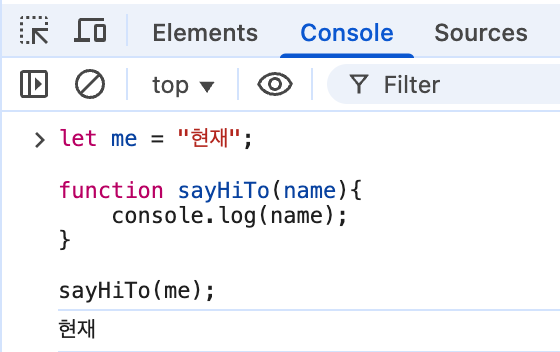
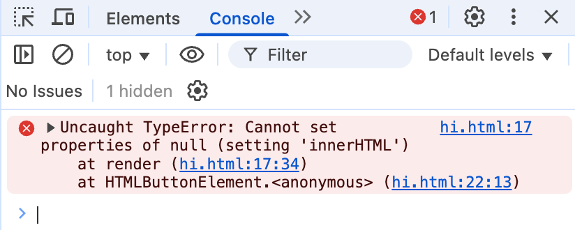
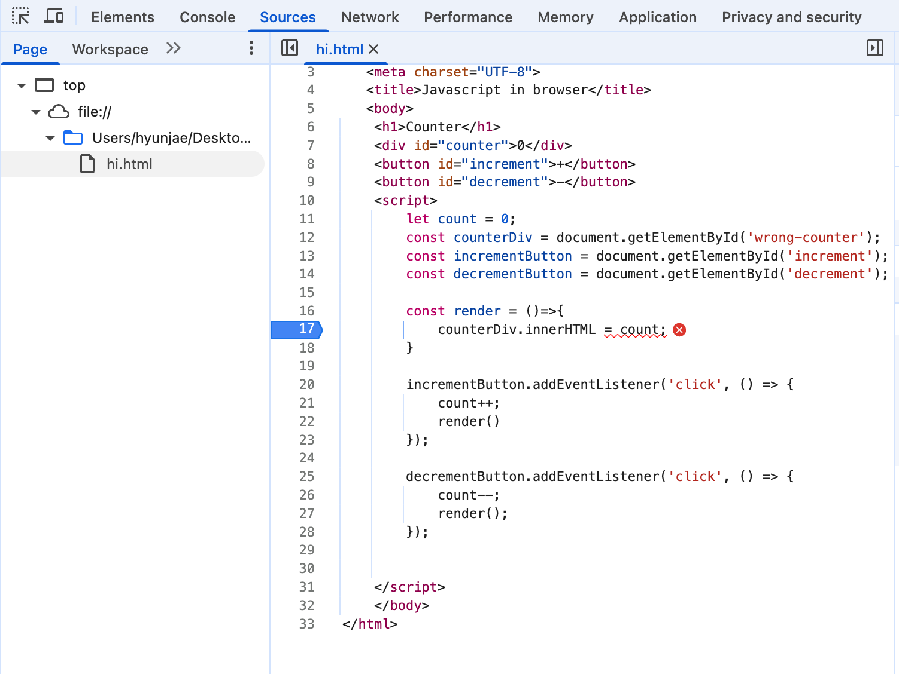
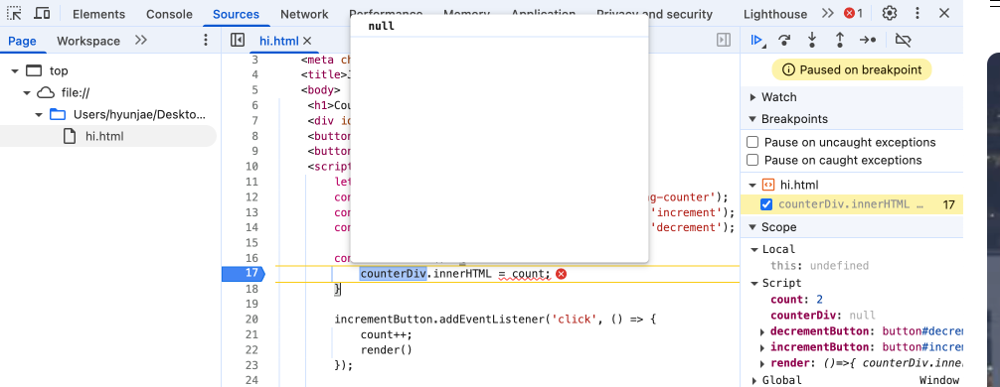
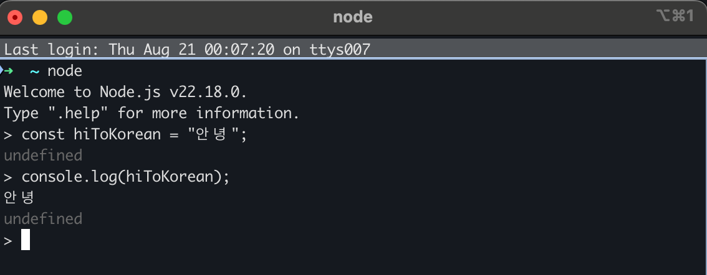

# 3장 자바스크립트 개발환경과 실행 방법

## 3.1 자바스크립트 실행 환경

브라우저와 Node.js 는 자바스크립트를 해석하고 실행할 수 있는 자바스크립트 엔젠을 내장하고 있다. 한가지 주의할 점은, **브라우저와 Node.js는 용도가 다르다**는 것이다. 

- 브라우저 : 자바스크립트를 실행해 **웹 페이지를 브라우저 화면에 렌더링**하는 것이 목적.
- Node.js : 자바스크립트 **실행 환경을 제공**하는 것 자체가 목적.

따라서 브라우저와 Node.js 모두 핵심 문법인 ECMAScript 는 실행가능 하지만, **추가로 제공하는 기능은 Node.js 에서 호환되지 않는다**.

대표적으로 **브라우저는 파싱된 HTML 요소를 선택하거나 제어하는 DOM API를 제공**하지만, Node.js 에서는 제공하지 않는다. 당연하게도 브라우저 외부환경에서는 DOM을 제어할 필요가 없기 때문이다.

반대로 **Node.js에서는 파일을 생성하고 수정할 수 있는 파일 시스템을 기본제공**하지만, 브라우저는 그렇지 않다.

이처럼 **브라우저만이 사용할 수 있는** DOM, XMLHttpRequest, fetch 등 과 같은 API를 **클라이언트 사이드 Web API**라고 부른다. **Node.js 역시 고유한 API** 를 지원한다.


이를 염두에 두고 자바스크립트 개발 환경을 구축하고, 자바스크립트를 실행하는 방법을 살펴보자.

## 3.2 웹 브라우저

다양한 웹 브라우저가 있지만 이 책에서는 구글 크롬 브라우저를 사용한다. 크롬 브라우저 역시 V8 자바스크립트 엔진을 사용하고 있다.

### 3.2.1 개발자 도구

크롬 브라우저가 제공하는 **개발자 도구**는 웹 앱 개발에 필수적인 강력한 도구다. 개발자 도구는 크롬에 내장되어 있어 별도의 설치가 필요하지 않다. 개발자 도구는 다음의 단축키로 열수 있다.

- 윈도우 : F12 or Ctrl + Shift + I
- MacOS : command + option + I

개발자 도구는 웹 개발에 유용한 다양한 기능을 제공한다. 

- Elements : 웹 페이지의 DOM과 CSS를 살펴볼수 있다.
- Console : 웹 페이지의 에러를 확인하거나, 자바스크립트 소스코드에서 작성한 console.log 메서드의 실행 결과를 확인할 수 있다.
- Sources : 웹 페이지의 자바스크립트 코드를 디버깅할 수 있다.
- Network : 웹 페이지에 관련된 네트워크 요청 정보와 성능을 확인할 수 있다.
- Application : 웹 스토리지, 세션, 쿠키 등을 확인하고 관리할 수 있다.

자세한 내용은 [Chrome DevTools](https://developer.chrome.com/docs/devtools/overview?hl=ko) 에서 확인해보자.

### 3.2.2 콘솔

개발자 도구의 Console 기능(이하 콘솔)은 **자바스크립트 코드에서 에러가 발생할 경우 가장 먼저 살펴보아야할** 곳이다.

혹은, 구현 단계에서 디버깅보다 간편하게 코드의 실행 결과를 확인하면서 개발을 진행하기 위해 console.log 메서드를 사용하는 경우가 많은데, 그 결과를 확인할 수 있는 것이 콘솔이다.

콘솔은 자바스크립트 코드를 직접 입력해 그 결과를 확인할 수도 있다. 이를 REPL(Read Eval Print Loop: 입력 수행 출력 반복) 환경이라고 부른다.

<p align="center">
  
</p>

### 3.2.3 브라우저에서 자바스크립트 실행

다음 HTML은 자바스크립트를 포함하고 있으며, 의도적으로 에러를 발생한 코드가 포함되어 있다. 파일을 클릭하여 브라우저에서 로드한 후, + 혹은 - 버튼을 클릭하면 콘솔에서 에러를 확인할 수 있다. 브라우저에서 자바스크립트가 실행되는 것을 확인할 수 있다.

```html
<!DOCTYPE html>
<html>
   <meta charset="UTF-8"> 
   <title>Javascript in browser</title>
   <body>
    <h1>Counter</h1>
    <div id="counter">0</div>
    <button id="increment">+</button>
    <button id="decrement">-</button>
    <script>
        let count = 0;
        
        const counterDiv = document.getElementById('wrong-counter'); // 에러 'wrong-counter' X / 'counter' O
        const incrementButton = document.getElementById('increment');
        const decrementButton = document.getElementById('decrement');

        const render = ()=>{
            counterDiv.innerHTML = count;
        }

        incrementButton.addEventListener('click', () => {
            count++;
            render()
        });

        decrementButton.addEventListener('click', () => {
            count--;
            render();
        });
    </script>
    </body>
</html>
```
<p align="center">
  
</p>

### 3.2.4 디버깅

앞선 3.2.3 에서 발생한 에러를 크롬의 Sources 기능을 활용해 디버깅해보자. 위의 이미지에서, 오른쪽의 `hi.html:17` 이라고 적힌 텍스트는 에러 발생 위치를 의미한다.

클릭하면 Sources 패널로 이동한다.

<figure>
  
  <figcaption></figcaption>
</figure>

17라인에서 왼쪽 숫자 17을 클릭하면, 중단점으로 지정이 가능하다. 다시 + 버튼을 클릭하여 에러를 야기해보자. 중단점을 지정하고, 자바스크립트를 실행하면 디버깅 모드에 돌입한다. 아래 이미지와 같이 에러의 원인을 파악할 수 있다.

<figure>
  
  <figcaption></figcaption>
</figure>

## 3.3 Node.js

클라이언트 사이드, 즉 브라우저에서 동작하는 간단한 웹 앱은 브라우저만으로도 개발할 수 있지만, 프로젝트 규모가 커짐에 따라 React, Angular 와 같은 프레임워크 혹은 라이브러리를 사용할 필요가 있다. **이때 Node.js와 `npm`이 필요하다.**

### 3.3.1 Node.js와 npm 소개

앞서 설명했지만, Node.js는 V8 자바스크립트 엔진으로 빌드된 자바스크립트 런타임 환경(실행 환경)이다.

`npm`은 **자바스크립트 패키지 매니저**다. 이는 **Node.js에서 사용할 수 있는 모듈들을 패키지화해서 모아둔 저장소 역할**과 **패키지 설치 및 관리를 위한 CLI**를 제공한다.

### 3.3.2 Node.js 설치

[Node.js](https://nodejs.org/ko)의 웹사이트에 접속해보자. LTS는 Long Term Support 버전으로, 장기적으로 안정된 지원이 보장된다. Current는 최신 버전을 제공한다.

그러므로 실제 개발환경에서는 LTS를, 학습 목적으로는 Current를 다운로드하는 것이 적합하다.

### 3.3.3 Node.js REPL

앞서 브라우저에서 자바스크립트를 실행하듯, Node.js에서 또한 실행할 수 있다.

터미널(윈도우에서는 명령 프롬프트)에서 다음과 같은 명령어를 실행해보자.

```zsh
$ node
```

프롬프트가 `>` 로로 변경되면 자바스크립트 코드를 실행해 볼 수있다.

<figure>
  
  <figcaption></figcaption>
</figure>