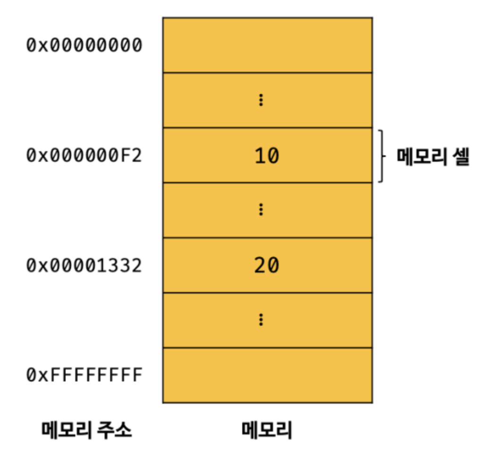
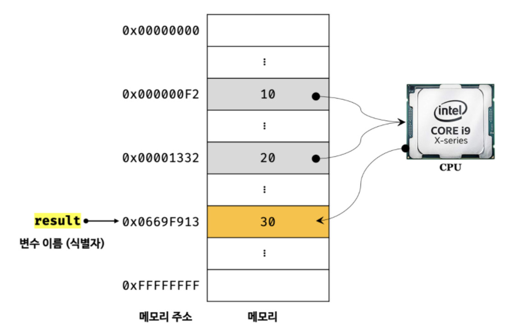
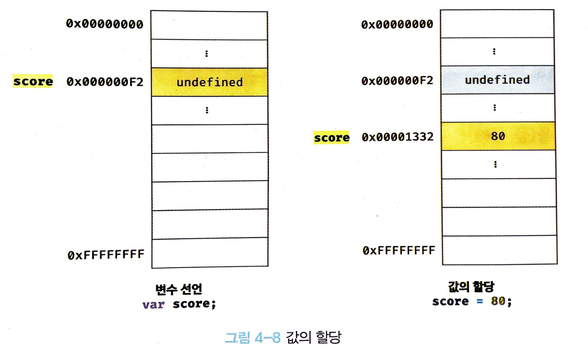
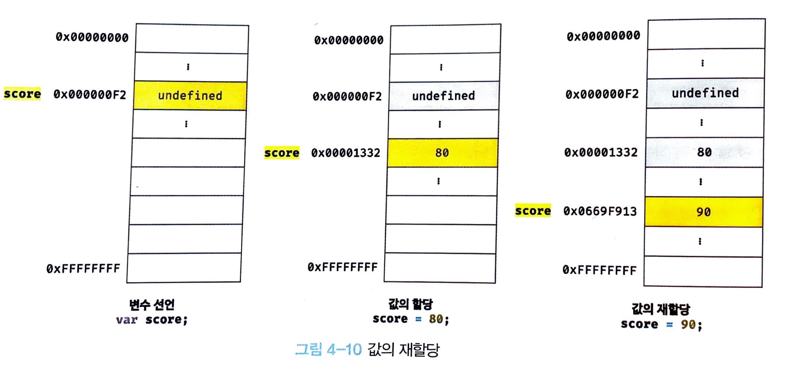

# 4장 변수

## 4.1 변수란 무엇인가? 왜 필요한가?

변수는 프로그래밍 언어에서 데이터를 관리하기 위한 핵심 개념이다. 먼저 다음과 같은 자바스크립트 코드를 실행하면 컴퓨터에서는 어떤 일이 일어날지 생각해보자.

```js
10 + 20
```

사람이 위 식을 계산하려면 

1. `10`, `20`, `+` 라는 기호의 의미를 알고 있어야 하며, 
2. `10 + 20`이라는 식의 의미도 해석할 수 있어야 한다. 

그리고 그 결과를 두뇌에 기억한다.

자바스크립트 엔진도 사람과 유사한 방식으로 계산한다. 우선 자바스크립트 엔진이 위 코드를 계산(**평가**, **evaluate**)하려면 역시 

1. `10`, `20`, `+`라는 기호(**리터럴**, **literal과** **연산자**, **operator**)의 의미를 알고 있어야 하며, 
2. `10 + 20`이라는 식(**표현식**, **expressor**)의 의미를 해석(**파싱**, **parsing**)할 수 있어야 한다.

자바스크립트 엔진은 우선 피연산자(`10`, `20`)를 기억한다. 사람은 이러한 값을 두뇌로 기억하지만, 컴퓨터는 메모리를 사용해 데이터를 기억한다.

**메모리**(memory)는 데이터를 저장할 수 있는 메모리 셀의 집합체다. 메모리 셀 하나의 크기는 1바이트(8비트)이다. 컴퓨터는 메모리 셀의 크기, 즉 1바이트 단위로 데이터를 저장하거나 읽어들인다.

각 셀은 고유의 메모리 공간의 위치를 나타내는 **메모리 주소**(memory adress)를 가진다. 0부터 시작해서 메모리의 크기만큼 정수로 표현된다. 예를 들어, 4GB의 메모리는 0부터, 4,294,967,295까지의 메모리 주소를 갖는다.

<figure>
  
  <figcaption>출처 : <a href="https://velog.io/@vinny/%EB%AA%A8%EB%8D%98-%EC%9E%90%EB%B0%94%EC%8A%A4%ED%81%AC%EB%A6%BD%ED%8A%B8-Deep-Dive-04%EC%9E%A5-%EB%B3%80%EC%88%98">모던 자바스크립트 Deep Dive 04장 변수</a></figcaption>
</figure>

위 예제에서 볼수 있듯 `10`과 `20`은 메모리 상의 메모리 주소에 저장된다. 편의상 `10`, `20` 으로 표기했지만 데이터 타입이 어떻든 메모리 상의 데이터는 모두 2진수로 처리된다.


성공적으로 연산이 끝나 결과도 메모리에 저장되었지만 문제가 있다. CPU가 연산해서 만들어낸 숫자 값인 `30`은 재사용이 불가한 것이다.

만일 재사용하려면 직접 메모리 주소를 통해 값에 접근해야한다. 하지만 이는 치명적 오류를 발생시킬 가능성이 매우 높다. 따라서 **자바스크립트는 개발자의 직접적인 메모리 제어를 허용하**지 않는다. 만일 허용한다하더라도, **메모리 주소는 코드가 실행될때 마다 변경**된다. 그렇기에 이는 올바른 시도 자체가 아니다.

프로그래밍 언어는 **기억하고 싶은 값을 메모리에 저장**하고, **저장된 값을 읽어 들여 재사용하기 위해** 변수라는 메커니즘을 제공한다. 변수의 정의를 내려보면 다음과 같다.

**변수는 하나의 값을 저장하기 위해 확보한 메모리 공간 자체 또는 그 메모리 공간을 식별하기 위해 붙인 이름을 말한다.**

간단히 말하자면 변수는 프로그래밍 언어에서 값을 저장하고 참조하는 메커니즘으로, **값의 위치를 가리키는** **상징적인 이름**이다. 변수는 컴파일러 혹은 인터프리터에 의해 값이 저장된 메모리 공간의 주소로 치환되어 실행된다. 따라서 개발자가 직접 메모리 주소를 참조할 필요가 없어진다.

앞서 살펴본 코드를 변수를 사용해 다시 작성해보자.

```js
var result = 10 + 20;
```

<figure>
  
  <figcaption>출처 : <a href="https://velog.io/@vinny/%EB%AA%A8%EB%8D%98-%EC%9E%90%EB%B0%94%EC%8A%A4%ED%81%AC%EB%A6%BD%ED%8A%B8-Deep-Dive-04%EC%9E%A5-%EB%B3%80%EC%88%98">모던 자바스크립트 Deep Dive 04장 변수</a></figcaption>
</figure>

연산을 통해 생성된 값 30은 메모리 공간에 저장된다. 이때 이 **메모리 공간에 상징적인 이름은 붙인 것이 변수**가 되는것이다. result 는 **변수 이름**(또는 **변수명**)이라고 한다. 그리고 result 에 저장된 값은 **변수 값**이라고 한다.

변수에 값을 저장하는 것을 **할당**(**대입**, **저장**)이라 하고, 변수에 저장된 값을 읽어 들이는 것을 **참조**(reference)라 한다.

그렇기에 변수 이름은 변수에 저장된 값의 의미를 명확히 알 수 있는 것으로 지어야한다.

## 4.2 식별자

변수 이름을 식별자라고도 한다. 식별자는 **어떤 값을 구별해서 식별할 수 있는 고유한 이름**을 말한다. 식별자는 어떤 값을 구별해, **어떤 메모리 주소에 있는지 식별**할 수 있어야 한다. 따라서 **값이 저장된 메모리 주소와 매핑 관계**를 맺으며, 이 매핑 정보도 메모리에 저장되어야 한다.

식별자라는 용어는 변수에만 국한되지 않는다. 예를 들어, 함수, 클래스 등 또한 모두 식별자이다. 즉, **메모리 상에 존재하는 어떤 값을 식별할 수 있는 이름**은 모두 **식별자**라고 부른다.

식별자는 네이밍 규칙을 준수해야하며, **선언(declaration)에 의해 자바스크립트 엔진에 식별자의 존재를 알린다**.

## 4.3 변수 선언

변수 선언이란 변수를 생성하는 것을 말한다. 자세히말하면 **변수 값을 위한 메모리 공간을 확보**하고, **변수 이름과 확보된 메모리 주소를 연결**해 값을 저장할 수 있게 준비하는 것 이다. **변수를 사용하려면 반드시 선언이 필요하다.**

변수를 선언할 때는 `var`, `let`, `const` 키워드를 사용한다.


> 💡 **키워드**는 자바스크립트 코드를 해석하고 실행하는 자바스크립트 엔진이 수행할 동작을 규정한 일종의 명령어다. 자바스크립트 엔진은 키워드를 만나면 자신이 수행해야 할 약속된 동작을 수행한다. 예를 들어, var 키워드를 만나면 자바스크립트 엔진은 뒤에 오는 변수 이름으로 새로운 변수를 선언한다.

`let`, `const` 는 ES6(ECMAScript 6)이후에 등장한 문법이므로 이전에는 `var` 키워드를 사용해서만 변수를 선언했다. 


> 💡 **ES5 vs ES6** 
> 
> 아직 살펴보진 않았지만 간단히 말하자면 var 키워드에는 여러 단점이 있다. 대표적으로 var 은 블록 레벨 스코프를 지원하지 않고, 함수 레벨 스코프를 지원한다. 이로 인해 의도치 않게 전역 변수가 선언되는 부작용이 발생한다. ES6에서 let과 const 키워드가 도입된 이유는 이러한 부작용을 보완하기 위해서이다. 하지만 그렇다고 해서 var 키워드가 폐기되는 것은아니다. 즉, ES6는 기본적으로 하위 호환성을 유지하며 새로운 기능을 추가한 것이다. 다시 말해, ES6는 ES5의 상위 집합이 된다.


---

이제 다음 코드를 살펴보자.

```js
var score;
```

위의 코드는 `score`라는 변수 이름을 **등록**하고 값을 저장할 메모리 공간을 확보한다. 

> 💡 **변수 이름은 어디에 등록되는가?**
>
> 변수 이름을 비롯한 모든 식별자는 **실행 컨텍스트**에 등록된다. 실행 컨텍스트는 자바스크립트 엔진이 소스코드를 평가하고 실행하기 위해 필요한 환경을 제공하고 코드의 실행 결과를 실제로 관리하는 영역이다. 

하지만 아직 변수에 값을 할당하지는 않았다. 이때 변수 선언에 의해 확보된 메모리 공간은 비어있지 않고, **`undefined`라는 값이 암묵적으로 할당되어 초기화**된다. **이것은 자바스크립트의 독특한 특징**이다.

> 💡 **undefined**는 자바스크립트에서 제공하는 원시 타입(primitive value)의 값이다. 

이를 통해 자바스크립트 엔진은 변수 선언을 엄밀히 말하면 2단계에 걸쳐 수행함을 알 수 있다.

- 선언 단계: 변수 이름을 등록해서 자바스크립트 엔진에 변수의 존재를 알린다.
- 초기화 단계: 값을 저장하기 위한 메모리 공간을 확보하고 암묵적으로 `undefined`를 할당해 초기화한다.

만약 초기화 단계를 거치지 않으면 확보된 메모리 공간에는 이전에 사용하던 값이 남아있을 수 있다. 이러한 값을 **쓰레기 값**(garbage value)라고 한다. 자바스크립트의 `var` 키워드는 **선언 단계와 초기화 단계를 동시에 수행**한다. 따라서 쓰레기 값이 생기는 위험으로부터 안전하다.

## 4.4 변수 선언의 실행 시점과 변수 호이스팅

다시 한번 변수를 사용하기 위해선 선언이 필요하다. **변수 선언을 하지 않고 참조를 시도하면 참조 에러(Reference Error)가 발생**한다.

다음 예제를 살펴보자.

```js
console.log(score); // undefined

var score; // 변수 선언문
```

자바스크립트 코드는 인터프리터에 의해 위에서 부터 아래로 한줄씩 순차적으로 실행된다. 따라서 변수 선언문보다 변수 참조하는 코드가 먼저 실행되었다. 하지만 참조 에러가 발생하지 않았다.

그 이유는 **변수 선언이 소스 코드가 실행되는 시점, 즉 런타임이 아닌 그 이전 단계에서 먼저 실행**되기 때문이다.

자바스크립트 엔진은 코드 실행 전, 먼저 **소스코드의 평가 과정을 거친다.** 이 평가 과정에서 자바스크립트 엔진은 **모든 선언문**을 소스코드에서 찾아내 **먼저 실행**한다. 이 과정이 끝나면 비로소 한줄씩 소스코드를 실행한다.

이말은, 자바스크립트 엔진은 **변수 선언이 소스코드 어디에서 되었든 상관없이 다른 코드보다 먼저 실행**한다는 뜻이 된다. 따라서, 소스코드의 물리적인 위치 어디서든 변수를 **참조*는*** 할 수 있다.

그렇다면 위의 코드를 다시 살펴보자. 

1. 자바스크립트 엔진은 평가 과정에서 선언문에 해당하는 `var score;`를 찾아내 먼저 실행한다. 
2. 이러한 평가 과정이 끝난 후, 소스코드를 순차적으로 실행하며 `console.log(score);` 이 실행된다.
3. `var` 키워드는 선언 단계와 초기화 단계를 동시에 수행하기에, `undefined`값이 할당되어 있다.
4. 콘솔창에는 `undefined`가 출력된다.

이처럼 **변수 선언문이 코드의 선두로 끌어 올려진 것*처럼* 동작**하는 자바스크립트 고유의 특징을 **변수 호이스팅**(variable hoisting)이라 한다.

변수 선언뿐아니라 모든 식별자는 호이스팅된다. 모든 선언문은 **런타임 이전 단계에서 먼저 실행**되기 때문이다.

## 4.5 값의 할당

변수에 값을 할당할 때는 할당 연산자 `=`을 사용한다. 할당 연산자는 우변의 값을 좌변의 변수에 할당한다.

```js
var score; // 변수 선언 및 초기화 
score = 80; // 값의 할당
```

<figure>
  
  <figcaption>출처: <a href="https://velog.io/@hustlekang/%EB%AA%A8%EB%8D%98-%EC%9E%90%EB%B0%94%EC%8A%A4%ED%81%AC%EB%A6%BD%ED%8A%B8-Deep-Dive-4%EC%9E%A5-%EB%B3%80%EC%88%98">모던 자바스크립트 Deep-Dive 4장 변수</a></figcaption>
</figure>

위의 그림처럼 변수에 값을 할당할 때는 선언 했을 때의 메모리 공간을 지우고 새로운 값을 할당하는 것이 아닌, **새로운 메모리 공간을 확보하고 그 곳에 값을 할당**한다.

변수 선언과 값의 할당을 다음과 같이 하나의 문으로 단축 표현할 수도 있다.

```js
var score = 80; // 변수 선언과 값의 할당
```

이때 주의할 점은, 변수 선언은 소스코드가 순차적으로 실행되는 런타임 이전 평가 과정에서 실행되지만, **값의 할당은 런타임에 실행**된다는 것이다.

```js
console.log(score);

var score;
score = 80;

console.log(score) // 80;
```

위의 코드가 평가되고 실행되는 과정은 다음과 같다.

1. 소스코드 평가 과정에서 `var score;` 선언문이 실행되고, `undefined` 값으로 초기화됨
2. 런타임에서 `score = 80;` 값의 할당 수행. 이로 인해 `score` 변수의 값이 `undefined` 에서 `80`으로 재할당됨.
3. `console.log(score)`의 결과로 `score`의 값인 `80` 출력


## 4.6 값의 재할당

이번에는 다음과 같이 `score` 변수에 값을 재할당해보자.

```js
var score = 80;
score = 90;

console.log(score); // 90
```
<figure>
  
  <figcaption>출처: <a href="https://velog.io/@hustlekang/%EB%AA%A8%EB%8D%98-%EC%9E%90%EB%B0%94%EC%8A%A4%ED%81%AC%EB%A6%BD%ED%8A%B8-Deep-Dive-4%EC%9E%A5-%EB%B3%80%EC%88%98">모던 자바스크립트 Deep-Dive 4장 변수</a></figcaption>
</figure>

재할당은 변수에 할당된 값을 다른 값으로 변경한다. 역시 기존의 메모리 공간에 값을 재할당하는 것이 아닌, 새로운 메모리 공간을 확보하고 그 곳에 값을 새로이 할당한다.

현재 `score`의 값은 `90`이다. 그 이전 값인 `undefine`와 `80`은 어떤 변수도 값으로 가지고 있지 않게 된다. 다시 말해, **어떠한 식별자와도 연결되어 있지 않다**. 이러한 불필요한 값은 **가비지 콜렉터**에 의해 메모리에서 자동 해제 된다. 


> 💡 **가비지 콜렉터(garbage collector, gc)**
> 
> 가비지 콜렉터는 애플리케이션이 할당한 메모리 공간을 주기적으로 검사하여 어떠한 식별자도 참조하지 않는 메모리 공간을 해제하는 기능을 말한다. 
> 자바스크립트는 이러한 가비지 콜렉터를 내장하고 있는 **매니지드 언어**로서 메모리 누수를 방지한다.


> 💡 **언매니지드 언어(unmanaged language) 매니지드 언어(managed language)**
>
> 프로그래밍 언어는 메모리 관리 방식에 따라 언매니지드 언어와 매니지드 언어로 분류할 수 있다.
>
> **언매니지드 언어**는 메모리를 할당하고 해제하기 위한 저수준 메모리 제어 기능을 제공한다. (e.g. C언어의 `malloc()`, `free()`)
>
> **매니지드 언어**는 이러한 메모리 관리 기능을 언어 차원에서 관리하고 개발자의 직접적인 메모리 제어를 허용하지 않는다.
---

**값을 재할당할 수 없는 변수**도 있는 데 이것은 변수가 아닌 **상수**라 부른다.

> 💡 **const 키워드**
>
> ES6에서 도입된 `const` 키워드로 선언한 변수는 재할당이 금지 된다. 즉, `const` 키워드는 단 한번만 할당할 수 있는 변수, 즉 **상수**를 표현할 수 있다. 
> 만약 `const` 키워드로 선언한 변수에 값을 재할당하려하면 에러가 발생한다.

## 4.7 식별자 네이밍 규칙

앞에서 언급했듯이 식별자는 어떤 값을 구별해서 식별해낼 수 있는 고유한 이름을 말한다. 식별자는 다음과 같은 네이밍 규칙을 준수해야 한다.

- 식별자는 특수문자를 제외한 문자, 숫자, 언더스코어(_), 달러 기호($)를 포함할 수 있다.
- 단, 식별자는 특수문자를 제외한 문자, 언더스코어(_), 달러 기호($)로 시작해야한다. 숫자로 시작하는 것은 허용하지 않는다.
- 예약어는 식별자로 사용할 수 없다. 예약어는 프로그래밍 언어에서 사용되고 있거나 사용될 예정인 단어를 말한다.

  <table>
  <tr>
    <td>abstract</td>
    <td>arguments</td>
    <td>await</td>
    <td>boolean</td>
  </tr>
  <tr>
    <td>break</td>
    <td>byte</td>
    <td>case</td>
    <td>catch</td>
  </tr>
  <tr>
    <td>char</td>
    <td>class</td>
    <td>const</td>
    <td>continue</td>
  </tr>
  <tr>
    <td>debugger</td>
    <td>default</td>
    <td>delete</td>
    <td>do</td>
  </tr>
  <tr>
    <td>double</td>
    <td>else</td>
    <td>enum</td>
    <td>eval</td>
  </tr>
  <tr>
    <td>export</td>
    <td>extends</td>
    <td>false</td>
    <td>final</td>
  </tr>
  <tr>
    <td>finally</td>
    <td>float</td>
    <td>for</td>
    <td>function</td>
  </tr>
  <tr>
    <td>goto</td>
    <td>if</td>
    <td>implements</td>
    <td>import</td>
  </tr>
  <tr>
    <td>in</td>
    <td>instanceof</td>
    <td>int</td>
    <td>interface</td>
  </tr>
  <tr>
    <td>let</td>
    <td>long</td>
    <td>native</td>
    <td>new</td>
  </tr>
  <tr>
    <td>null</td>
    <td>package</td>
    <td>private</td>
    <td>protected</td>
  </tr>
  <tr>
    <td>public</td>
    <td>return</td>
    <td>short</td>
    <td>static</td>
  </tr>
  <tr>
    <td>super</td>
    <td>switch</td>
    <td>synchronized</td>
    <td>this</td>
  </tr>
  <tr>
    <td>throw</td>
    <td>throws</td>
    <td>transient</td>
    <td>true</td>
  </tr>
  <tr>
    <td>try</td>
    <td>typeof</td>
    <td>var</td>
    <td>void</td>
  </tr>
  <tr>
    <td>volatile</td>
    <td>while</td>
    <td>with</td>
    <td>yield</td>
  </tr>
  </table>


```js
var my-name; // 특수문자이므로 ❌
var 1andonly; // 숫자가 처음에 나왔으므로 ❌
var this; // 예약어이므로 ❌

```

네이밍 컨벤션은 하나 이상의 영어 단어로 구성된 식별자를 만들 때 가독성 좋게 단어를 한눈에 구분하기 위해 규정한 명명 규칙이다.

일관성을 유지한다면 어떠한 네이밍 컨벤션도 좋지만 보통 자바스크립트에서는 **변수나 함수의 이름에는 카멜 케이스**를 사용하고, **생성자 함수, 클래스의 이름에는 파스칼 케이스**를 사용한다.

ECMAScript 사양에 정의되어있는 객체와 함수들도 카멜 케이스와 파스칼 케이스를 사용하고 있다. 따라서 코드 전체의 가독성을 높이려면 카멜 케이스와 파스칼 케이스를 따르는 것이 유리하다.