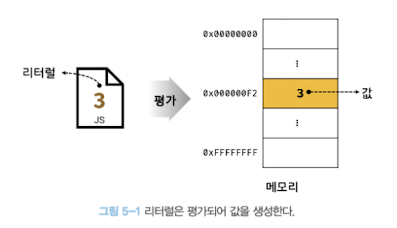
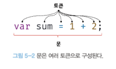

# 5장 표현식과 문

지금까지 살펴본 내용에서 **값**이라는 용어가 자주 등장했다. 이 용어가 자바스크립트에서 의미하는 바가 무엇인지 알아보자.

## 5.1 값

**값(value)** 은 **식(표현식, expression)** 이 **평가(evaluation)** 되어 생성된 결과를 말한다. 

평가란 표현식을 해석해서 **값**을 **생성**하거나 **참조**하는 것을 의미한다.

```js
// 10 + 20은 평가되어 숫자 값 30을 생성한다.
10 + 20; //30
```

모든 값은 데이터 타입(문자, 숫자 등)을 가지며 **메모리 공간에 저장**된다. **변수는 하나의 값을 저장하기 위해 확보한 메모리 공간 자체** 또는 그 메모리 공간을 식별하기 위해 붙인 이름이라고 했다.

따라서 **변수에 할당되는 것은 값**이다.

```js
// 변수에는 10 + 20이 평가되어 숫자 값 30이 생성되어, 할당된다.

var sum = 10 + 20; // 30
```

값은 다양한 방식으로 생성할 수 있다. 가장 기본적인 방법으로는 **리터럴**이 있다.

## 5.2 리터럴

**리터럴(literal)은 사람이 이해할 수 있는 문자 또는 약속된 기호를 사용해 값을 생성하는 표기법**을 말한다. 다음 예제를 살펴보자.

```js
// 숫자 리터럴 3
3
```

위 예제의 3은 단순한 아라비아 숫자인 3이 아닌 리터럴의 3이다. 사람이 이해할 수 있는 숫자 3을 코드에 기술하면 자바스크립트 엔진은 이를 평가해 숫자 **값** **3**을 생성한다.

<figure>
  
  <figcaption>출처 : <a href="https://velog.io/@indongcha/%EB%AA%A8%EB%8D%98-%EC%9E%90%EB%B0%94%EC%8A%A4%ED%81%AC%EB%A6%BD%ED%8A%B8-Deep-Dive-5%EC%9E%A5-%ED%91%9C%ED%98%84%EC%8B%9D%EA%B3%BC-%EB%AC%B8">모던 자바스크립트 Deep Dive 5장 표현식과 문</a></figcaption>
</figure>

이처럼 리터럴은 사람이 이해할수 있는 문자(아라비아 숫자, 알파벳 한글 등) 또는 미리 약속된 기호(`''`, `""`, `.`, `[]`, `{}`, `//` 등)로 표기한 코드여야 한다.

다양한 종류의 리터럴은 [MDN](https://developer.mozilla.org/ko/docs/Glossary/Literal)에서 확인할 수 있다.

## 5.3 표현식

**표현식(expression)** 은 **평가될 수 있는 문(statement)** 이다. 즉, **표현식이 평가되면 새로운 값을 생성하거나 기존 값을 참조**한다.

앞서 살펴본 **리터럴은 값으로 평가**된다. 따라서 **리터럴도 표현식**이다.

```js
var score = 100;
```

위 예제의 `100`은 리터럴이다. 리터럴 `100`은 자바스크립트 엔진에 의해 평가되어 값을 생성하므로 리터럴 그 자체로 표현식인 것이다.

```js
var score = 50 + 50;
```

위의 코드는 리터럴과 연산자로 이루어져있다. 역시 평가되어 숫자 값 100을 생성되므로 이는 표현식이다.

```js
score; // 100;
```

앞서 표현식을 참조하는 것도 평가라고 했다. 따라서 변수 식별자를 참조하면 변수 값으로 평가된다. 

이처럼 표현식은 리터럴, 식별자, 연산자, 함수 호출 등의 조합으로 이뤄질 수 있다. 다양한 표현식이 있지만 **값으로 평가될 수 있는 문은 모두 표현식**이다.

```js
// 리터럴 표현식
100
'hello'

// 식별자 표현식(선언이 존재한다는 가정)
sum
person.name
arr[1]

// 연산자 표현식
10 + 20
sum = 20
sum !== 10

// 함수/메서드 호출 표현식(선언이 존재한다는 가정)
square()
person.getName()
```

## 5.4 문

앞으로 자바스크립트를 설명할 때 문과 표현식이라는 용어가 자주 등장할 것이다.

**문은 프로그램을 구성하는 기본 단위이자 최소 실행 단위**다. 문의 집합으로 이뤄진 것이 바로 프로그램이며, 문을 작성하고 순서에 맞게 나열하는 것이 프로그래밍이다.

문은 여러 **토큰**으로 구성된다. 

**토큰(token)** 이란 **문법적인 의미**를 가지며, **문법적으로 더 이상 나눌 수 없는 코드의 기본 요소**를 의미한다.

<figure>
  
  <figcaption></figcaption>
</figure>

문은 명령문이라고도 부른다. 문은 선언문, 할당문, 조건문, 반복문 등으로 구분할 수 있다. 

```js
// 변수 선언문
var x;

// 할당문
x = 5;

// 함수 선언문
fucntion foo () {}

// 조건문
if (x > 1) { console.log(x); } 

// 반복문
for (var i = 0; i < 2; i++) { console.log(i); }
```

## 5.5 세미콜론과 세미콜론 자동 삽입 기능

세미콜론(`;`)은 **문의 종료**를 나타낸다. 즉 자바스크립트 엔진은 세미콜론의 위치로 문이 종료함을 파악하고 순차적으로 하나씩 문을 실행한다.

문의 끝에 붙이는 세미콜론은 옵션이며, 생략 가능하다. 이는 세미콜론 자동 삽입 기능(ASI)이 암묵적으로 수행되기 때문이다.

하지만 ESLint 같은 정적 분석 도구에서도 세미 콜론 사용을 기본으로 설정하고 있고, TC39(ECMAScript 기술 위원회)도 세미콜론 사용을 권장하는 분위기므로 이 책에서는 세미콜론을 붙인다.

## 5.6 표현식인 문과 표현식이 아닌 문

표현식은 문의 일부일 수 도 있고 그 자체로 문이 될 수도 있다.

```js
// 선언문은 값으로 평가될 수 없으므로 표현식이 아니다.
var x;

// 1, 2(리터럴), x = 1 + 2(연산자) 는 모두 표현식이다.
// x = 1 + 2는 문이면서 표현식이다.
x = 1 + 2;
```

표현식인 문은 값으로 평가될 수 있는 문이며, 표현식이 아닌 문은 값으로 평가될 수 없는 문을 말한다. 이를 구분하는 가장 간단한 방법은 **변수에 할당해 보는 것**이다.

표현식은 값으로 평가되기 때문에 변수에 할당할 수 있다. 반대로 표현식이 아닌 문은 값으로 평가되지 않기에 변수에 할당할 수 없을 것이다.

```js
// var x 는 표현식이 아니므로 값이 아니며, var foo 에 할당할 수 없다.
var foo = var x;
```

위 예제의 `var x` 는 선언문에 해당하므로 표현식이 아니다. 다시 말해 값으로 평가될 수 없다.

```js
// 변수 선언문은 표현식이 아닌 문이다.
var x;

// 할당문은 그 자체로 표현식이다. 그러므로 표현식인 문이다.
x = 100;
```

그렇다면 위의 표현식을 변수에 할당해보자.

```js
// x = 100은 표현식이므로 변수에 할당할 수 있다.
var foo = x = 100;
console.log(x); // 100
```
