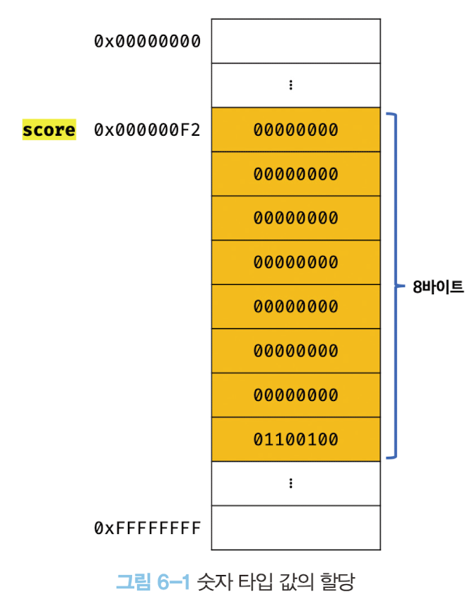

# 6장 데이터 타입

데이터 타입(data type, 줄여서 '타입' 이라고도 한다.)은 **값의 종류**를 말한다. 자바스크립트의 모든 값은 데이터 타입을 갖는다. 자바스크립트 엔진은 **타입을 구별해 값을 취급**한다.  

자바스크립트에는 **7개의 값**이 있으며 이들은 **원시 타입**과 **객체 타입**으로 분류할 수 있다.

| 구분      | 데이터 타입 | 설명                                               |
|-----------|-------------|----------------------------------------------------|
| 원시 타입 | 숫자 number 타입      | 숫자. 정수와 실수 구분 없음.   |
|           | 문자열 string 타입      | 문자열                      |
|           | 불리언 boolean 타입     | 논리적 참과 거짓            |
|           | undefined 타입   | var 키워드로 선언된 변수에 암묵적으로 할당되는 값               |
|           | null 타입        | 값이 없다는 것을 의도적으로 명시할 때 사용되는 값                |
|           | 심벌 symbol 타입      | ES6에 추가된 타입  |
| 객체 타입 |       | 객체, 함수, 배열 등 |


예를 들어 숫자 타입 값 `1` 과 문자열 타입 값 `"1"` 은 **완전히 다르다**. 목적과 용도 뿐 아니라, 확보해야할 메모리 공간의 크기도, 저장되는 2진수도, 읽어들이는 방식 등 모든 것이 다르다.

이제 자바스크립트가 제공하는 데이터 타입의 특징들을 살펴보자.

## 6.1 숫자 타입

C, 자바의 경우 숫자를 정수와 실수를 나누어 int, long, float 등과 같은 다양한 타입을 제공한다. 하지만 특이하게 자바스크립트는 하나의 숫자 타입만 존재한다.

ES(ECMAScript) 사양에 따르면 숫자 타입의 값은 배정밀도 **64비트 부동소수점 형식**을 따른다. 즉, **모든 수를 실수로만 처리**하며, 정수만 표현하기 위한 데이터 타입은 따로 제공하지 않는다. 혹은 음수, 소숫 점이 붙은 숫자 모두 하나의 숫자 타입으로 표현된다.

```js
// 모두 숫자 타입
var integer = 10; // 정수
var double = 10.12; // 실수
var negative = -20;// 음의 정수
``` 

또한 정수, 실수, 2진수, 8진수, 16진수 리터럴은 모두 메모리에 **배정밀도 64비트 부동소수점 형식의 2진수로 저장**되며, 이는 모두 **10진수로 해석**된다.

```js
var binary = 0b01000001; // 2진수
var octal = 0o101; // 8진수
var hex = 0x41; // 16진수

// 표기법이 다를 뿐 모두 같은 값
console.log(binary); // 65
console.log(octal); // 65
console.log(hex); // 65
```

숫자 타입은 추가적으로 **세 가지 특별한 값**도 표현할 수 있다.

- `Infinity`: 양의 무한대
- `-Infinity`: 음의 무한대
- `NaN`: 산술 연산 불가

```js
// 숫자 타입의 세 가지 특별한 값
console.log(10 / 0); // Infinity
console.log(10 / -10); // -Infinity
console.log(1 * 'String'); // NaN
```

자바스크립트 엔진은 대소문자를 구별하기에 `NaN`을 사용할 때는 대소문자를 정확하게 구분해서 사용해야한다.

## 6.2 문자열 타입

문자열 타입은 텍스트 데이터를 나타내는 데 사용한다. 문자열은 0개 이상의 16비트 유니코드 문자(UTF-16)의 집합으로 전 세계 대부분의 문자를 표현할 수 있다.

문자열은 작은 따옴표(`''`), 큰 따옴표(`""`), 백틱(` `` `) 으로 텍스트를 감싼다.

```js
var string;
string = '문자열'; // 작은 따옴표
string = "문자열"; // 큰 따옴표
string = `문자열`; // 백틱
```

다른 타입과 달리 문자열을 이러한 문자로 감싸는 이유는, **키워드나 식별자 같은 토큰** 또한 문자열 형태일 수 있기에 **구분하기 어렵기 때문**이다. 만약 문자열을 감싸지 않고 사용한다면 자바스크립트 엔진은 키워드나 식별자와 같은 토큰으로 인식한다.

C는 문자열 타입을 제공하지 않고 문자의 배열로 문자열을 표현하고, 자바는 문자열을 객체로 표현한다. 하지만 자바스크립트의 문자열은 **원시 타입**으로서, **변경 불가능한 값**이다. 이는 이후에 자세히 살펴보자.

## 6.3 템플릿 리터럴

ES6부터 템플릿 리터럴이라고 하는 새로운 문자열 표기법이 도입되었다. 템플릿 리터럴은 일반 문자열과 비슷해 보이지만 일반적인 따옴표가 아닌 **백틱(` `` `)을 사용해서만 표기**해야한다. 

```js
var template = `Template literal`;

console.log(template); // Template literal;
```

템플릿 리터럴은 런타임에 일반 문자열로 변환되어 처리된다. 

템플릿 리터럴은 멀티라인 문자열, 표현식 삽입, 태그드 템플릿 등 편리한 문자열 처리 기능을 제공한다. 

### 6.3.1 멀티라인 문자열
일반 문자열 내에서는 개행이 불가하다.

```js
var str = 'hello
world.';

// SyntaxError: Invalid or unexpected token
```

따라서 문자열 내의 개행 등 공백을 표현하려면 백슬래시(\)로 시작하는 이스케이프 시퀀스를 사용해야 한다.

| 이스케이프 시퀀스 | 의미                               |
|-------------------|------------------------------------|
| \n                | 개행. 다음 행으로 이동
| \r                | 개행(Carriage Return). 커서를 처음으로 이동.      |
| \t                | 탭(수평)                           |
| \v                | 탭(수직) |
| \b                | 백스페이스         |
| \f                | 폼 피드. 프린터로 출력할 경우 다음 페이지의 시작 지점으로 이동한다.               |
| \\                | 백슬래시 자체                |
| \'                | 작은 따옴표       |
| \"                | 큰 따옴표      |
| \0                | NULL |
| \uXXXX            | 유니코드.         |

> 💡 라인 피드와 캐리지 리턴
>
> 라인 피드(`\n`)는 커서를 정지한 상태에서 종이를 한 줄 올리는, 캐리지 리턴(`\r`)은 종이를 움직이지 않고 커서를 맨 앞줄로 이동하는 것이다. 초창기 컴퓨터가 출력을 프린터로 수행하던 시절 사용되던 개념이다.
>
> 자바스크립트에서는 둘다 개행을 의미하며, 캐리지 리턴을 사용하는 경우는 거의 없다. 일반적으로 라인 피드를 사용해 개행한다.

```js
var template = `<ul>\n\t<li><a href="#">Home</a></li>\n</ul`;

console.log(template);
```
결과는 다음과 같다.
```text
<ul>
    <li><a href="#">Home</a></li>
</ul>
```

그리고 템플릿 리터럴 내에선 **이스케이프 시퀀스를 사용하지 않고도 개행이 허용**된다. 따라서 다음 코드는 위와 똑같은 결과를 출력한다.

```js
var template = `<ul>
    <li><a href="#">Home</a></li>
</ul>`;
```

### 6.3.2 표현식 삽입

문자열은 문자열 연산자 `+`를 사용해 연결할 수 있다. `+`연산자는 **피연산자 중 하나 이상이 문자열인 경우 문자열 연결 연산자로 동작**한다. 그 외의 경우는 덧셈 연산자로 동작한다.

```js
var first = 'Hyun-jae';
var last = 'Oh';

// ES5: 문자열 연결
console.log('My name is' + first + last); // My name is Oh Hyun-jae
```

**템플릿 리터럴에선 문자열 내에 표현식을 삽입**할 수 있다. 따라서 가독성이 훨씬 좋다. 이때 **표현식 내의 값**은 평가 결과가 문자열이 아니더라도 **문자열로 타입이 강제로 변환**된다.

표현식을 삽입하려면 `${}`을 사용한다.

```js
var first = 'Hyun-jae';
var last = 'Oh';

// ES6: 문자열 연결
console.log(`My name is ${first} ${last}`); // My name is Oh Hyun-jae
```

## 6.4 불리언 타입

불리언 타입의 값은 논리적 참, 거짓을 나타내는 `true`와 `false`뿐이다. 불리언 타입의 값은 프로그램의 흐름을 제어하는 조건문에서 자주 사용한다.

```js
var foo = true;
console.log(foo); // true

foo = false;
console.log(foo); // false
```

## 6.5 undefined 타입

`undefined` 타입의 값은 `undefined`가 유일하다.

var 로 변수를 선언하면 암묵적으로 `undefined`로 초기화 된다. 이처럼 `undefined`는 개발자가 의도적으로 할당하기 위한 값이 아니라 자바스크립트 엔진이 변수를 초기화할 때 사용하는 값이다.

따라서 개발자가 의도적으로 변수에 할당한다면 `undefined`의 본래 취지와 어긋날뿐더러 혼란을 줄 수 있으므로 권장하지 않는다.

그렇다면 변수에 값이 없다는 것을 명시하고 싶을 땐 어떤 데이터 타입을 사용해야할까? 그런 경우에는 `null`을 할당할 수 있다.

> 💡 선언과 정의
>
> `undefined`를 직역하면 "정의되지 않은"이다. 자바스크립트의 `undefined`에서 말하는 정의란 변수에 값을 할당하여 변수의 실체를 명확히 하는 것을 말한다.
>
> 다른 프로그래밍언어 에서는 선언과 정의를 명확히 구분하는 경우가 많다. 하지만 자바스크립트의 경우 변수를 선언하면 암묵적으로 정의가 이루어져 그 구분이 모호하다.
>
> ECMAScript 사양에서 **변수**는 *'선언한다'* 라고 표현하고, **함수**는 *'정의한다'* 라고 표현한다. 따라서 이 책에서도 최대한 반영하여 변수는 선언, 함수는 정의로 표현한다.

## 6.6 null 타입

`null` 타입의 값도 `null`이 유일하다. 프로그래밍 언어에서 `null`은 변수에 값이 없다는 것을 의도적으로 명시할 때 사용한다.

변수에 `null`을 할당하는 행위는 **변수가 이전에 참조하던 값을 더이상 참조하지 않겠다**는 의미이다.

```js
var foo = 'Oh';

// 이전 참조를 제거. foo 변수는 더이상 'Oh'를 참조하지 않는다.
// 유용해 보이지는 않는다. 변수의 스코프를 좁게 만들어 변수 자체를 재빨리 소멸시키는 편이 낫다.

foo = null;
```

**함수가 유효한 값을 반환할 수 없는 경우**, 명시적으로 `null`을 반환하기도 한다. 예를 들어, HTML 요소를 검색해 반환하는 `document.querySelector`메서드는 조건에 부합하는 HTML 요소를 검색할 수 없는 경우 에러 대신 `null`을 반환한다.

```html
<!DOCTYPE html>
<html>
<body>
    <script>
        var element = document.querySelector('.myClass');

        // HTML 문서에 myClass 클래스를 갖는 요소가 없기에 null 반환
        console.log(element); // null
    </script>
</body>
</html>
```

## 6.7 심벌 타입

심벌은 ES6에 추가된 7번째 타입으로, **변경 불가능한 원시 타입의 값**이다. 심벌 값은 다른 값과 중복되지 않는 유일무이한 값이다. 따라서 주로 이름이 충돌할 위험이 없는 객체의 유일한 프로퍼티 키를 만들기 위해 사용한다.

원시 값은 리터럴을 통해 생성하지만 심볼은 `Symbol` 함수를 호출해 생성한다.

```js
// 심벌 값 생성
var key = Symbol('key');
console.loG(typeof key); // symbol

// 객체 생성
var obj = {};

// 이름이 충돌할 위험이 없는 유일무이한 값인 심벌을 프로퍼티 키로 사용한다.
obj[key] = 'value';
console.log(obj[key]); // value
```

심벌에 대해서는 이후에 자세히 살펴보자.

## 6.8 객체 타입
자바스크립트의 데이터 타입은 크게 **원시 타입과 객체 타입과 분류**한다. 원시 타입과 객체 타입은 근본적으로 다르다. 이에 대해선 이후에 자세히 다룬다.

여기서 짚고 넘어갈 것은 자바스크립트는 객체 기반의 언어이며, **자바스크립트를 이루고 있는 거의 모든 것이 객체**라는 것이다.

## 6.9 데이터 타입의 필요성

### 6.9.1 데이터 타입에 의한 메모리 공간의 확보와 참조

값은 메모리 공간에 저장된다. 그 때 얼만큼의 공간을 사용해야 낭비와 손실 없이 값을 저장할 수 있는 지 알아야한다. 

**자바스크립트 엔진은 데이터 타입, 즉 값의 종류에 따라 정해진 크기의 메모리 공간**을 **확보**한다. 즉, 변수에 할당되는 값의 데이터 타입에 따라 확보할 메모리 공간의 크기가 결정된다.

예를 들어 다음과 같이, `score`에 리터럴 `100`을 할당했다. 이 경우 자바스크립트 엔진은 리터럴 `100`을 숫자 타입의 값 `100`으로 인식하고, 그에 맞는 8바이트의 메모리 공간을 확보한다. 

<figure>
  
  <figcaption></figcaption>
</figure>

```js
var score = 100;
```

이번에는 **값의 참조**에 대해 생각해보자. 값의 참조는 식별자 `score`를 통해 숫자 타입의 값 `100`을 찾아 가는 것을 의미한다. 정확히 **말하면 메모리 공간의 선두 메모리 셀의 주소를 찾아**가는 것이다.

이때 **한 번에 읽어들여야할 메모리 공간의 크기, 즉 메모리 셀의 개수(바이트 개수)를 알아야**한다. 자바스크립트 엔진은 `score`의 값을 이 숫자 타입, 즉 8바이트로 인식할 수 있다.

### 6.9.2 데이터 타입에 의한 값의 해석

성공적으로 `score`의 값을 읽어들였다. 하지만 이 값은 2진수 형태이다. 따라서 이제 남은 것은 이 **값을 "어떻게 해석할 것인가"** 이다.

**데이터 타입은 이 때 어떻게 해석할지에 대해 결정**한다. `score`변수에 할당된 값은 숫자 타입이다. 따라서 `score`를 참조하면 메모리 공간의 주소에서 읽어 들인 2진수 값을 숫자로 해석한다.

### 요약

- 값을 저장할 때 확보해야 하는 **메모리 공간의 크기**를 결정
- 값을 참조할 때 한 번에 읽어 들여야 할 **메모리 공간의 크기**를 결정
- 메모리에서 읽어 들인 **2진수를 어떻게 해석**할지 결정하기 위해

## 6.10 동적 타이핑
### 6.10.1 동적 타입 언어와 정적 타입 언어

정적 타입 언어(C, 자바와 같은)은 변수를 선언할 때 변수에 할당할 수 있는 값의 종류, 즉 데이터 타입을 사전에 선언한다. 이를 명시적 타입 선언이라 한다.

```C
// c 변수에는 1바이트 정수 타입의 값만 할당할 수있다.
char c;

// num 변수에는 4바이트 정수 타입의 값만 할당할 수 있다.
int num;
```

정적 타입 언어는 컴파일 시점에 **타입 체크**를 수행한하여, 만약 에러가 발생하면 프로그램의 실행 자체를 막는다. 이를 통해 타입의 일관성을 강제하고 런타임의 에러를 줄인다. 

반면, 자바스크립트는 **변수를 선언할 때 타입을 선언하지 않는다**. 자바스크립트의 변수는 어떤 데이터 타입의 값이라도 자유롭게 할당할 수 있다.

다음 예에서는, **하나의 변수**를 선언하고 **다양한 데이터 타입의 값**을 할당해볼 것이다.

```js
var foo;
console.log(typeof foo); // undefined

foo = 1;
console.log(typeof foo); // number

foo = "hi";
console.log(typeof foo); // string

foo = true;
console.log(typeof foo); // boolean

foo = Symbol();
console.log(typeof foo); // symbol

foo = {};
console.log(typeof foo); // object

foo = [];
console.log(typeof foo); // object

foo = function (){};
console.log(typeof foo); //object
```

- 정적 타입 언어는 **변수 선언 시점**에 **변수의 타입이 결정**되며, 이 후 변수의 타입은 변경할 수 없다.
- 반면, 자바스크립트에서는 **값을 할당하는 시점**에 **변수의 타입이 결정**되며, 이 후 변수의 타입은 변경할 수 있다.

다시 말해, 자바스크립트의 **변수는 선언이 아닌 할당에 의해 타입이 결정**(이를 **타입 추론**이라고 부른다)된다. 그리고 재할당에 의해 변수의 타입은 언제든 동적으로 변할 수 있다. 

이러한 특징을 **동적 타이핑** 이라하며, 자바스크립트를 **동적 타입 언어**라 한다.

그렇다면 자바스크립트에서는 변수 자체가 타입을 가지는 것이 아니라, **데이터 타입을 가진 값에 의해 변수의 타입이 동적으로 결정**된다고 표현하는 것이 더 적절하다.

### 6.10.2 동적 타입 언어와 변수

동적 타입 언어는 어떤 데이터 타입의 값이라도 변수에 할당할 수 있다. 이러한 특성은 편리함도 제공하지만 위험 또한 도사리고 있다.

- 복잡한 프로그램이라면 변화하는 변수 값의 데이터 타입을 추적하기 어려울 수 있다. 
- 자바스크립트는 자바스크립트 엔진에 의해 암묵적인 형변환이 일어나기에, 잘못된 예측이 일어날 수 있다.

이러한 이유로 동적 타입 언어는 **유연성은 높지만 신뢰성은 떨어진다.**

변수를 사용할 때 주의할 사항은 다음과 같다.

- 변수는 꼭 필요한 경우에 한해 제한적으로 사용한다. 변수 값이 어떠한 데이터 타입으로든 언제든 재할당이 가능하기 때문이다.
- 변수의 유효 범위(스코프)를 최대한 좁게 만들어 변수의 부작용을 억제한다.
- 전역 변수는 최대한 사용하지 않는다. 전역 변수는 어디서든 참조/변경 가능한 변수라는 의미가 된다. 따라서 의도치 않게 변경될 가능성이 높다.
- 변수보다는 상수를 사용한다. 상수는 값의 변경이 불가하기에 값의 변경이 자연스레 억제된다.
- 변수 이름은 적절하게 짓는다.
