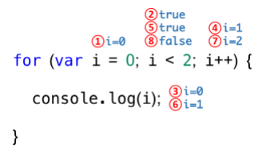

# 8장 제어문

제어문은 **조건에 따라** 코드 블록을 실행하거나 **반복** 실행할 때 사용한다. 

제어문을 사용하면 코드의 실행 흐름을 인위적으로 제어할 수 있다. 따라서 가끔은 가독성을 해치는 단점이 되기도 한다. 나중에 살펴볼 함수형 프로그래밍 기법에서는 이러한 제어문의 사용을 억제하여 복잡성을 해결하려 노력한다.

우선 제어문을 바르게 이해해보자.

## 8.1 블록문

블록문은 **0개 이상의 문을 중괄호로 묶은 것**으로, 코드 블록 또는 블록이라고 부르기도 한다. 자바스크립트는 블록문을 하나의 **실행 단위로 취급**한다. 

블록문은 단독으로 사용할 수 있으나, 일반적으로 제어문/반복문과 함께 사용한다.

문의 끝에는 종료를 알리는 세미콜론(`;`)이 붙는 것이 일반적이나, 블록문은 언제나 문의 종료를 자체적으로 의미하기에 **세미콜론을 붙이지 않는다.**

```js
// 블록문
{
    var foo = 10;
}
```

## 8.2 조건문
조건문은 주어진 **조건식**(불리언 값으로 평가될 수 있는 표현식)의 **평가 결과**에 따라 **코드 블록(블록문)의 실행을 결정**한다. 

자바스크립트는 `if ... else` 문과 `switch` 문으로 두 가지 조건문을 제공한다.

### 8.2.1 if ... else 문
조건식의 평가결과가 `true`일 경우 `if`문의 코드 블록이 실행되고, `false`일 경우 `else`문의 코드 블록이 실행된다.

```js
if (조건식) {
    // 조건식이 참이면 이 코드 블록이 실행
}
else {
    // 조건식이 거짓이면 이 코드 블록이 실행
}
```

`if`문의 조건식은 불리언 값으로 평가되어야 한다. 하지만 불리언 값으로 평가되지 않는 다면, **자바스크립트 엔진에 의해 암묵적으로 불리언 값으로 형변환**이 된다.

```js
var foo = "hi";

// 불리언 값으로 암묵적으로 형변환
if(foo){
    // 조건식이 참이면 이 코드 블록이 실행
}
```

조건식을 추가하고 싶다면 `else if`문을 추가한다. `if`문과 `else`문은 2번 이상 사용할 수 없지만, `else if`는 여러번 사용할 수 있다.

```js
if (조건식1){
    // 조건식1이 참이면 이 코드 블록이 실행
}
else if (조건식2){
    // 조건식1이 거짓이고, 조건식2이 참이면 이 코드 블록이 실행
}
else {
    // 조건식1과 조건식2가 거짓이면 이 코드 블록이 실행
}
```

만약 코드 블록 내의 문이 하나뿐이라면 중괄호를 생략할 수 있다.
```js
var num = 2;
var kind;
if (num > 0) kind = '양수';
else if (num < 0) kind = '음수';
```

앞선 삼항연산자에서 살펴보았듯 대부분의 `if ... else`문은 삼항 조건 연산자로 바꿔 쓸 수 있다. 다음 예제를 살펴보자.

```js
// if ... else 문
var x = 2;
var result;

if (x % 2) {
    result = '홀수';
} else {
    result = '짝수';
}

console.log(result); // 짝수

// 삼항 연산자

result = x % 2 ? '홀수 ' : '짝수';

console.log(result); // 짝수
```

둘의 차이는 표현식을 생성하느냐 아니냐 이다. `if ... else`문은 조건식의 표현식을 실행하여 그 결과에 따라 각기 다른 **코드 블록을 실행**할 뿐이다. 

반면, 삼항 연산자는 조건식을 실행하고, 그 결과로 값으로 평가되는 **표현식을 만든다**.

### 8.2.2 switch 문

`switch` 문은 주어진 표현식을 평가하여 **그 값**과 **일치하는 표현식**을 갖는 `case` 문으로 실행 흐름을 옮긴다.

`switch` 문의 표현식과 일치하는 **`case` 문이 없다면 실행 순서는 `default` 문으로 이동**한다. `default` 문은 선택사항이다.

```js
switch (표현식) {
    case 표현식 1:
        switch 문의 표현식과 표현식1이 일치하면 실행될 문;
        break;
    case 표현식 2:
        switch 문의 표현식과 표현식2이 일치하면 실행될 문;
        break;
    default:
        switch 문의 표현식과 일치하는 case 문이 없을 때 실행될 문;
}
```

`if ... else` 문의 조건식은 불리언 값으로 평가되어야 한다. 하지만 `switch` 문의 조건식은 불리언 값보다는 문자열이나 숫자 값인 경우가 많다.

다시말 해, `switch` 문은 논리적 참, 거짓보다는 다양한 상황(case)에 따라 실행할 코드 블록을 결정할 때 사용한다. 다음 예제를 살펴보자.

```js
var month = 11;
var monthName;

switch (month) {
    case 1: monthName = 'January';
    // ...
    case 11: monthName = 'November';
    // ...
    default: monthName = 'Invalid month';
}

console.log(monthName); // Invalid month
```

지금까지 살펴본 `switch` 문을 생각하면 monthName 에는 'November'가 할당되어 있어야 한다. 하지만 default 에 해당하는 Invalid month가 할당되어 있다.

이러한 현상은 적합한 `case`(`11`) 에서 값을 할당 받았지만, `break` 문을 통해 `switch` 문을 탈출하지 않고 `switch` 문이 끝날 때까지 이후의 모든 `case` 문과 `default` 문을 실행했기 때문이다. 이를 **폴스루**(fall through)라 한다.

즉, 각 `case` 마다 `break` 문을 사용해야한다.

```js
var month = 11;
var monthName;

switch (month) {
    case 1: monthName = 'January';
        break;
    // ...
    case 11: monthName = 'November';
        break;
    // ...
    default: monthName = 'Invalid month';
}

console.log(monthName); // 'November'
```

만약 `if ... else` 문으로 해결할 수 있다면 `switch` 문보다는 `if ... else` 문을 사용하는 편이 좋다. 하지만 조건이 너무 많다면 반대로 `switch` 문을 사용할 수 있겠다.

## 8.3 반복문

반복문은 조건식의 평가 결과가 참인 경우 코드 블록을 실행한다. 그 후 조건식을 **다시 평가**하여 **여전히 참인 경우 코드 블록을 다시 실행**한다. 이는 **조건식이 거짓일 때까지** **반복**된다.

자바스크립트는 세 가지 반복문인 `for` 문, `while` 문, `do ... while` 문을 제공한다.

> 💡 반복문을 대체할 수 있는 다양한 기능
>
> 자바스크립트는 배열을 순회하는 forEach 메서드, 객체의 프로퍼티를 열거하는 for ... in 문, 이터러블을 순회할 수 있는 for ... of 문과 같이 반복문을 대체할 수 있는 다양한 기능을 제공한다. 이에 대해서는 해당 장에서 자세히 살펴보자.

### 8.3.1 for 문

`for` 문은 조건식이 거짓으로 평가될 때까지 코드 블록을 반복 실행한다. 

```js
for (변수 선언문 또는 할당문; 조건식; 증감식) {
    조건식이 참인 경우 반복 실행될 문;
}
```

```js
for (var i = 0; i < 2; i++){
    console.log(i);
}

// 0 
// 1
```

다음은 for 문의 실행순서를 나타낸다. 변수 `i` 가 0으로 초기화된 상태에서 시작한다. 조건식인 `i < 2`를 거짓이 될때까지 `i`의 값을 증가하며, 코드 블록을 실행한다. 

<figure>
  
  <figcaption>출처 : <a href="https://choi-hyunho.com/deep-dive-6">모던 자바스크립트 Deep Dive_제어문
</a></figcaption>
</figure>

`for` 문의 변수 선언문, 조건식, 증감식은 모두 옵션이다. 단, 어떤 식도 선언하지 않으면 무한루프가 된다.

```js
// 무한루프
for (;;) { ... }
```

`for` 문 내에 `for` 문을 중첩해 사용할 수 있다. 이를 중첩 `for` 문이라 한다.

```js
for (var i = 1; i <= 6; i++){
    for (var j = 1; j <=6; j++){
        if (i + j === 6) console.log(`[${i}, ${j}]`);
    }
}

// [1, 5]
// [2, 4]
// [3, 3]
// [4, 2]
// [5, 1]
```

### while 문

`while` 문은 주어진 조건식의 평가 결과가 참이면 코드 블록을 계속해서 반복 실행한다. 

`while` 문은 조건문의 평가 결과가 거짓이 되면 코드 블록을 실행하지 않고 종료한다. 만약 조건식의 평가 결과가 불리언 값이 아니면 **불리언 값으로 강제 변환**되어 **논리적 참, 거짓을 구별**한다.

```js
var count = 0;

while (count < 3) {
    console.log(count); // 0 1 2
    count++;
}
```

조건식의 평가 결과가 언제나 참이면 무한루프가 된다.

```js
// 무한루프
while (true) { ... }
```

무한루프를 탈출하기 위해서는 코드 블록 내에 `if` 문으로 탈출 조건을 만들고 `break` 문으로 코드 블록을 탈출한다.

```js
var count = 0;

while (true) {
    console.log(count);
    count++;

    // count가 3이면 코드 블록을 탈출한다.
    if (count === 3) break;
}   // 0 1 2
```

### 8.3.3 do ... while 문

`do ... while` 문은 **코드 블록을 먼저 실행하고 조건식을 평가**한다. 

```js
var count = 0;

// count가 3보다 작을 때까지 코드 블록을 계속 반복 실행한다.
do {
    console.log(count); // 0 1 2
    count++;
} while (count < 3);
```

`while` 문이 조건식을 먼저 평가하고 코드 블록을 실행하는 반면, `do ... while` 문은 코드 블록을 먼저 실행하기 때문에, **코드 블록은 무조건 한 번 이상 실행**된다.

```js
var doWhileCount = 0;
var whileCount = 0;

do {
    doWhileCount++; // 1
} while (doWhileCount < 0);

while (whileCount < 0){
    couwhileCountnt2++; // 0
}
```

# 8.4 break 문

`break` 문은 코드 블록을 탈출한다. 정확히 말하면, 레이블 문, 반복문, switch 문의 코드 블록을 탈출 한다. 즉, 이 외에 `break` 문을 사용하면 문법 에러가 발생한다.

```js
if (true) {
    berak; // Uncaught SyntaxError: Illegal break statement
}
```

레이블 문은 프로그램의 실행 순서를 제어하는데 사용한다. 

> 💡 레이블 구문은 break나 continue 구문과 함께 사용할 수 있다. 원하는 식별자로 구문 앞에 레이블을 추가할 수 있다. 레이블을 붙인 반복문이나 블록가 자주 사용되는 것은 아니다. 반복문으로 점프하는 대신에 함수를 호출할 수도 있다. 출처 : [MDN Docs](https://developer.mozilla.org/ko/docs/Web/JavaScript/Reference/Statements/label)

`switch` 문의 `case` 문과 `default` 문도 레이블 문이다. 레이블 문을 탈출하려면 `break` 문에 레이블 식별자를 지정한다.

```js
// foo라는 식별자가 붙은 레이블 블록문
foo: {
    console.log(1);
    break foo; // foo 레이블 블록문을 탈출한다.
    console.log(2);
}

console.log('Done!');
```

중첩된 `for` 문의 내부 `for` 문에서 `break` 문을 실행하면 내부 `for` 문을 탈출하여 외부 `for` 문으로 진입한다. 이때 내부 `for` 문이 아닌 외부 `for` 문을 탈출하려면 레이블 문을 사용한다.

```js
outer: for (var i = 0; i < 3; i++){
    for (var j = 0; j < 3; j++){
        // i + j === 3이면 outer라는 식별자가 붙은 레이블 for 문을 탈출한다.
        if (i + j === 3) break outer;
        console.log(`inner [${i},  ${j}]`);
    }
}

console.log('Done!');
```

레이블 문은 중첩된 `for` 문 외부로 탈출할 때 유용하지만, 그 밖의 경우에는 일반적으로 권장하지 않는다. 프로그램 흐름이 복잡해서 가독성이 나빠지기 때문이다.

`break` 문은 레이블 문 뿐아니라, 반복문, `switch` 문에서도 사용할 수 있다.

```js
var string = 'Hello World.';
var search = 'l';
var index;

// 문자열은 유사 배열이므로 for 문으로 순회할 수 있다.
for (var i = 0; i < string.length; i++){
    // 문자열의 개별 문자가 'l' 이면
    if (string[i] === search){
        index = i;
        break; // 반복문을 탈출한다.
    }
}

console.log(index); // 2
```

## 8.5 continue 문

`continue` 문은 반복문의 코드 블록 실행을 현 지점에서 중단하고 반복문의 증감식으로 실행 흐름을 이동시킨다. `break` 문처럼 반복문을 탈출하지는 않는다.

다음은 문자열에서 특정 문자의 개수를 세는 예다.

```js
var string = 'Hello World.';
var search = 'l';
var count = 0;

// 문자열은 유사 배열이므로 for 문으로 순회할 수 있다.
for (var i = 0; i < string.length; i++){
    // 'l'이 아니면 현 지점에서 실행을 중단하고 반복문의 증감식으로 이동한다.
    if (string[i] !== search) continue;
    count++; // continue 문이 실행되면 이 문은 실행되지 않는다.
}

console.log(count); // 3
```

위 예제는 다음 `for` 문과 동일하게 동작한다.

```js
for (var i = 0; i< string.length; i++){
    // 'l'이면 카운트를 증가시킨다.
    if (string[i] === search) count++;
}
```
